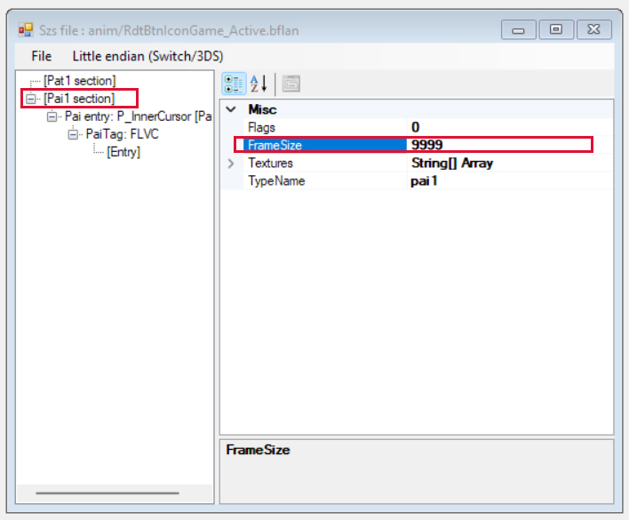

# Creación de animaciones personalizadas para tus temas de NX

*Escrito por [Capybara](https://themezer.net/creators/382997176307154945), marzo de 2023*

<em><strong>Actualización: Este tutorial ahora forma parte de [LayoutDocs](https://layoutdocs.themezer.net/guide/animations/). Gracias a Migush por corregirlo.</strong></em>

 

 
Este tutorial resume virtualmente todo lo que sé sobre animaciones. Sin embargo, algunas partes de este tutorial no son tan completas y rigurosas como me hubiera gustado, así que no dudes en ponerte en contacto conmigo o con Migush (enlaces más abajo) si conoces algún recurso adicional que se pueda incluir en este documento.

	
## Tabla de contenidos

- **[I. Introducción](#i-introduction)**
- **[II. Requisitos](#ii-requirements)**
- **[III. Antes de comenzar](#iii-before-actually-starting)**
	- [III.1. Algunas palabras sobre archivos .szs](#iii1-a-few-words-on-szs-files)
	- [III.2. Editor de diseño y diferenciación](#iii2-layout-editor-and-diffing)
	- [III.3. Resumen del proceso](#iii3-summing-up-the-process)
- **[IV. Tutorial](#iv-tutorial)**
- **[V. Avanzando](#v-going-further)**
	- [V.1. Estados activos e inactivos](#v1-active-and-inactive-states)
	- [V.2. Animaciones en bucle](#v2-looping-animations)
	- [V.3. Animaciones de desvanecimiento](#v3-fade-in-and-fade-out-animations)
	- [V.4. Fondos animados](#v4-animated-backgrounds)
	- [V.5. Las animaciones pueden sobrescribir cosas](#v5-animations-may-overwrite-things)
    - [V.6. Tablas útiles](#v6-useful-tables)
	    - [V.6.a. Entradas PaiTag](#v6a-paitag-entries)
         - [V.6.b. AnimationTarget](#v6b-animationtarget)
         - [V.6.c. Archivos notables](#v6c-notable-files)
- **[VI. Notas adicionales y agradecimientos especiales](#vi-additional-notes-and-special-thanks)**

## Enlaces útiles

#### Documentación y enlaces de descarga
- [LayoutDocs](https://layoutdocs.themezer.net/)
- [GitHub de exelix (Switch Theme Injector)](https://github.com/exelix11/SwitchThemeInjector)
- [GitHub de FuryBaguette (Switch Layout Editor)](https://github.com/FuryBaguette/SwitchLayoutEditor)
- [GitHub de Migush (ThemezerNX)](https://github.com/ThemezerNX/)
- [GitHub de Zhi (Tema Patterns)](https://github.com/zzzribas/Patterns)
- [GitHub de ElGatoFiestero (Tema Patterns)](https://github.com/ElGatoFiestero)

#### Para solicitar soporte
- [Servidor de Discord de ThemezerNX](https://discord.com/invite/nnm8wyM)
- [Servidor de Discord de exelix](https://discord.gg/rqU5Tf8)
- [Subreddit de NXTheme](https://www.reddit.com/r/NXThemes/)
- [Canal de El Gato Fiestero](https://www.youtube.com/@RevistaElGatoFiestero/videos)

## I. Introducción

En este tutorial, veremos cómo implementar animaciones personalizadas para los temas de NX. Este no es un tema trivial y espero que tengas un conocimiento mínimo sobre cómo está organizada la interfaz de usuario de la consola, cómo funcionan los diseños y cómo usar Switch Theme Injector. Todos los conceptos básicos están cubiertos en LayoutDocs.

Las animaciones se crean utilizando **3 transformaciones básicas: translación (desplazamiento lineal), escala y rotación**. Puede sonar bastante minimalista, pero, de hecho, puedes lograr casi cualquier cosa con estas; al final, depende de tu propia creatividad. Con fines pedagógicos, elaboraré todo el proceso pasando por un ejemplo sencillo, pero en caso de que desees ampliar tus posibilidades, se proporcionarán tablas con los valores que necesitarás más adelante en este tutorial, para que puedas probarlos por ti mismo. Ten en cuenta que también es posible manipular los canales RGBA de un objeto dado y, así, crear paneles de colores cambiantes. Sin embargo, *excepto para las transformaciones alfa (es decir, transparencia)*, esto resulta ser un proceso bastante tedioso y que consume mucho tiempo con las herramientas que tenemos a nuestra disposición, así que no lo cubriré aquí.

Puedes echar un vistazo a [mi perfil en Themezer](https://themezer.net/creators/382997176307154945) para ver ejemplos. Si quieres presenciar la personalización de temas en su máximo potencial, es posible que desees revisar el trabajo de [NSX](https://www.youtube.com/channel/UCtvgkpsXAGp0P3dJr6buxRg). La mayoría de sus temas aún funcionan en el firmware 15.0.1 (también deberían funcionar en 16.0.0), pero algunos podrían tener problemas y es probable que no se actualicen, ya que NSX lamentablemente ya no está activo en la escena.

Ten en cuenta que la modificación de temas aún se encuentra en una etapa "temprana" (bueno, para ser completamente honesto, la escena está algo inactiva en este momento...) y aún falta proporcionar una documentación completa. No dudes en comunicarte con el servidor de [Discord de Themezer](https://discord.com/invite/nnm8wyM) si necesitas ayuda.

  
## II. Requisitos

- Como mencioné, es obligatorio tener un conocimiento mínimo sobre personalización de temas. **Simplemente saber cómo cambiar la imagen de fondo usando el inyector definitivamente no funcionará**. Asegúrate de leer la documentación encontrada en [LayoutDocs](https://layoutdocs.themezer.net/) **cuidadosamente** antes de continuar. Aunque haré un repaso rápido, sería demasiado extenso elaborar esos temas aquí.

- Windows 10 o 11

- [Switch Theme Injector + NXTheme Installer](https://github.com/exelix11/SwitchThemeInjector/releases) para compilar e instalar tu tema

- [Switch Layout Editor](https://github.com/FuryBaguette/SwitchLayoutEditor) para hacer animaciones y revisar los archivos de la consola

- Un editor de texto. Se recomienda altamente [Visual Studio Code](https://code.visualstudio.com/download).

Asegúrate de descargar la última versión para cada software mencionado.

## III. Antes de comenzar

### III.1. Algunas palabras sobre archivos .szs

Crear temas implica alterar archivos `.szs`. Estos son archivos que contienen los activos gráficos de la interfaz de usuario, almacenados en archivos `.bflyt` y `.bflan`. Básicamente, toda la interfaz de usuario se descompone en estos archivos. Así que, para crear animaciones, obviamente tendremos que modificarlos.

  
Las imágenes, iconos, texto y prácticamente todo lo que se muestra en la pantalla de tu consola son objetos de tipo *pane* que se encuentran en archivos `.bflyt`. Estos archivos `.bflyt` también contienen información sobre la posición/tamaño/escala de los paneles y sus canales RGBA. En otras palabras, esos paneles son con los que jugaremos en este tutorial, **es decir, son precisamente los objetos a los que adjuntaremos nuestras animaciones.** Así que es posible que desees **ver de antemano el archivo** `.bflyt` **que contiene el panel que deseas animar.**

En la práctica, **nos centraremos principalmente en los archivos** `.bflan`, **donde se almacenan partes de los datos de animación para un archivo específico** `.bflyt`. **Casi todo el proceso se realiza a través de Switch Layout Editor**, que comenzaré a presentar en la próxima subsección.

Volviendo a los archivos de archivos `.szs`, los encontrarás en `themes/systemData` en tu tarjeta SD; estos ya han sido extraídos por la aplicación homebrew NXTheme Installer. Ten en cuenta que los archivos `.szs` contienen material con derechos de autor, lo que los hace ilegales para compartir (esa es la razón por la cual los modders implementaron el formato `.nxtheme` para evitar esto).

Cada archivo corresponde a un menú específico,

  

| Archivo `.szs`          | Menú                |
| ------------------ | ---------------- |
| `ResidentMenu.szs` | Pantalla de inicio |
| `Set.szs`          | Configuración       |
| `Psl.szs`          | Selección de jugador |
| `Flauncher.szs`    | Todo el software / lanzador completo |
| `Lock.szs`         | Pantalla de bloqueo |
| `MyPage.szs`       | Página de usuario    |

Entonces, si alguien quiere editar elementos de la interfaz de usuario en la página de inicio, necesitaría obtener el archivo `ResidentMenu.szs`. De manera similar, si queremos realizar ediciones en la sección de todas las aplicaciones, trabajaremos con el archivo `Flauncher.szs`. Ya captas la idea.

Como nota adicional, también encontrarás en `themes/systemData` otros archivos `.szs` que no se enumeran aquí, por ejemplo, `Option.szs`. **Estos no son compatibles oficialmente con el inyector de temas**, pero *aún puedes* modificarlos utilizando la función de plantillas adicionales proporcionada por el inyector. Para ver cómo hacerlo, es posible que desees estar atento a un próximo tutorial.

### III.2. Editor de diseño y diferenciación

Deberías estar acostumbrado a trastear con archivos `.json` y compilar temas con Switch Theme Injector, pero tal vez no estés familiarizado con Switch Layout Editor. Piensa en él como un lector/archivador de archivos `.szs` que también ofrece una vista previa real en pantalla de la posición de los paneles, lo cual es bastante conveniente para la edición de diseños. Resulta que Layout Editor también se utiliza para la edición de animaciones.

*Nota: alternativamente, puedes usar Switch Toolbox (también incluido con [LayoutKit](https://github.com/ThemezerNX/LayoutKit)), que es otro software que tiene prácticamente los mismos propósitos que Layout Editor. Sin embargo, dado que he estado trabajando con Layout Editor, no cubriré Switch Toolbox aquí, pero al final del día depende de tu preferencia. Solo pruébalos.*

Una vez que las animaciones hayan sido implementadas, necesitaremos hacer una *diferencia de diseño* (como en *diferencia*). Básicamente, queremos trabajar con dos versiones del archivo `.szs` de interés: la primera se mantiene intacta y la segunda contendrá todas las ediciones que se hayan realizado a través de Layout Editor. La diferenciación de diseño es el proceso de comparar (*hacer diff*) ambos archivos `.szs` y generar un archivo de diseño (del mismo tipo que has estado utilizando para tus temas) que traduzca todas las ediciones al formato de código JSON. El archivo `.json` resultante luego se puede usar en Switch Theme Injector para compilar el `.nxtheme`, como lo harías normalmente.

### III.3. Resumen del proceso

Pasaremos por estos pasos generales que aplican para cualquier tipo de edición de animación:

1. Hacer dos copias del archivo `.szs` seleccionado.

2. Editar uno de ellos con nuestras animaciones.

3. Diferenciación de diseño.

4. Compilar el `.nxtheme` utilizando el archivo `.json` de salida/diferenciado e instalar en la consola (proceso habitual con Switch Theme Injector y NXTheme Installer).

## IV. Tutorial

  
### o) Nuestro objetivo

A partir de ahora, me enfocaré únicamente en crear una animación para los iconos de juegos en la pantalla de inicio. **Quiero que esos iconos se escalen cuando se seleccionan y vuelvan a su tamaño inicial cuando el cursor se aleja. Este será nuestro objetivo a lo largo de esta sección del tutorial.** Como mencioné en la sección de introducción, se proporcionarán tablas más adelante si deseas experimentar más y realizar animaciones más exóticas.

### a) Configuración del espacio de trabajo

Para llevar un seguimiento de lo que estamos haciendo, primero configuraremos adecuadamente nuestro espacio de trabajo. Aquí sugiero una jerarquía de directorios que hace que mi propio flujo de trabajo sea lo suficientemente eficiente, pero puedes hacer lo que quieras a medida que te acostumbras a saber lo que estás haciendo.

1. Crea un directorio en tu escritorio y llámalo `animEdit`.

2. Ve a `themes/systemData` en la tarjeta SD de tu Switch. Dado que estoy interesado en editar la pantalla de inicio para este ejemplo, solo tomaré `ResidentMenu.szs`.

3. Copia `ResidentMenu.szs`, pégalo en tu escritorio y en `Desktop/animEdit`.

|  |  |
| -------------------------------------------- | ------------------------------------------------- |
| `Escritorio/`                                | `Escritorio/animEdit`                              |

Recuerda, necesitaremos un archivo `.szs` normal y una copia del mismo que editaremos, para poder diferenciarlos al final. Aquí el de escritorio se mantendrá sin cambios, así que editaremos el que está en `Escritorio/animEdit`.

### b) Editor de Diseño

4. Abre el Editor de Diseño y carga `animEdit/ResidentMenu.szs`. Puedes simplemente arrastrar y soltar el archivo en la ventana. Se abrirá una pequeña ventana que enumera todos los archivos contenidos en el archivo `.szs`.

5. Primero, crearemos la animación de escalado cuando el ícono del juego está **seleccionado**. En la ventana de la caja, busca `RdtBtnIconGame_Active.bflan` y ábrelo con un doble clic. Aparecerá una nueva ventana. En esta ventana, expande todos los elementos haciendo clic en los íconos `+`.

A la izquierda se enumeran *algunos* paneles contenidos en `RdtBtnIconGame.bflyt` (en realidad, solo uno en este caso, llamado `P_InnerCursor`). Dependiendo de lo que queramos lograr, es probable que necesitemos agregar más paneles a esta lista. Ese será el caso aquí para nuestro ejemplo.

A la derecha se muestran elementos que se utilizan para definir el comportamiento de la animación. No te preocupes, solo necesitaremos editar algunos de ellos.

Ahora, me disculpo de antemano, pero tendrás que seguir mis instrucciones a ciegas... por ahora. Explicaré algunos de ellos a lo largo de esta sección.

6. En el panel izquierdo, haz clic en la primera entrada, `Sección Pat1`. Luego, en el panel derecho,

	6.a. Establece `AnimationBinding` en `0`

	6.b. Expande la entrada `Groups` haciendo clic en la flecha izquierda y establece el campo `[0]` en `custom_G_Active` (el valor no es relevante aquí, así que puede ser cualquier cosa).

	6.c. En el panel izquierdo, haz clic en en el segundo entrada, `Sección Pai1` y establece `FrameSize` en `9999`.

  Si has hecho todo correctamente, esto debería verse así.

|  |  |
| ----------------------------------------- | ----------------------------------------- |
| `Sección Pat1`                            | `Sección Pai1`                            |

**Todo el paso 6 es una configuración recurrente que siempre debe hacerse para crear cualquier tipo de animación, independientemente de nuestro objetivo actual.** Ahora, para crear nuestra animación real, lo haremos editando el panel `N_Root` de `RdtBtnIconGame.bflyt`, lo que significa agregar una entrada a la lista de paneles.

*Nota: Si estás familiarizado con la personalización de temas, `N_Root` es el panel que básicamente contiene todos los demás en el archivo `.bflyt`. Así que aquí no nos molestaremos y animaremos todo (incluido el texto, el cursor, etc.), pero nada impide que seas más específico y animes, por ejemplo, solo el texto del título del juego. En este caso específico, agregarías la entrada `L_Balloon` en su lugar.*

8. Para agregar el panel `N_Root` a la lista, haz clic izquierdo en `Sección Pai1` Y LUEGO haz clic derecho en esta misma entrada (de lo contrario, esto se estropeará y sí, es un poco tonto). Selecciona la opción `Añadir entrada`. El panel izquierdo debería actualizarse con el nuevo elemento agregado al final de la lista. Haz clic en él y cámbiale el nombre a `N_Root` en el panel derecho.

| ") | ") |
| ------------------------------------------------------------- | ------------------------------------------------------------- |
| Añadiendo un panel (1)                                        | Añadiendo un panel (2)                                        |

9. Haz clic derecho en `N_Root` en la lista de paneles y selecciona `Añadir entrada`. Expande el panel `N_Root` y cambia el nombre de la entrada `PaiTag` a `FLPA`. Luego, agrega *2 sub-entradas* más a la entrada `FLPA`.

Ahora, los siguientes pasos definirán la animación de escalado que queremos lograr.

10. Bajo `FLPA`, selecciona la primera `[Entrada]`. El panel derecho mostrará otro conjunto de valores. Algunos de ellos realmente importarán, así que ten nota de estos,

	 - `AnimationTarget` es el tipo de animación que elegimos asignar a nuestro panel. Básicamente, aquí es donde le decimos al panel si debe escalar hacia arriba o hacia abajo, traducirse a lo largo del eje x o y, o rotar alrededor del eje z en sentido horario o antihorario. Más adelante, aquí es donde podrías estar interesado en consultar las tablas para probar los valores asociados a otros tipos de animaciones.
	 - `KeyFrames` es... autoexplicativo, supongo. Esto nos permite dividir nuestra animación en fotogramas clave definidos correctamente.
	 - `DataType` se refiere al tipo de nuestras entradas en el campo `KeyFrames`. **Solo ten en cuenta que siempre debe configurarse en `2`** (lo que significa `float`). Aunque no es relevante aquí, puedes seguir [este enlace](https://layoutdocs.themezer.net/guide/layouts/usd-sections/) si quieres saber un poco más.

11. Definiremos nuestros valores de la siguiente manera,

	11.a. `AnimationTarget` = `6`

	11.b. `DataType` = `2`

Deja el resto sin cambios. El valor `6` para `AnimationTarget` significa *"escalar a lo largo del eje x"* (horizontalmente).

12. Selecciona el elemento `KeyFrames` y haz clic en el botón de puntos que aparece. Se abrirá una nueva ventana en la que podemos agregar nuestros fotogramas clave usando los botones `Agregar` / `Quitar` en la parte inferior. Hazlo como se muestra a continuación.

")

Así es como debes leer esto: en el fotograma `0`, el valor es `1`, lo que significa que en el fotograma inicial, el panel `N_Root` mantendrá su relación base **a lo largo de su eje horizontal**. Luego, **hasta el fotograma `8`**, el panel se escalonará *progresivamente* hasta alcanzar un factor `1.4`.

*NB1: Ten en cuenta que definimos anteriormente `FrameSize` en `9999` en la `Sección Pai1`. Estamos bien siempre que este valor sea superior al valor máximo de `Keyframe`, que es `8` aquí.*

*NB2: El campo `Blend` se refiere a la pendiente de la función (como en matemáticas) que guía la animación. En términos sencillos, condiciona la velocidad a la que un panel se desplazará de un fotograma a otro. Dado que los valores de `Blend` no están documentados y son difíciles de entender, no me preocuparé en absoluto por ello. Mi consejo personal es siempre establecer el valor en `0`, lo que parece hacer que la animación del panel siga una función lineal simple.*

13. Repite los pasos 10, 11 y 12 para la segunda `[Entrada]` bajo `FLPA`, pero el valor de `AnimationTarget` debe ser `7` aquí en lugar de `6`, lo que significa *"escalar a lo largo del eje y"* (verticalmente).

Ahora, con todos estos pasos, hemos creado con éxito una animación de escalado cuando el ícono del juego está **seleccionado**. Pero ¿qué pasa cuando el ícono está **deseleccionado**? Bueno, la interfaz de usuario de Switch también nos ofrece la posibilidad de modificar eso. Si no se hace, el ícono realmente mantendrá su factor `1.4` **incluso después de dejar de estar seleccionado**. Entonces, si queremos hacer las cosas correctamente, lo que sigue es prácticamente obligatorio hacerlo. Así que, volvamos a empezar,

 14. Vuelve a la pequeña ventana que lista el contenido del archivo `.szs` y busca `RdtBtnIconGame_Inactive.bflan`. Abre este archivo y repite todos los pasos anteriores a partir del paso 6. **En el paso 6.b., cambia el valor `[0]` a `custom_G_Inactive`** (en realidad no importa, pero es por conveniencia). Para la animación, haremos las cosas al revés, así que el paso 12 debería verse así.

")

De esta manera, el ícono del juego se reducirá a su tamaño inicial cuando deje de estar seleccionado.

Ahora, hay una última cosa que debemos hacer antes de realizar la diferenciación, **agregar grupos**. Más precisamente, agregar grupos al archivo `RdtBtnIconGame.bflyt` en este caso. Esto es necesario para 1) evitar bloqueos que probablemente ocurran sin hacerlo, y 2) "ordenar al `.bflyt` que no siga su comportamiento original". Sí, la redacción es incómoda y no puedo desarrollar mucho sobre los grupos de todos modos, ya que aún no comprendo completamente cómo funcionan; simplemente ten en cuenta que el siguiente paso es obligatorio. Básicamente, necesitamos crear un grupo para cada `.bflan` con el que hemos manipulado, es decir, `RdtBtnIconGame_Active.bflan` y `RdtBtnIconGame_Inactive.bflan`.

15. Vuelve a la ventana del cuadro `.szs` y abre `RdtBtnIconGame.bflyt`. No te preocupes por el área gris a la derecha, simplemente agrega un nuevo grupo como se muestra en la imagen a continuación y asegúrate de **renombrarlo con el mismo nombre que definimos en el paso 6.b.** (es decir, `custom_G_Active`). Luego, selecciona el elemento `Panes` en el área rectangular debajo de la lista e ingresa los paneles enumerados en el archivo `RdtBtnIconGame_Active.bflan`. Cada panel debe separarse con un salto de línea.

| ") | ") |
| ------------------------------------- | ---------------------------------------- |
| Agregar un grupo                      | Enumerar paneles en el grupo                   |

16. Repite la operación para `RdtBtnIconGame_Inactive.bflan`. Mismo proceso, excepto que el grupo debe llamarse `custom_G_Inactive`.

Y con esto, ya casi hemos terminado. Ahora finalmente es el momento de realizar la diferenciación. **Asegúrate de guardar las ediciones en todas las ventanas abiertas.**

17. Vuelve a la ventana del cuadro `.szs`, selecciona `Herramientas` en el menú superior y luego la opción `Este es el szs editado`. Se abrirá una nueva ventana. Busca el `ResidentMenu.szs` sin editar que hemos estado guardando en `Desktop/`, deja la casilla de verificación como está y haz clic en `Generar diff`.

Esto generará un archivo `.json` que utilizaremos para compilar un `.nxtheme` con Switch Theme Injector. ¡Finalmente terminado!

(Se redujo la escala al pasar el ratón sobre el ícono del juego a `1.2` ya que se superponía, también oculté el texto del título del juego)

*NB: Al analizar el código `.json` de salida, puedes ver que se agregaron grupos al final de la sección `RdtBtnIconGame.bflyt`. También hay una sección `Anims` agregada al final del código fuente. Por lo tanto, podrías hacer animaciones sin usar Layout Editor en absoluto... si estás dispuesto a jugar con la propia sintaxis de toda la sección `Anims`.* 

|  |  |
| ---------------------------------------------------- | ---------------------------------------------- |
| `Sección AddGroups`                                   | `Sección Anims`                      |

## V. Iendo más lejos

### V.1. Active and Inactive states

For example, if we wanted to animate the settings applet button on the home screen, we would have searched for `RdtBtnSet_Active.bflan` and `RdtBtnSet_Inactive.bflan`. In fact, a few UI elements come as a pair of `.bflan` files named `[associated_bflyt_name]_Active.bflan` / `[associated_bflyt_name]_Inactive.bflan`. These `.bflan` dictate the state of the panes contained in `[associated_bflyt_name].bflyt`, when they are being selected by the cursor (Active) and unselected (Inactive). There are a couple more similar `.bflan` files following the same logic, like the `[associated_bflyt_name]_FocusKey.bflan` / `[associated_bflyt_name]_UnfocusKey.bflan` ones, but I won't discuss that here.

It's also worth noting that the edits made for Inactive states will actually overwrite the USD data you might have defined in your `.json` code (e.g. pane's position, colors, etc.). For example, if you've set the album button's x-coordinate to `660px` in your `.json` code while it is defined as `680px` in its Inactive `.bflan`, the `680px` value will take priority over the `660px` one and be applied.

### V.2. Looping animations

It is possible to make a loop for an animation. Such a thing can be seen in [Migush](https://themezer.net/creators/123859829453357056)'s [JAG layout](https://themezer.net/layouts/homemenu/JAG-Layout-2) where selected game icons follow a scale up and down idle animation. All you have to do to make a looping animation is to set the `Flags` value to `1` (while `0` disables the loop) in the `Pai1 section` of a `.bflan` file. Unfortunately, **more complex animations that combine multiple transformations can't be achieved properly** since the flag is applied to the whole `.bflan`. To be more explicit, a game icon wouldn't be able to move `10px` above AND THEN follow a looping scale up and down. In such a case, the linear displacement would also be looped.

### V.3. Fade in and fade out animations

While it's too convoluted to make changing colors animations (as I said in my introduction speech), we still can tinker with a pane's alpha (transparency) channel. If you've guessed it, this allows us to very easily make fade in and fade out animations.

Let's say I want a blinking cursor for the navigation menu in the settings applet. This time, we'll load up `Set.szs` in Layout Editor. Here are the steps,

1. Open `BtnNav_Root_Active.bflan`. **As always when creating custom animations,** do the proper modifications to the `Pat1` and `Pai1` sections. Add the `N_BtnFocusKey` entry (cursor pane) to the list, create a **`FLVC` entry** (not `FLPA`!) right under it, and then another entry under `FLVC`. I chose to make my key frames as shown below. Notice that the `AnimationTarget` value is `16` here.
2. We'll also edit `BtnNav_Root_Inactive.bflan`, otherwise navigating the tabs will interrupt the cursor animation and lock it to a certain frame (same behavior as in our previous game icon animation). Considering that, we simply "reset" `N_BtnFocusKey`'s state (after adding this pane to the list) by setting its alpha channel to `0` at frame `0`.
3. Then again, for each `.bflan` file, create properly named groups in the `RootGroup` section of `BtnNav_Root.bflyt`. **Don't forget to save all your edits.**
4. Layout diff, compile and install, and there you go: now you have a blinking cursor.

| ") | ") |
| ------------------------------------------ | ------------------------------------------ |
| Adding `FLVC` entry (Active)               | Adding `FLVC` entry (Inactive)             |

### V.4. Animated backgrounds

There is no *proper* nor easy known way to make animated backgrounds. Switch Theme Injector only supports `.dds` and `.jpg` files.
An alternative solution would be to animate the pane that contains your custom background image. That *indeed* works, and there are a few themes that already have achieved this out there. To do so, working with `ResidentMenu.szs`, you need to add `L_BgNml` to the pane list in `RdtBase_Enter.bflan` and make your edits to your convenience. However, this solution has its limitations:

- You're still stuck with a static background image since there is no support for animated images of any kind, nor for video files
- `RdtBase_Enter.bflan` contains the home screen unlocking animation. Try to loop your animation using the `Flags` item and maybe you can guess what will happen (boot loop, UI and sound glitches). The only thing you can do to sort of emulate the loop is to duplicate your animation pattern all the way through an absurd amount of key frames. [Zhi](https://themezer.net/creators/239384767785730048) actually did this in his [Patterns theme](https://themezer.net/packs/Patterns.-58f) with a frame limit of 64000 (which makes it about 8 minutes). If you are interested in learning the whole process, you can read through [his own documentation there](https://github.com/zzzribas/Patterns/wiki). As a side note, you might want to stay tuned for Zhi's next releases because he comes up with quite some good ideas!

For other applets (e.g. settings, user page, etc.), there is actually no known way at all to apply any kind of animation behavior to a custom background image.

### V.5. Animations *may* overwrite things</a>

If you've spent some time editing `.json` layouts, you may have encountered cases where, no matter what you do, the changes you make to a pane (e.g. colors, position, etc.), even while having the `C_W` and `C_B` patches enabled, lead to no result. **In such cases, chances are that an animation is overwriting your edits.**

To illustrate this, one notable case is the Redownload Software button at the bottom of the full launcher applet's main page (`Flauncher.szs`). The panes corresponding to this button are `L_Shop` and `T_Empty`, and these won't hide by simply attaching the `Visible: false` property to them. This is due to the `FLVI` entries within `FlcCntMain_Type.bflan` that overwrite any attempt made in your `.json` code. To sort this out, the `KeyFrames` values under each `FLVI` entry must be set to `0` (`1` by default).

| ") | ") |
| ------------------------------------------ | ------------------------------------------ |
| `L_Shop` > `FLVI` > `KeyFrames`               | `T_Empty` > `FLVI` > `KeyFrames`             |

| ") | ") |
| ------------------------------------------ | ------------------------------------------ |
| Visible Redownload Software button               | Hidden Redownload Software button             |

To give another example, a highlighted game in my Spotify Deck home menu has a gray rounded card around its icon. These are `P_BtnBase` panes found in `RdtBtnIconGame.bflyt`. They actually have some transparency by default, meaning that simply changing their colors in your `.json` won't render as intended. I made them full opaque by changing the `KeyFrames` value under the `P_BtnBase`'s `FLVC` entry to `255`.

*NB: Notice that I never mentioned the `FLVI PaiTag` up to now. It's because I don't actually know what they stand for as their occurrences are rather rare, therefore had no opportunity to actually figure them out (apart from hiding the shop button in the full launcher).*

### V.6. Useful tables

#### V.6.a. PaiTag entries

`AnimationTarget` values and subsequent animation behavior change depending on the defined `PaiTag`.

| `PaiTag` | Used for                |
| -------- | --------------------- |
| `FLPA`   | basic transformations |
| `FLVC`     | vertex colors         |
| `FLEU`     | USD patches           |
| `FLVI`     | *unknown*           |
| `FLMC`     | *unknown*                      |

#### V.6.b. AnimationTarget

##### FLPA PaiTag

Related to basic transformations listed below.
Expected value type for `KeyFrames` is `float`.

| `AnimationTarget` (`FLPA PaiTag`) | Transformation                     | Unit    | 
| --------------------------------- | ---------------------------------- | --- |
| `0`                               | x-axis translation                 | px    |
| `1`                               | y-axis translation                 | px    |
| `2`                               | *unknown*                                   | /    |
| `3`                               | y-axis scale **down**                                   | px    |
| `4`                               | z-axis rotation (clockwise)        | degrees    |
| `5`                               | z-axis rotation (counterclockwise) | degrees    |
| `6`                               | x-axis scale   | none    |
| `7`                               | y-axis scale   | none    |
| `8`                               | pane size along x-axis             | px    |
| `9`                               | pane size along y-axis             | px    |

- Translations are relative to the (x, y) coordinates defined in your `.json` layout, so a (0, 0) translation means that the pane keeps its base position
- Scaling is also relative to what is defined in your `.json` layout. To keep your pane size at a 1:1 ratio, `KeyFrames` values should be set to `1`
- Value `3` for `AnimationTarget` scales the pane down along the y-axis by a certain px amount (no cropping involved), **although** it needs further testing to be completely sure. It seems to work with absolute values within `KeyFrames`, meaning that negative values have the same effect as if they were positive
- Value `2` for `AnimationTarget` also needs further testing. This time I couldn't figure out what it actually does. An obvious guess would be that it scales the pane down along the x-axis, but my trial and error sessions haven't given any luck towards that expected result

##### FLVC PaiTag

Related to vertex colors transformations listed below.
`KeyFrames` values range from 0 (invisible color channel) to 255 (opaque color channel).

| `AnimationTarget` (`FLVC PaiTag`) | Channel | Corner    | 
| --------------------------------- | ------- | --- |
| `16`                             | alpha        | whole pane    |

*NB: I haven't tested this thoroughly for RGB channels (now you're probably seeing how annoying it is), but my guess is that `AnimationTarget` values follow a fairly simple and similar pattern: `0`, `1`, `2` = R, G, B for a specific pane corner, `3` = alpha for that same corner ; `4`, `5`, `6` = R, G, B for another corner, `7` = alpha for this second corner, ..., `16` = alpha channel for the whole pane.*

#### V.6.c. Notable files

##### ResidentMenu.szs (home screen)

| `.bflyt`           | UI element                 | Notable `.bflan` files                         |
| ------------------ | -------------------------- | ---------------------------------------------- |
| `RdtBase`          | entire home screen menu     | `RdtBase_Enter` (animation upon unlocking the console to home screen)                               |
| `RdtBtnIconGame`   | game button                | `RdtBtnIconGame_Active`, `RdtBtnGame_Inactive` |
| `RdtBtnFullLauncher` | all software applet button | `RdtBtnFullLauncher_Active`, `RdtBtnFullLauncher_Inactive`                                               |
| `RdtBtnPvr`        | album applet button        | `RdtBtnPvr_Active`, `RdtBtnPvr_Inactive`       |
| `RdtBtnCtrl`       | controllers applet button  | `RdtBtnCtrl_Active`, `RdtBtnCtrl_Inactive`     |
| `RdtBtnSet`        | settings applet button     | `RdtBtnSet_Active`, `RdtBtnSet_Inactive`       |
| `RdtBtnPow`        | power button               | `RdtBtnPow_Active`, `RdtBtnPow_Inactive`       |
| `RdtBtnMyPage`        | user profile button               | `RdtBtnMyPage_Active`, `RdtBtnMyPage_Inactive`       |

##### Set.szs (settings applet)

| `.bflyt`      | UI element          | Notable `.bflan` files                       |
| ------------- | ------------------- | -------------------------------------------- |
| `BtnNav_Root` | Navigation menu tab | `BtnNav_Root_Active`, `BtnNav_Root_Inactive` |

##### Flauncher.szs (all software applet)

| `.bflyt`             | UI element                                 | Notable `.bflan` files                             |
| -------------------- | ------------------------------------------ | -------------------------------------------------- |
| `FlcBtnIconGame`     | game icon in the main and group screens               | `FlcBtnIconGame_Active`, `FlcBtnIconGame_Inactive` |
| `FlcBtnIconGameEdit` | game icon in the create group and add/remove software screens | `FlcBtnIconGameEdit_Active`, `FlcBtnIconGameEdit_Inactive`                                                   |

## VI. Additional notes and special thanks

At last, special (and big) thanks to:
- exelix and Migush for all the tips
- Zhi for the animated background testing part
- All the contributors from the Nintendo Switch modding scene

