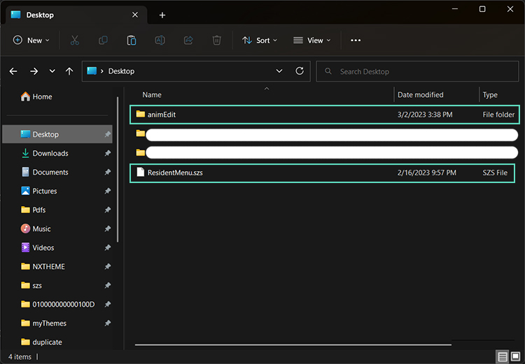
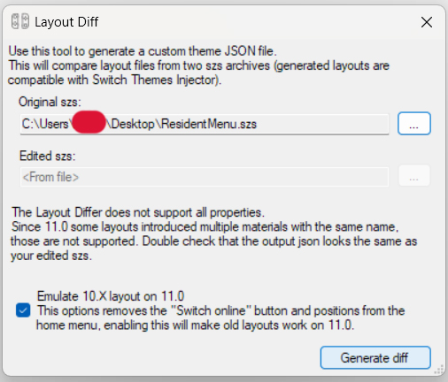

# Creación de animaciones personalizadas para tus temas de NX

*Escrito por [Capybara](https://themezer.net/creators/382997176307154945), marzo de 2023*

<em><strong>Actualización: Este tutorial ahora forma parte de [LayoutDocs](https://layoutdocs.themezer.net/guide/animations/). Gracias a Migush por corregirlo.</strong></em>

 

 
Este tutorial resume virtualmente todo lo que sé sobre animaciones. Sin embargo, algunas partes de este tutorial no son tan completas y rigurosas como me hubiera gustado, así que no dudes en ponerte en contacto conmigo o con Migush (enlaces más abajo) si conoces algún recurso adicional que se pueda incluir en este documento.

	
## Tabla de contenidos

- **[I. Introducción](##i-introducci%C3%B3n)**
- **[II. Requisitos](#ii-requisitos)**
- **[III. Antes de comenzar](#iii-antes-de-comenzar)**
	- [III.1. Algunas palabras sobre archivos .szs](#iii1-algunas-palabras-sobre-archivos-szs)
	- [III.2. Editor de diseño y diferenciación](#iii2-editor-de-dise%C3%B1o-y-diferenciaci%C3%B3n)
	- [III.3. Resumen del proceso](#iii3-resumen-del-proceso)
- **[IV. Tutorial](#iv-tutorial)**
	- **[a. Configuración del espacio de trabajo](#a-configuraci%C3%B3n-del-espacio-de-trabajo)**
 	- **[b. Editor de Diseño](#b-editor-de-dise%C3%B1o)**
- **[V. Avanzando](#v-iendo-m%C3%A1s-lejos)**
	- [V.1. Estados activos e inactivos](#v1-estados-activo-e-inactivo)
	- [V.2. Animaciones en bucle](#v2-animaciones-en-bucle)
	- [V.3. Animaciones de desvanecimiento](#v3-animaciones-de-fundido-de-entrada-y-salida)
	- [V.4. Fondos animados](#v4-fondos-animados)
	- [V.5. Las animaciones pueden sobrescribir cosas](#v5-las-animaciones-pueden-sobrescribir-cosas)
    - [V.6. Tablas útiles](#v6-tablas-%C3%BAtiles)
	    - [V.6.a. Entradas PaiTag](#v6a-entradas-de-paitag)
         - [V.6.b. AnimationTarget](#v6b-animationtarget)
         	- [flpa-paitag](#flpa-paitag)
          	- [flvc-paitag](#flvc-paitag)
         - [V.6.c. Archivos notables](#v6c-archivos-notables)
         	- [ResidentMenu.szs - Pantalla de Inicio](#residentmenuszs-pantalla-de-inicio)
         	- [Set.szs - Configuración](#setszs-aplicaci%C3%B3n-de-configuraci%C3%B3n)
         	- [Flauncher.szs - Todas las aplicaciones](#flauncherszs-aplicaci%C3%B3n-de-software-completa)
- **[VI. Notas adicionales y agradecimientos especiales](#vi-notas-adicionales-y-agradecimientos-especiales)**

## Enlaces útiles

#### Documentación y enlaces de descarga
- [LayoutDocs](https://layoutdocs.themezer.net/)
- [GitHub de exelix (Switch Theme Injector)](https://github.com/exelix11/SwitchThemeInjector)
- [GitHub de FuryBaguette (Switch Layout Editor)](https://github.com/FuryBaguette/SwitchLayoutEditor)
- [GitHub de Migush (ThemezerNX)](https://github.com/ThemezerNX/)
- [GitHub de Zhi (Tema Patterns)](/PatternsTraducido.md)

#### Para solicitar soporte
- [Servidor de Discord de ThemezerNX](https://discord.com/invite/nnm8wyM)
- [Servidor de Discord de exelix](https://discord.gg/rqU5Tf8)
- [Subreddit de NXTheme](https://www.reddit.com/r/NXThemes/)
- [Canal de El Gato Fiestero](https://www.youtube.com/@RevistaElGatoFiestero/videos)

## I. Introducción

En este tutorial, veremos cómo implementar animaciones personalizadas para los temas de NX. Este no es un tema trivial y espero que tengas un conocimiento mínimo sobre cómo está organizada la interfaz de usuario de la consola, cómo funcionan los diseños y cómo usar Switch Theme Injector. Todos los conceptos básicos están cubiertos en LayoutDocs.

Las animaciones se crean utilizando **3 transformaciones básicas: translación (desplazamiento lineal), escala y rotación**. Puede sonar bastante minimalista, pero, de hecho, puedes lograr casi cualquier cosa con estas; al final, depende de tu propia creatividad. Con fines pedagógicos, elaboraré todo el proceso pasando por un ejemplo sencillo, pero en caso de que desees ampliar tus posibilidades, se proporcionarán tablas con los valores que necesitarás más adelante en este tutorial, para que puedas probarlos por ti mismo. Ten en cuenta que también es posible manipular los canales RGBA de un objeto dado y, así, crear paneles de colores cambiantes. Sin embargo, *excepto para las transformaciones alfa (es decir, transparencia)*, esto resulta ser un proceso bastante tedioso y que consume mucho tiempo con las herramientas que tenemos a nuestra disposición, así que no lo cubriré aquí.

Puedes echar un vistazo a [mi perfil en Themezer](https://themezer.net/creators/382997176307154945) para ver ejemplos. Si quieres presenciar la personalización de temas en su máximo potencial, es posible que desees revisar el trabajo de [NSX](https://www.youtube.com/channel/UCtvgkpsXAGp0P3dJr6buxRg). La mayoría de sus temas aún funcionan en el firmware 15.0.1 (también deberían funcionar en 16.0.0), pero algunos podrían tener problemas y es probable que no se actualicen, ya que NSX lamentablemente ya no está activo en la escena.

Ten en cuenta que la modificación de temas aún se encuentra en una etapa "temprana" (bueno, para ser completamente honesto, la escena está algo inactiva en este momento...) y aún falta proporcionar una documentación completa. No dudes en comunicarte con el servidor de [Discord de Themezer](https://discord.com/invite/nnm8wyM) si necesitas ayuda.

  
## II. Requisitos

- Como mencioné, es obligatorio tener un conocimiento mínimo sobre personalización de temas. **Simplemente saber cómo cambiar la imagen de fondo usando el inyector definitivamente no funcionará**. Asegúrate de leer la documentación encontrada en [LayoutDocs](https://layoutdocs.themezer.net/) **cuidadosamente** antes de continuar. Aunque haré un repaso rápido, sería demasiado extenso elaborar esos temas aquí.

- Windows 10 o 11

- [Switch Theme Injector + NXTheme Installer](https://github.com/exelix11/SwitchThemeInjector/releases) para compilar e instalar tu tema

- [Switch Layout Editor](https://github.com/FuryBaguette/SwitchLayoutEditor) para hacer animaciones y revisar los archivos de la consola

- Un editor de texto. Se recomienda altamente [Visual Studio Code](https://code.visualstudio.com/download).

Asegúrate de descargar la última versión para cada software mencionado.

## III. Antes de comenzar

### III.1. Algunas palabras sobre archivos .szs

Crear temas implica alterar archivos `.szs`. Estos son archivos que contienen los activos gráficos de la interfaz de usuario, almacenados en archivos `.bflyt` y `.bflan`. Básicamente, toda la interfaz de usuario se descompone en estos archivos. Así que, para crear animaciones, obviamente tendremos que modificarlos.

  
Las imágenes, iconos, texto y prácticamente todo lo que se muestra en la pantalla de tu consola son objetos de tipo *pane* que se encuentran en archivos `.bflyt`. Estos archivos `.bflyt` también contienen información sobre la posición/tamaño/escala de los paneles y sus canales RGBA. En otras palabras, esos paneles son con los que jugaremos en este tutorial, **es decir, son precisamente los objetos a los que adjuntaremos nuestras animaciones.** Así que es posible que desees **ver de antemano el archivo** `.bflyt` **que contiene el panel que deseas animar.**

En la práctica, **nos centraremos principalmente en los archivos** `.bflan`, **donde se almacenan partes de los datos de animación para un archivo específico** `.bflyt`. **Casi todo el proceso se realiza a través de Switch Layout Editor**, que comenzaré a presentar en la próxima subsección.

Volviendo a los archivos de archivos `.szs`, los encontrarás en `themes/systemData` en tu tarjeta SD; estos ya han sido extraídos por la aplicación homebrew NXTheme Installer. Ten en cuenta que los archivos `.szs` contienen material con derechos de autor, lo que los hace ilegales para compartir (esa es la razón por la cual los modders implementaron el formato `.nxtheme` para evitar esto).

Cada archivo corresponde a un menú específico,

  

| Archivo `.szs`          | Menú                |
| ------------------ | ---------------- |
| `ResidentMenu.szs` | Pantalla de inicio |
| `Set.szs`          | Configuración       |
| `Psl.szs`          | Selección de jugador |
| `Flauncher.szs`    | Todo el software / lanzador completo |
| `Lock.szs`         | Pantalla de bloqueo |
| `MyPage.szs`       | Página de usuario    |

Entonces, si alguien quiere editar elementos de la interfaz de usuario en la página de inicio, necesitaría obtener el archivo `ResidentMenu.szs`. De manera similar, si queremos realizar ediciones en la sección de todas las aplicaciones, trabajaremos con el archivo `Flauncher.szs`. Ya captas la idea.

Como nota adicional, también encontrarás en `themes/systemData` otros archivos `.szs` que no se enumeran aquí, por ejemplo, `Option.szs`. **Estos no son compatibles oficialmente con el inyector de temas**, pero *aún puedes* modificarlos utilizando la función de plantillas adicionales proporcionada por el inyector. Para ver cómo hacerlo, es posible que desees estar atento a un próximo tutorial.

### III.2. Editor de diseño y diferenciación

Deberías estar acostumbrado a trastear con archivos `.json` y compilar temas con Switch Theme Injector, pero tal vez no estés familiarizado con Switch Layout Editor. Piensa en él como un lector/archivador de archivos `.szs` que también ofrece una vista previa real en pantalla de la posición de los paneles, lo cual es bastante conveniente para la edición de diseños. Resulta que Layout Editor también se utiliza para la edición de animaciones.

*Nota: alternativamente, puedes usar Switch Toolbox (también incluido con [LayoutKit](https://github.com/ThemezerNX/LayoutKit)), que es otro software que tiene prácticamente los mismos propósitos que Layout Editor. Sin embargo, dado que he estado trabajando con Layout Editor, no cubriré Switch Toolbox aquí, pero al final del día depende de tu preferencia. Solo pruébalos.*

Una vez que las animaciones hayan sido implementadas, necesitaremos hacer una *diferencia de diseño* (como en *diferencia*). Básicamente, queremos trabajar con dos versiones del archivo `.szs` de interés: la primera se mantiene intacta y la segunda contendrá todas las ediciones que se hayan realizado a través de Layout Editor. La diferenciación de diseño es el proceso de comparar (*hacer diff*) ambos archivos `.szs` y generar un archivo de diseño (del mismo tipo que has estado utilizando para tus temas) que traduzca todas las ediciones al formato de código JSON. El archivo `.json` resultante luego se puede usar en Switch Theme Injector para compilar el `.nxtheme`, como lo harías normalmente.

### III.3. Resumen del proceso

Pasaremos por estos pasos generales que aplican para cualquier tipo de edición de animación:

1. Hacer dos copias del archivo `.szs` seleccionado.

2. Editar uno de ellos con nuestras animaciones.

3. Diferenciación de diseño.

4. Compilar el `.nxtheme` utilizando el archivo `.json` de salida/diferenciado e instalar en la consola (proceso habitual con Switch Theme Injector y NXTheme Installer).

## IV. Tutorial

  
### o) Nuestro objetivo

A partir de ahora, me enfocaré únicamente en crear una animación para los iconos de juegos en la pantalla de inicio. **Quiero que esos iconos se escalen cuando se seleccionan y vuelvan a su tamaño inicial cuando el cursor se aleja. Este será nuestro objetivo a lo largo de esta sección del tutorial.** Como mencioné en la sección de introducción, se proporcionarán tablas más adelante si deseas experimentar más y realizar animaciones más exóticas.

### a) Configuración del espacio de trabajo

Para llevar un seguimiento de lo que estamos haciendo, primero configuraremos adecuadamente nuestro espacio de trabajo. Aquí sugiero una jerarquía de directorios que hace que mi propio flujo de trabajo sea lo suficientemente eficiente, pero puedes hacer lo que quieras a medida que te acostumbras a saber lo que estás haciendo.

1. Crea un directorio en tu escritorio y llámalo `animEdit`.

2. Ve a `themes/systemData` en la tarjeta SD de tu Switch. Dado que estoy interesado en editar la pantalla de inicio para este ejemplo, solo tomaré `ResidentMenu.szs`.

3. Copia `ResidentMenu.szs`, pégalo en tu escritorio y en `Desktop/animEdit`.

|  |  |
| -------------------------------------------- | ------------------------------------------------- |
| `Escritorio/`                                | `Escritorio/animEdit`                              |

Recuerda, necesitaremos un archivo `.szs` normal y una copia del mismo que editaremos, para poder diferenciarlos al final. Aquí el de escritorio se mantendrá sin cambios, así que editaremos el que está en `Escritorio/animEdit`.

### b) Editor de Diseño

4. Abre el Editor de Diseño y carga `animEdit/ResidentMenu.szs`. Puedes simplemente arrastrar y soltar el archivo en la ventana. Se abrirá una pequeña ventana que enumera todos los archivos contenidos en el archivo `.szs`.

5. Primero, crearemos la animación de escalado cuando el ícono del juego está **seleccionado**. En la ventana de la caja, busca `RdtBtnIconGame_Active.bflan` y ábrelo con un doble clic. Aparecerá una nueva ventana. En esta ventana, expande todos los elementos haciendo clic en los íconos `+`.

A la izquierda se enumeran *algunos* paneles contenidos en `RdtBtnIconGame.bflyt` (en realidad, solo uno en este caso, llamado `P_InnerCursor`). Dependiendo de lo que queramos lograr, es probable que necesitemos agregar más paneles a esta lista. Ese será el caso aquí para nuestro ejemplo.

A la derecha se muestran elementos que se utilizan para definir el comportamiento de la animación. No te preocupes, solo necesitaremos editar algunos de ellos.

Ahora, me disculpo de antemano, pero tendrás que seguir mis instrucciones a ciegas... por ahora. Explicaré algunos de ellos a lo largo de esta sección.

6. En el panel izquierdo, haz clic en la primera entrada, `Sección Pat1`. Luego, en el panel derecho,

	6.a. Establece `AnimationBinding` en `0`

	6.b. Expande la entrada `Groups` haciendo clic en la flecha izquierda y establece el campo `[0]` en `custom_G_Active` (el valor no es relevante aquí, así que puede ser cualquier cosa).

	6.c. En el panel izquierdo, haz clic en en el segundo entrada, `Sección Pai1` y establece `FrameSize` en `9999`.

  Si has hecho todo correctamente, esto debería verse así.

|  |  |
| ----------------------------------------- | ----------------------------------------- |
| `Sección Pat1`                            | `Sección Pai1`                            |

**Todo el paso 6 es una configuración recurrente que siempre debe hacerse para crear cualquier tipo de animación, independientemente de nuestro objetivo actual.** Ahora, para crear nuestra animación real, lo haremos editando el panel `N_Root` de `RdtBtnIconGame.bflyt`, lo que significa agregar una entrada a la lista de paneles.

*Nota: Si estás familiarizado con la personalización de temas, `N_Root` es el panel que básicamente contiene todos los demás en el archivo `.bflyt`. Así que aquí no nos molestaremos y animaremos todo (incluido el texto, el cursor, etc.), pero nada impide que seas más específico y animes, por ejemplo, solo el texto del título del juego. En este caso específico, agregarías la entrada `L_Balloon` en su lugar.*

8. Para agregar el panel `N_Root` a la lista, haz clic izquierdo en `Sección Pai1` Y LUEGO haz clic derecho en esta misma entrada (de lo contrario, esto se estropeará y sí, es un poco tonto). Selecciona la opción `Añadir entrada`. El panel izquierdo debería actualizarse con el nuevo elemento agregado al final de la lista. Haz clic en él y cámbiale el nombre a `N_Root` en el panel derecho.

| ") | ") |
| ------------------------------------------------------------- | ------------------------------------------------------------- |
| Añadiendo un panel (1)                                        | Añadiendo un panel (2)                                        |

9. Haz clic derecho en `N_Root` en la lista de paneles y selecciona `Añadir entrada`. Expande el panel `N_Root` y cambia el nombre de la entrada `PaiTag` a `FLPA`. Luego, agrega *2 sub-entradas* más a la entrada `FLPA`.

Ahora, los siguientes pasos definirán la animación de escalado que queremos lograr.

10. Bajo `FLPA`, selecciona la primera `[Entrada]`. El panel derecho mostrará otro conjunto de valores. Algunos de ellos realmente importarán, así que ten nota de estos,

	 - `AnimationTarget` es el tipo de animación que elegimos asignar a nuestro panel. Básicamente, aquí es donde le decimos al panel si debe escalar hacia arriba o hacia abajo, traducirse a lo largo del eje x o y, o rotar alrededor del eje z en sentido horario o antihorario. Más adelante, aquí es donde podrías estar interesado en consultar las tablas para probar los valores asociados a otros tipos de animaciones.
	 - `KeyFrames` es... autoexplicativo, supongo. Esto nos permite dividir nuestra animación en fotogramas clave definidos correctamente.
	 - `DataType` se refiere al tipo de nuestras entradas en el campo `KeyFrames`. **Solo ten en cuenta que siempre debe configurarse en `2`** (lo que significa `float`). Aunque no es relevante aquí, puedes seguir [este enlace](https://layoutdocs.themezer.net/guide/layouts/usd-sections/) si quieres saber un poco más.

11. Definiremos nuestros valores de la siguiente manera,

	11.a. `AnimationTarget` = `6`

	11.b. `DataType` = `2`

Deja el resto sin cambios. El valor `6` para `AnimationTarget` significa *"escalar a lo largo del eje x"* (horizontalmente).

12. Selecciona el elemento `KeyFrames` y haz clic en el botón de puntos que aparece. Se abrirá una nueva ventana en la que podemos agregar nuestros fotogramas clave usando los botones `Agregar` / `Quitar` en la parte inferior. Hazlo como se muestra a continuación.

")

Así es como debes leer esto: en el fotograma `0`, el valor es `1`, lo que significa que en el fotograma inicial, el panel `N_Root` mantendrá su relación base **a lo largo de su eje horizontal**. Luego, **hasta el fotograma `8`**, el panel se escalonará *progresivamente* hasta alcanzar un factor `1.4`.

*NB1: Ten en cuenta que definimos anteriormente `FrameSize` en `9999` en la `Sección Pai1`. Estamos bien siempre que este valor sea superior al valor máximo de `Keyframe`, que es `8` aquí.*

*NB2: El campo `Blend` se refiere a la pendiente de la función (como en matemáticas) que guía la animación. En términos sencillos, condiciona la velocidad a la que un panel se desplazará de un fotograma a otro. Dado que los valores de `Blend` no están documentados y son difíciles de entender, no me preocuparé en absoluto por ello. Mi consejo personal es siempre establecer el valor en `0`, lo que parece hacer que la animación del panel siga una función lineal simple.*

13. Repite los pasos 10, 11 y 12 para la segunda `[Entrada]` bajo `FLPA`, pero el valor de `AnimationTarget` debe ser `7` aquí en lugar de `6`, lo que significa *"escalar a lo largo del eje y"* (verticalmente).

Ahora, con todos estos pasos, hemos creado con éxito una animación de escalado cuando el ícono del juego está **seleccionado**. Pero ¿qué pasa cuando el ícono está **deseleccionado**? Bueno, la interfaz de usuario de Switch también nos ofrece la posibilidad de modificar eso. Si no se hace, el ícono realmente mantendrá su factor `1.4` **incluso después de dejar de estar seleccionado**. Entonces, si queremos hacer las cosas correctamente, lo que sigue es prácticamente obligatorio hacerlo. Así que, volvamos a empezar,

 14. Vuelve a la pequeña ventana que lista el contenido del archivo `.szs` y busca `RdtBtnIconGame_Inactive.bflan`. Abre este archivo y repite todos los pasos anteriores a partir del paso 6. **En el paso 6.b., cambia el valor `[0]` a `custom_G_Inactive`** (en realidad no importa, pero es por conveniencia). Para la animación, haremos las cosas al revés, así que el paso 12 debería verse así.

")

De esta manera, el ícono del juego se reducirá a su tamaño inicial cuando deje de estar seleccionado.

Ahora, hay una última cosa que debemos hacer antes de realizar la diferenciación, **agregar grupos**. Más precisamente, agregar grupos al archivo `RdtBtnIconGame.bflyt` en este caso. Esto es necesario para 1) evitar bloqueos que probablemente ocurran sin hacerlo, y 2) "ordenar al `.bflyt` que no siga su comportamiento original". Sí, la redacción es incómoda y no puedo desarrollar mucho sobre los grupos de todos modos, ya que aún no comprendo completamente cómo funcionan; simplemente ten en cuenta que el siguiente paso es obligatorio. Básicamente, necesitamos crear un grupo para cada `.bflan` con el que hemos manipulado, es decir, `RdtBtnIconGame_Active.bflan` y `RdtBtnIconGame_Inactive.bflan`.

15. Vuelve a la ventana del cuadro `.szs` y abre `RdtBtnIconGame.bflyt`. No te preocupes por el área gris a la derecha, simplemente agrega un nuevo grupo como se muestra en la imagen a continuación y asegúrate de **renombrarlo con el mismo nombre que definimos en el paso 6.b.** (es decir, `custom_G_Active`). Luego, selecciona el elemento `Panes` en el área rectangular debajo de la lista e ingresa los paneles enumerados en el archivo `RdtBtnIconGame_Active.bflan`. Cada panel debe separarse con un salto de línea.

| ") | ") |
| ------------------------------------- | ---------------------------------------- |
| Agregar un grupo                      | Enumerar paneles en el grupo                   |

16. Repite la operación para `RdtBtnIconGame_Inactive.bflan`. Mismo proceso, excepto que el grupo debe llamarse `custom_G_Inactive`.

Y con esto, ya casi hemos terminado. Ahora finalmente es el momento de realizar la diferenciación. **Asegúrate de guardar las ediciones en todas las ventanas abiertas.**

17. Vuelve a la ventana del cuadro `.szs`, selecciona `Herramientas` en el menú superior y luego la opción `Este es el szs editado`. Se abrirá una nueva ventana. Busca el `ResidentMenu.szs` sin editar que hemos estado guardando en `Desktop/`, deja la casilla de verificación como está y haz clic en `Generar diff`.

Esto generará un archivo `.json` que utilizaremos para compilar un `.nxtheme` con Switch Theme Injector. ¡Finalmente terminado!

(Se redujo la escala al pasar el ratón sobre el ícono del juego a `1.2` ya que se superponía, también oculté el texto del título del juego)

*NB: Al analizar el código `.json` de salida, puedes ver que se agregaron grupos al final de la sección `RdtBtnIconGame.bflyt`. También hay una sección `Anims` agregada al final del código fuente. Por lo tanto, podrías hacer animaciones sin usar Layout Editor en absoluto... si estás dispuesto a jugar con la propia sintaxis de toda la sección `Anims`.* 

|  |  |
| ---------------------------------------------------- | ---------------------------------------------- |
| `Sección AddGroups`                                   | `Sección Anims`                      |

## V. Iendo más lejos

### V.1. Estados Activo e Inactivo

Por ejemplo, si quisiéramos animar el botón de la aplicación de configuración en la pantalla de inicio, habríamos buscado `RdtBtnSet_Active.bflan` y `RdtBtnSet_Inactive.bflan`. De hecho, algunos elementos de la interfaz de usuario vienen en pares de archivos `.bflan` llamados `[nombre_bflyt_asociado]_Active.bflan` / `[nombre_bflyt_asociado]_Inactive.bflan`. Estos archivos `.bflan` dictan el estado de los paneles contenidos en `[nombre_bflyt_asociado].bflyt`, cuando están siendo seleccionados por el cursor (Activo) y cuando no lo están (Inactivo). Hay un par de archivos `.bflan` más siguiendo la misma lógica, como los archivos `[nombre_bflyt_asociado]_FocusKey.bflan` / `[nombre_bflyt_asociado]_UnfocusKey.bflan`, pero no los discutiré aquí.

También vale la pena señalar que las ediciones realizadas para los estados Inactivos sobrescribirán efectivamente los datos USD que hayas definido en tu código `.json` (por ejemplo, la posición de un panel, colores, etc.). Por ejemplo, si has establecido la coordenada x del botón del álbum en `660px` en tu código `.json` mientras que está definida como `680px` en su `.bflan` Inactivo, el valor de `680px` tomará prioridad sobre el valor de `660px` y se aplicará.

### V.2. Animaciones en bucle

Es posible hacer un bucle para una animación. Tal cosa se puede ver en el [diseño JAG](https://themezer.net/layouts/homemenu/JAG-Layout-2) de [Migush](https://themezer.net/creators/123859829453357056) donde los íconos de juego seleccionados siguen una animación de escala hacia arriba y hacia abajo en reposo. Todo lo que tienes que hacer para hacer una animación en bucle es establecer el valor de `Flags` en `1` (mientras que `0` desactiva el bucle) en la sección `Pai1` de un archivo `.bflan`. Desafortunadamente, **no se pueden lograr animaciones más complejas que combinen múltiples transformaciones de manera adecuada**, ya que la bandera se aplica a todo el `.bflan`. Para ser más explícito, un ícono de juego no podría moverse `10px` hacia arriba Y LUEGO seguir una animación en bucle de escala hacia arriba y hacia abajo. En tal caso, el desplazamiento lineal también se repetiría.

### V.3. Animaciones de fundido de entrada y salida

Aunque es demasiado complicado hacer animaciones de cambio de color (como dije en mi discurso de introducción), aún podemos jugar con el canal alfa (transparencia) de un panel. Si lo has adivinado, esto nos permite hacer animaciones de fundido de entrada y salida de manera muy sencilla.

Digamos que quiero un cursor parpadeante para el menú de navegación en la aplicación de configuración. Esta vez, cargaremos `Set.szs` en Layout Editor. Aquí están los pasos,

1. Abre `BtnNav_Root_Active.bflan`. **Como siempre cuando creas animaciones personalizadas,** haz las modificaciones adecuadas en las secciones `Pat1` y `Pai1`. Agrega la entrada `N_BtnFocusKey` (panel del cursor) a la lista, crea una entrada **`FLVC` (¡no `FLPA`!)** justo debajo de ella, y luego otra entrada debajo de `FLVC`. Elegí hacer mis fotogramas clave como se muestra a continuación. Observa que el valor de `AnimationTarget` es `16` aquí.
2. También editaremos `BtnNav_Root_Inactive.bflan`, de lo contrario, al navegar por las pestañas, la animación del cursor se interrumpirá y se bloqueará en un cierto fotograma (mismo comportamiento que en nuestra animación anterior del ícono del juego). Considerando eso, simplemente "reiniciamos" el estado de `N_BtnFocusKey` (después de agregar este panel a la lista) estableciendo su canal alfa en `0` en el fotograma `0`.
3. Una vez más, para cada archivo `.bflan`, crea grupos con nombres adecuados en la sección `RootGroup` de `BtnNav_Root.bflyt`. **No olvides guardar todas tus ediciones.**
4. Realiza la diferenciación de diseño, compila e instala, y listo: ahora tienes un cursor parpadeante.

| ") | ") |
| ----------------------------------------------------- | ----------------------------------------------------- |
| Agregando entrada `FLVC` (Activo)                        | Agregando entrada `FLVC` (Inactivo)                      |

### V.4. Fondos animados

No hay una manera *correcta* ni fácil conocida de crear fondos de pantalla animados. Switch Theme Injector solo admite archivos `.dds` y `.jpg`.
Una solución alternativa sería animar el panel que contiene tu imagen de fondo personalizada. Esto *realmente* funciona, y ya hay algunos temas que lo han logrado. Para hacerlo, trabajando con `ResidentMenu.szs`, necesitas agregar `L_BgNml` a la lista de paneles en `RdtBase_Enter.bflan` y realizar tus ediciones según tu conveniencia. Sin embargo, esta solución tiene sus limitaciones:

- Aún estás limitado a una imagen de fondo estática, ya que no hay soporte para imágenes animadas de ningún tipo ni para archivos de video.
- `RdtBase_Enter.bflan` contiene la animación de desbloqueo de la pantalla de inicio. Intenta hacer un bucle con tu animación usando el elemento `Flags` y tal vez puedas adivinar lo que sucederá (bucle de inicio, fallas en la interfaz de usuario y el sonido). La única forma de emular el bucle es duplicar tu patrón de animación a través de una cantidad absurda de fotogramas clave. [Zhi](https://themezer.net/creators/239384767785730048) realmente hizo esto en su [tema Patterns](https://themezer.net/packs/Patterns.-58f) con un límite de 64000 fotogramas clave (lo que equivale a unos 8 minutos). Si estás interesado en aprender todo el proceso, puedes leer [su propia documentación aquí](/PatternsTraducido.md). Como nota adicional, es posible que desees estar atento a las próximas versiones de Zhi, ya que siempre tiene ideas interesantes.

Para otros applets (por ejemplo, configuración, página de usuario, etc.), en realidad no hay ninguna manera conocida de aplicar algún tipo de comportamiento de animación a una imagen de fondo personalizada.

### V.5. Las animaciones *pueden* sobrescribir cosas</a>

Si has pasado algún tiempo editando diseños en formato `.json`, es posible que te hayas encontrado con casos en los que, sin importar lo que hagas, los cambios que realices en un panel (por ejemplo, colores, posición, etc.), incluso cuando tienes habilitados los parches `C_W` y `C_B`, no tengan ningún efecto. **En tales casos, es probable que una animación esté sobrescribiendo tus ediciones.**

Para ilustrar esto, un caso notable es el botón de "Volver a descargar software" en la parte inferior de la página principal de la aplicación completa del lanzador (`Flauncher.szs`). Los paneles correspondientes a este botón son `L_Shop` y `T_Empty`, y estos no se ocultarán simplemente adjuntando la propiedad `Visible: false` a ellos. Esto se debe a las entradas `FLVI` dentro de `FlcCntMain_Type.bflan` que sobrescriben cualquier intento hecho en tu código `.json`. Para solucionar esto, los valores de `KeyFrames` bajo cada entrada `FLVI` deben establecerse en `0` (`1` de forma predeterminada).

| ") | ") |
| ------------------------------------------ | ------------------------------------------ |
| `L_Shop` > `FLVI` > `KeyFrames`               | `T_Empty` > `FLVI` > `KeyFrames`             |

| ") | ") |
| ------------------------------------------ | ------------------------------------------ |
| Botón de "Volver a descargar software" visible     | Botón de "Volver a descargar software" oculto            |

Como otro ejemplo, un juego destacado en el menú principal de mi Spotify Deck tiene una tarjeta redonda gris alrededor de su icono. Estos son paneles `P_BtnBase` que se encuentran en `RdtBtnIconGame.bflyt`. En realidad, tienen cierta transparencia por defecto, lo que significa que simplemente cambiar sus colores en tu código `.json` no se representará como se esperaba. Los hice completamente opacos cambiando el valor de `KeyFrames` bajo la entrada `FLVC` de `P_BtnBase` a `255`.

*NB: Observa que nunca mencioné la `FLVI PaiTag` hasta ahora. Es porque realmente no sé qué representan, ya que sus ocurrencias son bastante raras y, por lo tanto, no tuve la oportunidad de descifrarlas realmente (excepto para ocultar el botón de la tienda en el lanzador completo).*

### V.6. Tablas útiles

#### V.6.a. Entradas de PaiTag

Los valores de `AnimationTarget` y el comportamiento de la animación subsiguiente cambian dependiendo del `PaiTag` definido.

| `PaiTag` | Usado para                |
| -------- | --------------------- |
| `FLPA`   | transformaciones básicas |
| `FLVC`     | colores de vértices         |
| `FLEU`     | parches USD           |
| `FLVI`     | *desconocido*           |
| `FLMC`     | *desconocido*                      |

#### V.6.b. AnimationTarget

##### FLPA PaiTag

Relacionado con las transformaciones básicas enumeradas a continuación.
El tipo de valor esperado para `KeyFrames` es `float`.

| `AnimationTarget` (`FLPA PaiTag`) | Transformación                     | Unidad    | 
| --------------------------------- | ---------------------------------- | --- |
| `0`                               | traslación en el eje x             | px    |
| `1`                               | traslación en el eje y             | px    |
| `2`                               | *desconocido*                                   | /    |
| `3`                               | escala en el eje y **hacia abajo**                                   | px    |
| `4`                               | rotación en el eje z (sentido horario)        | grados    |
| `5`                               | rotación en el eje z (sentido antihorario) | grados    |
| `6`                               | escala en el eje x   | ninguna    |
| `7`                               | escala en el eje y   | ninguna    |
| `8`                               | tamaño del panel a lo largo del eje x             | px    |
| `9`                               | tamaño del panel a lo largo del eje y             | px    |

- Las traslaciones son relativas a las coordenadas (x, y) definidas en tu diseño `.json`, por lo que una traslación (0, 0) significa que el panel mantiene su posición base.
- La escala también es relativa a lo que se define en tu diseño `.json`. Para mantener el tamaño del panel en una relación 1:1, los valores de `KeyFrames` deben establecerse en `1`.
- El valor `3` para `AnimationTarget` escala el panel hacia abajo a lo largo del eje y por una cierta cantidad de px (sin recorte involucrado), **aunque** necesita más pruebas para estar completamente seguro. Parece funcionar con valores absolutos dentro de `KeyFrames`, lo que significa que los valores negativos tienen el mismo efecto que si fueran positivos.
- El valor `2` para `AnimationTarget` también necesita más pruebas. En esta ocasión, no pude entender realmente qué hace. Una suposición obvia sería que escala el panel hacia abajo a lo largo del eje x, pero mis sesiones de prueba y error no han dado suerte hacia ese resultado esperado.

##### FLVC PaiTag

Relacionado con transformaciones de colores de vértices enumeradas a continuación.
Los valores de `KeyFrames` van desde 0 (canal de color invisible) hasta 255 (canal de color opaco).

| `AnimationTarget` (`FLVC PaiTag`) | Canal | Esquina    | 
| --------------------------------- | ------- | --- |
| `16`                             | alfa        | todo el panel    |

*NB: No he probado esto a fondo para los canales RGB (ahora probablemente estás viendo lo molesto que es), pero mi suposición es que los valores de `AnimationTarget` siguen un patrón bastante simple y similar: `0`, `1`, `2` = R, G, B para una esquina específica del panel, `3` = alfa para esa misma esquina; `4`, `5`, `6` = R, G, B para otra esquina, `7` = alfa para esta segunda esquina, ..., `16` = canal alfa para todo el panel.*

#### V.6.c. Archivos notables

##### ResidentMenu.szs (pantalla de inicio)

| `.bflyt`           | Elemento de la interfaz de usuario   | Archivos `.bflan` notables                         |
| ------------------ | -------------------------- | ---------------------------------------------- |
| `RdtBase`          | menú completo de la pantalla de inicio     | `RdtBase_Enter` (animación al desbloquear la consola hasta la pantalla de inicio)                               |
| `RdtBtnIconGame`   | botón de juego                | `RdtBtnIconGame_Active`, `RdtBtnGame_Inactive` |
| `RdtBtnFullLauncher` | botón de la aplicación de software completa | `RdtBtnFullLauncher_Active`, `RdtBtnFullLauncher_Inactive`                                               |
| `RdtBtnPvr`        | botón de la aplicación de álbum        | `RdtBtnPvr_Active`, `RdtBtnPvr_Inactive`       |
| `RdtBtnCtrl`       | botón de la aplicación de controladores  | `RdtBtnCtrl_Active`, `RdtBtnCtrl_Inactive`     |
| `RdtBtnSet`        | botón de la aplicación de configuración     | `RdtBtnSet_Active`, `RdtBtnSet_Inactive`       |
| `RdtBtnPow`        | botón de encendido               | `RdtBtnPow_Active`, `RdtBtnPow_Inactive`       |
| `RdtBtnMyPage`        | botón de perfil de usuario               | `RdtBtnMyPage_Active`, `RdtBtnMyPage_Inactive`       |

##### Set.szs (aplicación de configuración)

| `.bflyt`      | Elemento de la interfaz de usuario          | Archivos `.bflan` notables                       |
| ------------- | ------------------- | -------------------------------------------- |
| `BtnNav_Root` | pestaña del menú de navegación | `BtnNav_Root_Active`, `BtnNav_Root_Inactive` |

##### Flauncher.szs (aplicación de software completa)

| `.bflyt`             | Elemento de la interfaz de usuario                              | Archivos `.bflan` notables                             |
| -------------------- | ------------------------------------------ | -------------------------------------------------- |
| `FlcBtnIconGame`     | icono de juego en las pantallas principales y de grupo               | `FlcBtnIconGame_Active`, `FlcBtnIconGame_Inactive` |
| `FlcBtnIconGameEdit` | icono de juego en las pantallas de creación de grupo y añadir/eliminar software | `FlcBtnIconGameEdit_Active`, `FlcBtnIconGameEdit_Inactive`                                                   |

## VI. Notas adicionales y agradecimientos especiales

Finalmente, un agradecimiento especial (y grande) a:
- exelix y Migush por todos los consejos
- Zhi por la parte de pruebas de fondo animado
- Todos los colaboradores de la escena de modding de Nintendo Switch
