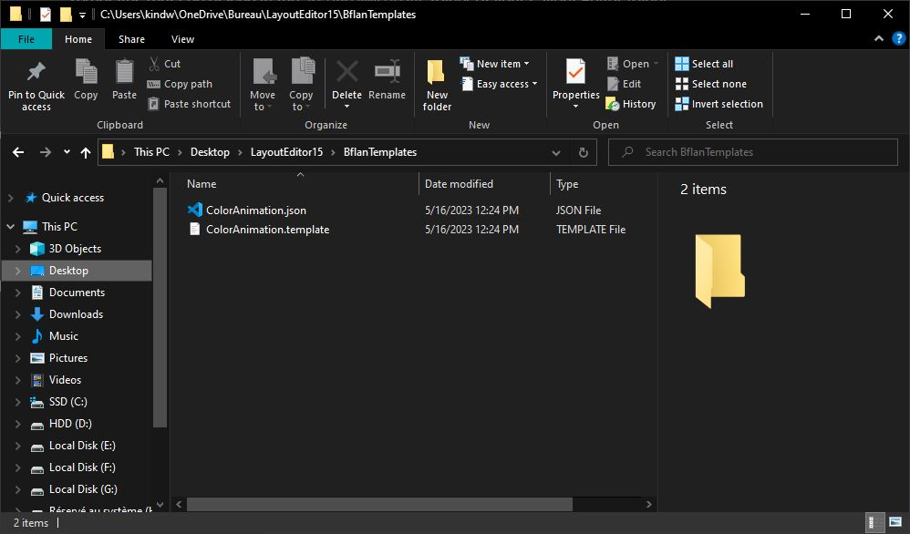
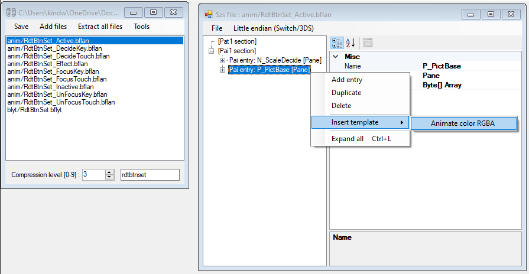
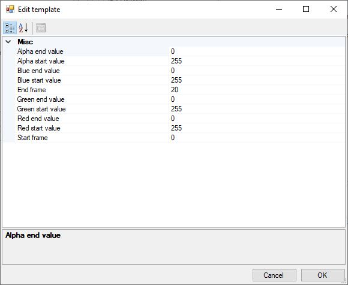
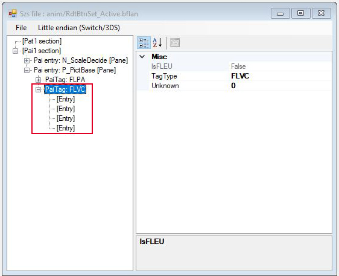
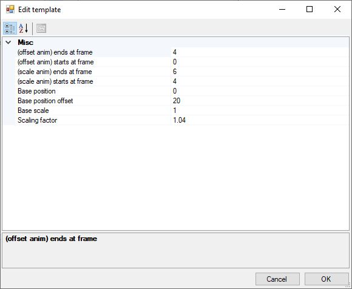
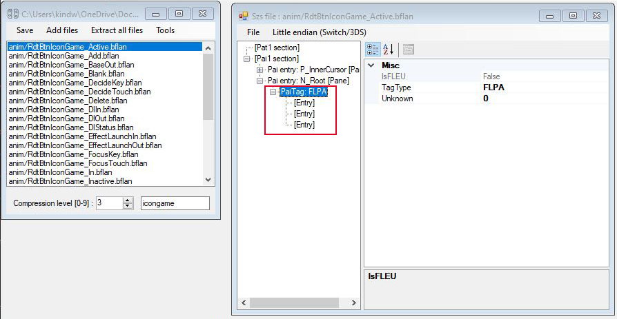
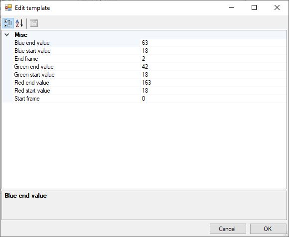
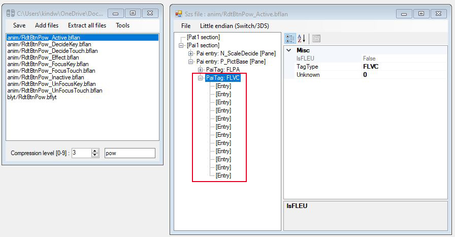
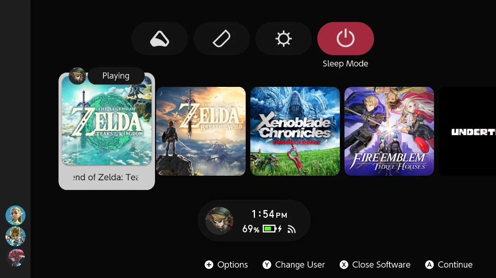

#####  [Volver a Animaciones: tutorial principal](main-tutorial.md)

# Animaciones: plantillas bflan
---

La versión 15 del Editor de Diseño ha introducido plantillas definidas por el usuario, una adición muy conveniente que tiene como objetivo acelerar el proceso de creación de animaciones, que puede ser muy tedioso en algunos casos específicos. Estas plantillas son especialmente útiles si deseas realizar animaciones basadas en colores o tienes múltiples ocurrencias de la misma animación dentro de tu tema.

!!! info
        Las plantillas `.bflan` no se implementaron en las versiones anteriores del Editor de Diseño. Asegúrate de obtener la última versión.

!!! cite "¡Echa un vistazo a las tablas!"
        En el tutorial principal nos centramos en crear animaciones de escala que solo involucraban `FLPA` `PaiTag`s y dos valores específicos de `AnimationTarget`. Aquí iremos más lejos usando `FLVC` y diferentes valores de `AnimationTarget`. Puede que quieras consultar las siguientes tablas y tenerlas cerca mientras lees esta sección.

        - **[AnimationTargets y PaiTags](./paitags-and-targets.md) **

## ¿Cómo funciona?

En lugar de agregar manualmente entradas dentro de archivos `.bflan` como lo hicimos en el tutorial principal, podemos automatizar la operación escribiendo plantillas en su lugar. Puede que no sea relevante para ajustes menores, pero comienza a ser bastante necesario para tareas más grandes y repetitivas.

Cada plantilla viene como un par de dos archivos:

- un archivo `.template` que define la animación real
- un descriptor `.json` que implementa el archivo `.template` y define propiedades y variables destinadas a ser utilizadas dentro del archivo `.template`

Las plantillas deben colocarse en la carpeta `BflanTemplates` de tu carpeta del Editor de Diseño.



Para comprender mejor, aquí está la plantilla que proporciona la versión 15 por defecto:


- `ColorAnimation.template`
```
[
  {
    "Unknown": 0,
    "TagType": "FLVC",
    "Entries": [
      {
        "Index": 0,
        "AnimationTarget": 0,
        "DataType": 2,
        "KeyFrames": [
          { "Frame": %START_FRAME%, "Value": %RED_START_VAL%, "Blend": 0 },
          { "Frame": %END_FRAME%, "Value": %RED_END_VAL%, "Blend": 0 }
        ],
        "FLEUUnknownInt": 0,
        "FLEUEntryName": ""
      },
	  {
        "Index": 0,
        "AnimationTarget": 4,
        "DataType": 2,
        "KeyFrames": [
          { "Frame": %START_FRAME%, "Value": %RED_START_VAL%, "Blend": 0 },
          { "Frame": %END_FRAME%, "Value": %RED_END_VAL%, "Blend": 0 }
        ],
        "FLEUUnknownInt": 0,
        "FLEUEntryName": ""
      },
	  ...
]
```

- `ColorAnimation.json`
```json
{
  "Name": "Animate color RGBA",
  "FileName": "ColorAnimation.template",
  "Target": "PaiEntry",
  "Parameters": [
    {
      "Kind": "Int",
      "Name": "Start frame",
      "Default": "0",
      "Keyword": "%START_FRAME%"
    },
    {
      "Kind": "Int",
      "Name": "End frame",
      "Default": "20",
      "Keyword": "%END_FRAME%"
    },
    ...

  ]
}
```

En este punto, espero que veas lo poderoso que es: puedes escribir toda tu animación a mano en lugar de tener que hacer operaciones una por una a través de la interfaz gráfica de usuario del Editor de Diseño. De hecho, `AnimationTarget` y `KeyFrames` están todos definidos dentro de `ColorAnimation.template`, y se utilizan parámetros (por ejemplo, `%START_FRAME%`, `%RED_START_VAL%`, etc.) para almacenar los valores de entrada.

Sin embargo, no descartaremos el Editor de Diseño, las plantillas están destinadas a ser utilizadas con él, esa es la característica principal de la versión 15. Para cargar plantillas, abre un archivo `.bflan` y simplemente haz clic derecho en la entrada `[Pane]` deseada y pasa el mouse sobre `Insertar plantilla`. Esto mostrará una lista desplegable que contiene tus plantillas, en este caso `Animar color RGBA` según el `FileName` en el descriptor `.json`. Selecciona tu plantilla.



Se abrirá una nueva ventana, que contiene entradas que reflejan lo que se define en `ColorAnimation.template`. Los valores allí son editables.



Haz tus ajustes si es necesario, confirma y tu animación debería crearse.



Veremos ejemplos más detallados en las siguientes secciones.

## 1er ejemplo: un patrón de animación

Digamos que quiero animar los iconos de mis juegos. Quiero que esta animación se aplique a los iconos de los juegos tanto en `ResidentMenu.szs` (pantalla de inicio) como en `Flaunch.szs` (todas las aplicaciones), pero no quiero pasar por el mismo proceso exacto de crear entradas manualmente dentro del `.bflyt` varias veces. Ahí es donde entran en juego las plantillas.

Elegiré intencionalmente un patrón de animación "complejo" para que realmente veamos lo convenientes que son las plantillas.

Así es como quiero configurarlo:

- el icono debería subir `20px` con respecto a su posición base, tomando `4` cuadros
- luego el icono debería *entonces* escalar con un factor de `1.04`, tomando `2` cuadros

Por lo tanto, necesitaremos usar los siguientes valores de `PaiTag` y `AnimationTarget`:

```
📜RdtBtnIconGame_Active.bflan (ResidentMenu.szs)
 ┣ PaiTag: FLPA
   ┗ AnimationTarget: 1 (y-axis position)
   ┗ AnimationTarget: 6 (x-axis scale)
   ┗ AnimationTarget: 7 (y-axis scale) 
```

```
📜FlcBtnIconGame_Active.bflan (Flauncher.szs)
 ┣ PaiTag: FLPA
   ┗ AnimationTarget: 1 (y-axis position)
   ┗ AnimationTarget: 6 (x-axis scale)
   ┗ AnimationTarget: 7 (y-axis scale) 
```

Así es como se ve la plantilla:

- **`gameIcon.template`**
```
[
  {
    "Unknown": 0,
    "TagType": "FLPA",
    "Entries": [
      {
        "Index": 0,
        "AnimationTarget": 1,
        "DataType": 2,
        "KeyFrames": [
          { "Frame": %START_FRAME_POSITION%, "Value": %BASE_POSITION%, "Blend": 0 },
          { "Frame": %END_FRAME_POSITION%, "Value": %POSITION_OFFSET%, "Blend": 0 }
        ],
        "FLEUUnknownInt": 0,
        "FLEUEntryName": ""
      },
      {
        "Index": 0,
        "AnimationTarget": 6,
        "DataType": 2,
        "KeyFrames": [
          { "Frame": %START_FRAME_SCALE%, "Value": %BASE_SCALE%, "Blend": 0 },
          { "Frame": %END_FRAME_SCALE%, "Value": %SCALE_FACTOR%, "Blend": 0 }
        ],
        "FLEUUnknownInt": 0,
        "FLEUEntryName": ""
      },
      {
        "Index": 0,
        "AnimationTarget": 7,
        "DataType": 2,
        "KeyFrames": [
          { "Frame": %START_FRAME_SCALE%, "Value": %BASE_SCALE%, "Blend": 0 },
          { "Frame": %END_FRAME_SCALE%, "Value": %SCALE_FACTOR%, "Blend": 0 }
        ],
        "FLEUUnknownInt": 0,
        "FLEUEntryName": ""
      }
    ]
  }
]
```

- **`gameIcon.json`**
```json
{
  "Name": "Game icon animation",
  "FileName": "gameIcon.template",
  "Target": "PaiEntry",
  "Parameters": [
    {
      "Kind": "Int",
      "Name": "(offset anim) starts at frame",
      "Default": "0",
      "Keyword": "%START_FRAME_POSITION%"
    },
    {
      "Kind": "Int",
      "Name": "(offset anim) ends at frame",
      "Default": "4",
      "Keyword": "%END_FRAME_POSITION%"
    },
    {
      "Kind": "Int",
      "Name": "(scale anim) starts at frame",
      "Default": "4",
      "Keyword": "%START_FRAME_SCALE%"
    },
    {
      "Kind": "Int",
      "Name": "(scale anim) ends at frame",
      "Default": "6",
      "Keyword": "%END_FRAME_SCALE%"
    },
    {
      "Kind": "Int",
      "Name": "Base position",
      "Default": "0",
      "Keyword": "%BASE_POSITION%"
    },
    {
      "Kind": "Int",
      "Name": "Base position offset",
      "Default": "20",
      "Keyword": "%POSITION_OFFSET%"
    },
    {
      "Kind": "Int",
      "Name": "Base scale",
      "Default": "1",
      "Keyword": "%BASE_SCALE%"
    },
    {
      "Kind": "Float",
      "Name": "Scaling factor",
      "Default": "1.04",
      "Keyword": "%SCALE_FACTOR%"
    }
  ]
}
```

Toma estos como principios generales:

- Todos los valores de interés (es decir, que determinarán cómo se ve realmente la animación) se almacenan en parámetros: `%START_FRAME_POSITION%`, `%END_FRAME_POSITION%`, `%START_FRAME_SCALE%`, `%END_FRAME_SCALE%`, `%BASE_POSITION%`, `%POSITION_OFFSET%`, `%BASE_SCALE%`, `%SCALE_FACTOR%`
- En el descriptor `.json`, el tipo de valor de los parámetros (especificado por `Kind`) debe definirse en consecuencia: `Int` (entero), `Float` (número real), `String` (texto)
- Cada parámetro definido dentro del archivo `.template` tiene su propia entrada en el descriptor `.json`. Por ejemplo:
    - **`%SCALE_FACTOR%`** 

        ```json
        {
          "Kind": "Float",
          "Name": "Scaling factor",
          "Default": "1.04",
          "Keyword": "%SCALE_FACTOR%"
        }
        ```

!!! tip
    - Mi recomendación personal es escribir primero el archivo `.template` para que puedas configurar correctamente tus parámetros en el archivo `.json` después.
    - Puedes nombrar los parámetros según tu conveniencia, simplemente enciérralos con símbolos `%`.
    - Agregar más fotogramas clave es posible simplemente expandiendo la matriz `KeyFrames` para el `AnimationTarget` de tu elección dentro del archivo `.template`:

        ```
        { "Frame": %FRAME_ONE%, "Value": %VALUE_ONE%, "Blend": 0 },
        { "Frame": %FRAME_TWO%, "Value": %VALUE_TWO%, "Blend": 0 },
        { "Frame": %FRAME_THREE%, "Value": %VALUE_THREE%, "Blend": 0 },
        { "Frame": %FRAME_FOUR%, "Value": %VALUE_FOUR%, "Blend": 0 },
        ...
        ```

Podemos proceder cargando esta nueva plantilla en el Editor de Diseño y finalmente probándola en la consola. Agregaré este patrón de animación a `RdtBtnIconGame_Active.bflan` y `FlcBtnIconGame_Active.bflan` desde `ResidentMenu.szs` y `Flauncher.szs` respectivamente.





## 2do ejemplo: animaciones basadas en color

!!! info
        Para obtener más detalles sobre los colores, consulta la siguiente sección:
        
        - **[PaiTags y Targets - FLVC (Color de vértice)](paitags-and-targets.md#flvc-vertex-color) **

En este punto, sabes casi todo sobre las plantillas `.bflan`. En esta sección solo te mostraré cómo se aplican a animaciones basadas en color.

Digamos que quiero cambiar el color de fondo del botón de Modo de Suspensión del menú principal cuando está seleccionado. Así es como elijo configurar esta animación:

- el fondo transita desde `rgb(18, 18, 18)` (gris oscuro) hasta `rgb(163, 42, 63)` (rojo carmesí)
- la duración de la transición es de `2` cuadros

Esta vez, los `PaiTag` y `AnimationTarget` son los siguientes:


```
📜RdtBtnPow_Active.bflan (ResidentMenu.szs)
 ┣ PaiTag: FLVC
   ┗ AnimationTarget: 0 (red, top left)
   ┗ AnimationTarget: 1 (green, top left)
   ┗ AnimationTarget: 2 (blue, top left)
   ┗ AnimationTarget: 4 (red, top right)
   ┗ AnimationTarget: 5 (green, top right)
   ┗ AnimationTarget: 6 (blue, top right) 
   ┗ AnimationTarget: 8 (red, bottom left)
   ┗ AnimationTarget: 9 (green, bottom left)
   ┗ AnimationTarget: 10 (blue, bottom left) 
   ┗ AnimationTarget: 12 (red, bottom right)
   ┗ AnimationTarget: 13 (green, bottom right)
   ┗ AnimationTarget: 14 (blue, bottom right) 
```

!!! info
    Puede que notes que faltan `AnimationTarget` = `3`, `7`, `11`, `15`. Estos valores se utilizan para la transparencia, lo cual no me interesa aquí. Consulta las [tablas](./paitags-and-targets.md) para obtener más detalles.

Haremos algunos ajustes a la plantilla preconfigurada que proporciona por defecto el Editor de Diseño 15:

- **`ColorAnimation.template`**
```
[
  {
    "Unknown": 0,
    "TagType": "FLVC",
    "Entries": [
      {
        "Index": 0,
        "AnimationTarget": 0,
        "DataType": 2,
        "KeyFrames": [
          { "Frame": %START_FRAME%, "Value": %RED_START_VAL%, "Blend": 0 },
          { "Frame": %END_FRAME%, "Value": %RED_END_VAL%, "Blend": 0 }
        ],
        "FLEUUnknownInt": 0,
        "FLEUEntryName": ""
      },
      {
        "Index": 0,
        "AnimationTarget": 1,
        "DataType": 2,
        "KeyFrames": [
          { "Frame": %START_FRAME%, "Value": %GREEN_START_VAL%, "Blend": 0 },
          { "Frame": %END_FRAME%, "Value": %GREEN_END_VAL%, "Blend": 0 }
        ],
        "FLEUUnknownInt": 0,
        "FLEUEntryName": ""
      },
      {
        "Index": 0,
        "AnimationTarget": 2,
        "DataType": 2,
        "KeyFrames": [
          { "Frame": %START_FRAME%, "Value": %BLUE_START_VAL%, "Blend": 0 },
          { "Frame": %END_FRAME%, "Value": %BLUE_END_VAL%, "Blend": 0 }
        ],
        "FLEUUnknownInt": 0,
        "FLEUEntryName": ""
      },
	    {
        "Index": 0,
        "AnimationTarget": 4,
        "DataType": 2,
        "KeyFrames": [
          { "Frame": %START_FRAME%, "Value": %RED_START_VAL%, "Blend": 0 },
          { "Frame": %END_FRAME%, "Value": %RED_END_VAL%, "Blend": 0 }
        ],
        "FLEUUnknownInt": 0,
        "FLEUEntryName": ""
      },
      {
        "Index": 0,
        "AnimationTarget": 5,
        "DataType": 2,
        "KeyFrames": [
          { "Frame": %START_FRAME%, "Value": %GREEN_START_VAL%, "Blend": 0 },
          { "Frame": %END_FRAME%, "Value": %GREEN_END_VAL%, "Blend": 0 }
        ],
        "FLEUUnknownInt": 0,
        "FLEUEntryName": ""
      },
      {
        "Index": 0,
        "AnimationTarget": 6,
        "DataType": 2,
        "KeyFrames": [
          { "Frame": %START_FRAME%, "Value": %BLUE_START_VAL%, "Blend": 0 },
          { "Frame": %END_FRAME%, "Value": %BLUE_END_VAL%, "Blend": 0 }
        ],
        "FLEUUnknownInt": 0,
        "FLEUEntryName": ""
      },
	    {
        "Index": 0,
        "AnimationTarget": 8,
        "DataType": 2,
        "KeyFrames": [
          { "Frame": %START_FRAME%, "Value": %RED_START_VAL%, "Blend": 0 },
          { "Frame": %END_FRAME%, "Value": %RED_END_VAL%, "Blend": 0 }
        ],
        "FLEUUnknownInt": 0,
        "FLEUEntryName": ""
      },
      {
        "Index": 0,
        "AnimationTarget": 9,
        "DataType": 2,
        "KeyFrames": [
          { "Frame": %START_FRAME%, "Value": %GREEN_START_VAL%, "Blend": 0 },
          { "Frame": %END_FRAME%, "Value": %GREEN_END_VAL%, "Blend": 0 }
        ],
        "FLEUUnknownInt": 0,
        "FLEUEntryName": ""
      },
      {
        "Index": 0,
        "AnimationTarget": 10,
        "DataType": 2,
        "KeyFrames": [
          { "Frame": %START_FRAME%, "Value": %BLUE_START_VAL%, "Blend": 0 },
          { "Frame": %END_FRAME%, "Value": %BLUE_END_VAL%, "Blend": 0 }
        ],
        "FLEUUnknownInt": 0,
        "FLEUEntryName": ""
      },
	    {
        "Index": 0,
        "AnimationTarget": 12,
        "DataType": 2,
        "KeyFrames": [
          { "Frame": %START_FRAME%, "Value": %RED_START_VAL%, "Blend": 0 },
          { "Frame": %END_FRAME%, "Value": %RED_END_VAL%, "Blend": 0 }
        ],
        "FLEUUnknownInt": 0,
        "FLEUEntryName": ""
      },
            {
        "Index": 0,
        "AnimationTarget": 13,
        "DataType": 2,
        "KeyFrames": [
          { "Frame": %START_FRAME%, "Value": %GREEN_START_VAL%, "Blend": 0 },
          { "Frame": %END_FRAME%, "Value": %GREEN_END_VAL%, "Blend": 0 }
        ],
        "FLEUUnknownInt": 0,
        "FLEUEntryName": ""
      },
      {
        "Index": 0,
        "AnimationTarget": 14,
        "DataType": 2,
        "KeyFrames": [
          { "Frame": %START_FRAME%, "Value": %BLUE_START_VAL%, "Blend": 0 },
          { "Frame": %END_FRAME%, "Value": %BLUE_END_VAL%, "Blend": 0 }
        ],
        "FLEUUnknownInt": 0,
        "FLEUEntryName": ""
      }
    ]
  }
]
```

- **`ColorAnimation.json`**
```json
{
  "Name": "Animate color RGBA",
  "FileName": "ColorAnimation.template",
  "Target": "PaiEntry",
  "Parameters": [
    {
      "Kind": "Int",
      "Name": "Start frame",
      "Default": "0",
      "Keyword": "%START_FRAME%"
    },
    {
      "Kind": "Int",
      "Name": "End frame",
      "Default": "2",
      "Keyword": "%END_FRAME%"
    },
    {
      "Kind": "Int",
      "Name": "Red start value",
      "Default": "18",
      "Keyword": "%RED_START_VAL%"
    },
    {
      "Kind": "Int",
      "Name": "Red end value",
      "Default": "163",
      "Keyword": "%RED_END_VAL%"
    },
    {
      "Kind": "Int",
      "Name": "Green start value",
      "Default": "18",
      "Keyword": "%GREEN_START_VAL%"
    },
    {
      "Kind": "Int",
      "Name": "Green end value",
      "Default": "42",
      "Keyword": "%GREEN_END_VAL%"
    },
    {
      "Kind": "Int",
      "Name": "Blue start value",
      "Default": "18",
      "Keyword": "%BLUE_START_VAL%"
    },
    {
      "Kind": "Int",
      "Name": "Blue end value",
      "Default": "63",
      "Keyword": "%BLUE_END_VAL%"
    }
  ]
}
```





Esta plantilla se ha utilizado para crear **[Unison R](https://themezer.net/packs/Unison-R-5fc)**, así es como se ve (con *algunos* aspectos estéticos agregados pero la parte de cambio de color sigue siendo la misma)



!!! cite "Acerca del Editor de Diseño y animaciones de color"
    Antes del lanzamiento del Editor de Diseño versión 15, hacer animaciones basadas en color era tedioso debido a cómo se manejan los colores de los elementos de la interfaz de usuario, y para las animaciones en particular no hay opción para colores hexadecimales. Cada esquina de un panel (como en esquinas reales: arriba a la izquierda, arriba a la derecha, abajo a la izquierda, abajo a la derecha) tiene sus componentes RGBA únicos y el correspondiente `AnimationTarget`, lo que significa que necesitábamos *agregar manualmente* no menos de **12 entradas** al archivo `.bflan` solo para cambiar el color de un panel (sin tener en cuenta la transparencia), lo que obviamente no es muy eficiente en términos de tiempo. Como probablemente puedas ver, las plantillas facilitan enormemente esta tarea.

## Definiendo objetivos

Según [código fuente del Editor de Diseño](https://github.com/FuryBaguette/SwitchLayoutEditor/blob/master/BflytPreview/Automation/BflanTemplates.cs), también puedes usar plantillas `.bflan` para agregar paneles a la sección `Pai1`, agregando aún más automatización al proceso. Personalmente no lo he probado, pero siéntete libre de experimentar y compartir tus plantillas.

# [Continuar con Animaciones: extras](going-further.md) 
