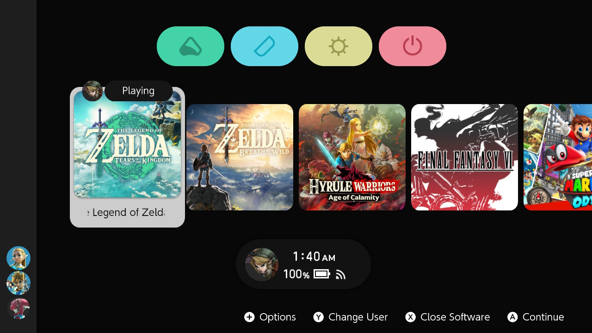

##### :octicons-arrow-left-16: [Volver a Tipos de Archivo](../filetypes.md)

# Creando animaciones personalizadas para tus temas de NX
_Escrito por [Capybara](https://themezer.net/creators/382997176307154945), revisado por Migush. Última actualización: junio de 2023_

---

!!! info
      Aunque esta guía proporciona una cantidad razonable de información sobre animaciones, siempre hay espacio para recursos adicionales ya que las cosas aún no están completamente documentadas. Siéntete libre de contribuir ya sea [enviando una solicitud de extracción en GitHub](https://github.com/ThemezerNX/LayoutDocs) o simplemente comunicándote con el [Discord de Themezer](https://discord.com/invite/nnm8wyM).

## Introducción

En este tutorial, veremos cómo implementar animaciones personalizadas para temas de NX. Este no es un tema trivial y espero que tengas conocimientos mínimos sobre cómo está organizada la interfaz de usuario de la consola, cómo funcionan los diseños y cómo usar Switch Theme Injector. Todos los conceptos básicos deberían estar cubiertos en las secciones anteriores de LayoutDocs.

Podemos distinguir dos tipos "principales" de animaciones:

- Animaciones realizadas utilizando las **3 transformaciones básicas: traslación (desplazamiento lineal), escalado y rotación**. Suena bastante minimalista, pero de hecho, puedes lograr prácticamente cualquier cosa con estas, al final depende de tu propia creatividad.
- Animaciones basadas en color, que también incluyen transparencia.

Hay algunos tipos más, pero por razones pedagógicas, elaboraré sobre el proceso de creación de animaciones pasando por un ejemplo fácil. En caso de que quieras ampliar tus posibilidades, más adelante en este tutorial se proporcionará documentación adicional y tablas con los valores que necesitarás, para que puedas probarlos por ti mismo.

Puedes echar un vistazo a [mi perfil en Themezer](https://themezer.net/creators/382997176307154945) para ver ejemplos. Si quieres presenciar el tema en su máximo potencial, es posible que quieras ver el trabajo de [NSX](https://www.youtube.com/channel/UCtvgkpsXAGp0P3dJr6buxRg). La mayoría de sus temas aún funcionan en el firmware 15.x (también deberían en 16.x), pero algunos podrían tener problemas y es probable que no se actualicen ya que NSX lamentablemente ya no está activo en la escena.

|                                                                               |                                                                                                                                                     |
|:----------------------------------------------------------------------------------------------------------------------------:|:------------------------------------------------------------------------------------------------------------------------------------------------------------------------------------------------------------:|
|                                                    **Mod AnimNX** por NSX                                                   |                                                                     **[Unison R](https://themezer.net/packs/Unison-R-5fc)** por mí                                                                    |
| El cursor cambia de forma en una animación en bucle, animación de crecimiento en iconos de juegos y applets al pasar el ratón, entre otras características | Desbloquear la consola en la pantalla de inicio desencadena una animación de zoom out + fade in, animación de caída para los títulos de juegos, botones que cambian de color al pasar el ratón, entre otras características |

## Requisitos

- Como mencioné, es obligatorio tener un conocimiento mínimo sobre los diseños. Asegúrate de leer **cuidadosamente** la documentación que se encuentra en [LayoutDocs](https://layoutdocs.themezer.net/) antes de continuar. Aunque haré un repaso rápido, sería demasiado largo elaborar más sobre esos temas aquí.

- Windows 10 o 11

- [Switch Theme Injector + NXTheme Installer](https://github.com/exelix11/SwitchThemeInjector/releases) para compilar e instalar tu tema

- [Switch Layout Editor release 15](https://github.com/FuryBaguette/SwitchLayoutEditor) para hacer animaciones y verificar los archivos de la consola

- Un editor de texto. Se recomienda altamente [Visual Studio Code](https://code.visualstudio.com/download).

Asegúrate de descargar la última versión de cada software mencionado anteriormente.

## Estructura de la guía

Aquí está la estructura general de esta guía:

- **Parte de introducción:** presentación de las animaciones y un breve repaso sobre los archivos de Nintendo Switch

- **Tutorial principal:** proceso de creación de animaciones

- **Extras:** 
    - **Plantillas de animación:** agilizar el proceso, hacer animaciones basadas en color
    - **Más sobre animaciones:** notas adicionales, animaciones en bucle, fondos animados
    - **Tablas:** para experimentar más y ampliar las posibilidades de animación

# [Continuar con Animaciones: repaso del curso](refresher.md) :octicons-arrow-right-16:

---

## Agradecimientos especiales

- exelix y Migush por todos los consejos
- Zhi por la parte de pruebas de fondos animados
- Todos los contribuyentes de la escena de modificación de Nintendo Switch

## Guías adicionales

Echa un vistazo a estas guías para obtener más información sobre cómo crear animaciones:

- [Esta guía de herramientas](https://github.com/KillzXGaming/Switch-Toolbox/wiki/BFLYT-Editing#animations) muestra cómo puedes crear animaciones.
- [Esta guía](https://www.reddit.com/r/NXThemes/comments/biu5hc/making_your_own_custom_animations/) muestra cómo tienes que implementar los grupos para que las animaciones funcionen con el Switch Theme Injector
-   [Hacer tus propias animaciones personalizadas](https://www.reddit.com/r/NXThemes/comments/biu5hc/making_your_own_custom_animations/)
-   [Importar animaciones a tu propio diseño desde otro tema](https://www.reddit.com/r/NXThemes/comments/biti3d/importing_animations_to_your_own_layout_from/)
-   [Importar animaciones usando el SwitchLayoutEditor](https://www.reddit.com/r/NXThemes/comments/bkb5ix/importing_animations_using_the_layout_editor/)
- [Guía de temas de Zhi's Patterns](https://github.com/ElGatoFiestero/PatternsTraducido/blob/main/PatternsTraducido.md): un enfoque específico sobre fondos animados
