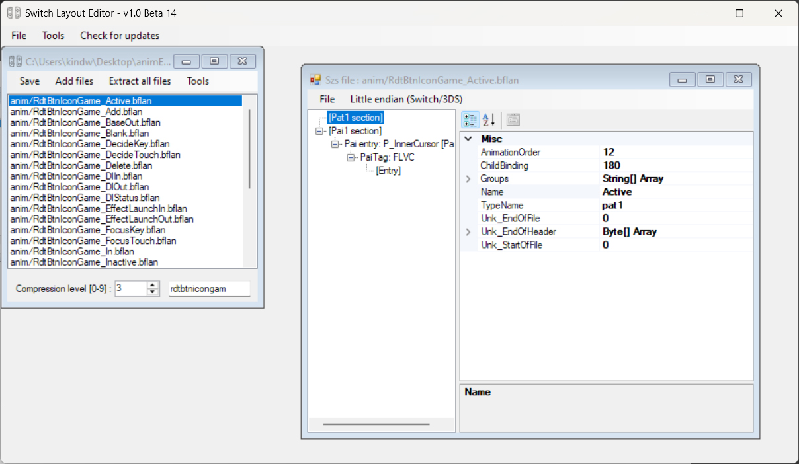
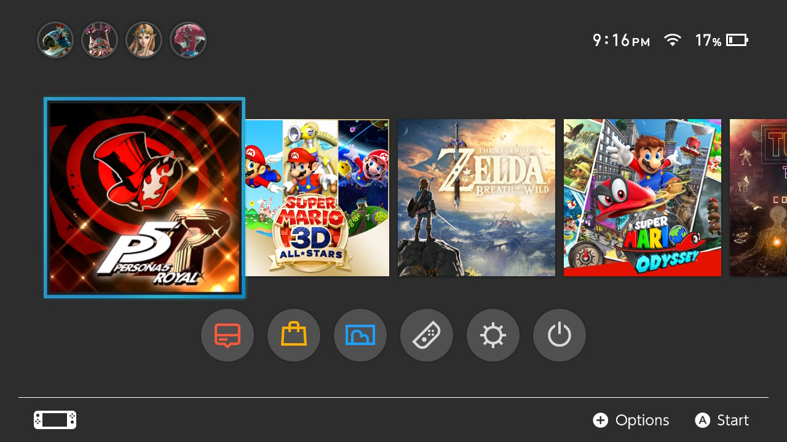
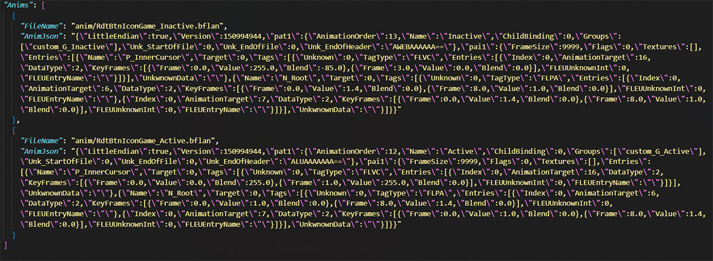

#####  [Volver a Animaciones: curso de repaso](refresher.md)

# Animaciones: Tutorial principal
---

## Nuestro objetivo

A partir de ahora, me centraré únicamente en crear una animación para los iconos de los juegos en la pantalla de inicio. **Quiero que esos iconos se escalen cuando se seleccionan y que se escalen a su tamaño inicial cuando el cursor se aleja. Este será nuestro objetivo en toda esta sección del tutorial.** Como mencioné en la sección de introducción, más adelante se proporcionarán tablas si quieres experimentar más y hacer animaciones más exóticas.

## Organización de nuestro flujo de trabajo

Para hacer un seguimiento de lo que estamos haciendo, primero configuraremos correctamente nuestro espacio de trabajo. Aquí sugiero una jerarquía de directorios que hace que mi propio flujo de trabajo sea lo suficientemente eficiente, pero puedes hacer lo que quieras a medida que te acostumbres a saber lo que estás haciendo.

**1-**

Crea un directorio en tu escritorio y llámalo `animEdit`.

**2-**

Ve a `themes/systemData` en la tarjeta SD de tu Switch. Como estoy interesado en editar la pantalla de inicio para este ejemplo, solo tomaré `ResidentMenu.szs`.

**3-**

Copia `ResidentMenu.szs`, pégalo en tu escritorio y en `Escritorio/animEdit`.

|  |  |
|---------------------------------------|-----------------------------------------------|
| `Escritorio/`                            | `Escritorio/animEdit`                            |

Recuerda, necesitaremos un `.szs` vainilla y una copia de él que editaremos, para que podamos diferenciarlos al final. Aquí, el de escritorio permanecerá vainilla, así que editaremos el que está en `Escritorio/animEdit`.

## Proceso de creación de la animación

**4-**

Abre Layout Editor y carga `animEdit/ResidentMenu.szs`. Simplemente arrastra y suelta el archivo en la ventana. Se abrirá una pequeña ventana que lista todos los archivos contenidos en el archivo `.szs`.

**5-**

Primero, crearemos la animación de escalado hacia arriba cuando el icono del juego está **seleccionado**. En la ventana de la caja, busca `RdtBtnIconGame_Active.bflan` y ábrelo haciendo doble clic. Se abrirá una nueva ventana. En esta ventana, expande todos los elementos haciendo clic en los iconos `+`.

A la izquierda se enumeran *algunos* paneles contenidos en `RdtBtnIconGame.bflyt` (en realidad, solo uno en este caso, que es `P_InnerCursor`). Dependiendo de lo que queramos lograr, probablemente necesitaremos agregar más paneles a esta lista. Ese será el caso aquí para nuestro ejemplo.

A la derecha se muestran elementos que se utilizan para definir el comportamiento de la animación. No te preocupes, solo necesitaremos editar algunos de ellos.

Ahora, me disculpo de antemano, pero necesitarás seguir mis instrucciones a ciegas... por ahora. Explicaré algunas de ellas a lo largo de esta sección.

**6-**

En el panel izquierdo, haz clic en la primera entrada, `Sección Pat1`. Luego, en el panel derecho,

- Configura `AnimationBinding` en `0`

- Expande la entrada `Groups` haciendo clic en la flecha izquierda y establece el campo `[0]` en `custom_G_Active` (el valor no es relevante aquí, así que en realidad puede ser cualquier cosa).

- En el panel izquierdo, haz clic en la segunda entrada, `Sección Pai1` y establece el `FrameSize` en `9999`.

!!! warning
      Este 6º paso es una configuración recurrente que siempre debe realizarse para crear **cualquier tipo de animación**, independientemente de nuestro objetivo actual.

Si has hecho todo correctamente, debería verse así.

|  |  |
|-------------------------------------------|-------------------------------------------|
| `Sección Pat1`                            | `Sección Pai1`                            |

      
Ahora, sobre la creación de nuestra animación real, lo haremos editando el panel `N_Root` de `RdtBtnIconGame.bflyt`, lo que significa agregar una entrada a la lista de paneles.

!!! tip
      Si estás familiarizado con el tema de los temas, `N_Root` es el panel que básicamente contiene todos los demás dentro del archivo `.bflyt`. Por lo tanto, aquí no nos molestaremos y animaremos todo (incluido el texto, el cursor, etc.). Pero puedes ser más específico y animar, por ejemplo, solo el texto del título del juego. En este caso particular, agregarías la entrada `L_Balloon` en su lugar.

**7-**

Para agregar el panel `N_Root` a la lista, haz clic izquierdo Y LUEGO clic derecho en la sección `Pai1` (de lo contrario, te encontrarás con un comportamiento inesperado). Selecciona la opción `Add Entry`. El panel izquierdo debería actualizarse con el nuevo elemento agregado al final de la lista. Haz clic en él y renómbralo como `N_Root` en el panel derecho.

| ") | ") |
|-----------------------------------------------------|-----------------------------------------------------|
| Añadiendo un panel (1)                               | Añadiendo un panel (2)                               |

**8-**

Haz clic derecho en `N_Root` en la lista de paneles y selecciona `Add Entry`. Expande el panel `N_Root` y renombra la entrada `PaiTag` como `FLPA`. Luego, nuevamente, agrega *2 sub-entradas* a la entrada `FLPA`.

Ahora, los siguientes pasos definirán la animación de escalado que queremos lograr.

**9-**

Bajo `FLPA`, selecciona el primer `[Entry]`. El panel derecho mostrará otro conjunto de valores. Algunos de ellos realmente importarán, así que ten en cuenta estos,

- `AnimationTarget` es el tipo de animación que elegimos asignar a nuestro panel. Básicamente, aquí es donde le decimos al panel que se escale hacia arriba o hacia abajo, se traduzca a lo largo del eje x o del eje y, o rote alrededor del eje z en el sentido de las agujas del reloj o en sentido contrario. Más adelante, aquí es donde podrías estar interesado en consultar las tablas para probar los valores asociados con otros tipos de animaciones.

- `KeyFrames` es... autoexplicativo, supongo. Esto nos permite desglosar nuestra animación en key frames correctamente definidos.
    
- `DataType` se refiere al tipo de nuestras entradas en el campo `KeyFrames`. **Solo ten en cuenta que siempre debe establecerse en `2`** (significa `float`). Aunque no es realmente relevante aquí, puedes seguir [este enlace](/docs/guide/layouts/usd-sections.md) si quieres saber un poco más.

**10-**

Definiremos nuestros valores de la siguiente manera,

- `AnimationTarget` = `6`

- `DataType` = `2`

Deja el resto sin cambios. El valor `6` para `AnimationTarget` significa *"escalar a lo largo del eje x"* (horizontalmente).

**11-**

Selecciona el elemento `KeyFrames` y haz clic en el botón de puntos que aparece. Se abrirá una nueva ventana en la que podemos agregar nuestros key frames usando los botones `Add` / `Remove` en la parte inferior. Hazlo como se muestra a continuación.

")

Así es como deberías leer esto: en el fotograma `0`, el valor es `1`, lo que significa que en el fotograma inicial, el panel `N_Root` mantendrá su proporción base **a lo largo de su eje horizontal**. Luego, **hasta el fotograma `8`**, el panel se escalará *progresivamente* hasta alcanzar un factor `1.4`.

!!! tip
      Ten en cuenta que definimos anteriormente el `FrameSize` en `9999` en la sección `Pai1`. Estamos bien siempre que este valor sea superior al valor máximo de `Keyframe`, que es `8` aquí.
      

!!! cite "Valor de mezcla"
      `Blend` se refiere a la pendiente de la función (como en función matemática) que guía la animación. En términos simples, condiciona el ritmo al que un panel viajará de un fotograma a otro. Dado que los valores de `Blend` no están documentados y son difíciles de entender, no me molestaré en absoluto por ellos. Personalmente, siempre establezco este valor en `0`, lo que parece representar una función lineal, pero siéntete libre de experimentar (y tal vez contribuir a esta guía).

**12-**

Repite los pasos 9, 10 y 11 para el segundo `[Entry]` bajo `FLPA`, pero el valor de `AnimationTarget` debería ser `7` aquí en lugar de `6`, lo que significa *"escalar a lo largo del eje y"* (verticalmente).

Ahora, con todos estos pasos, hemos creado con éxito una animación de escalado cuando el ícono del juego está **seleccionado**. Pero ¿qué pasa cuando el ícono está **deseleccionado**? Bueno, la interfaz de usuario de Switch también nos ofrece la posibilidad de manipular eso. Si no se hace, el ícono realmente mantendrá su factor de `1.4` **incluso después de ser deseleccionado**. Entonces, si queremos hacer las cosas correctamente, lo que sigue es casi obligatorio. Así que, de vuelta al punto de partida,

**13-**

Vuelve a la pequeña ventana que lista el contenido del archivo `.szs` y busca `RdtBtnIconGame_Inactive.bflan`. Abre este archivo y repite todos los pasos anteriores a partir del paso 6. **En el paso 6.b., cambia el valor `[0]` a `custom_G_Inactive`** (en realidad no importa, pero es por conveniencia). Para la animación, haremos las cosas al revés, por lo que el paso 12 debería verse así.

")

De esta manera, el ícono del juego se reducirá a su tamaño inicial cuando se deseleccione.

Ahora, hay una última cosa que debemos hacer antes de diferenciar, **agregar grupos**. Más precisamente, agregar grupos al archivo `RdtBtnIconGame.bflyt` en este caso. Esto es necesario para 1) evitar bloqueos que probablemente ocurran sin hacerlo, y 2) ordenar al `.bflyt` que no siga su animación original. Básicamente, necesitamos crear un grupo para cada `.bflan` que hayamos modificado, es decir, `RdtBtnIconGame_Active.bflan` y `RdtBtnIconGame_Inactive.bflan`.

**14-**

Vuelve a la ventana de la caja `.szs` y abre `RdtBtnIconGame.bflyt`. No te preocupes por el área gris a la derecha, simplemente agrega un nuevo grupo como se muestra en la imagen a continuación, y asegúrate de **renombrarlo con el mismo nombre que definimos en el paso 6** (es decir, `custom_G_Active`). Luego, selecciona el elemento `Panes` en el área rectangular debajo de la lista y escribe los paneles enumerados en el archivo `RdtBtnIconGame_Active.bflan`. Cada panel debe estar separado por un salto de línea.

| ") | ") |
|---------------------------------------|----------------------------------------|
| Agregando un grupo                    | Enumerando paneles en el grupo         |

**15-**

Repite la operación para `RdtBtnIconGame_Inactive.bflan`. El mismo proceso excepto que el grupo debe llamarse `custom_G_Inactive`.

Y con esto, casi hemos terminado. Ahora finalmente es el momento de diferenciar. **Asegúrate de guardar las ediciones en todas las ventanas abiertas.**

**16-**

Regresa a la ventana del cuadro `.szs`, selecciona `Herramientas` en el menú superior, luego la opción `Esta es la szs editada`. Se te abrirá una nueva ventana. Busca el archivo `ResidentMenu.szs` sin editar que hemos estado guardando en `Escritorio/`, deja la casilla de verificación como está y haz clic en `Generar diferencia`.

Esto producirá un archivo `.json` que utilizaremos para compilar un `.nxtheme` con Switch Theme Injector. ¡Finalmente terminado!

(el escalado del ícono del juego seleccionado se ha reducido a `1.2` ya que se superponía y también oculté el texto del título del juego)

!!! tip
    Al revisar el archivo `.json` de salida, puedes ver que se agregaron grupos al final de la sección `RdtBtnIconGame.bflyt`. También hay una sección `Anims` agregada al final del código. Teóricamente, podrías hacer animaciones por completo sin usar el Editor de diseño en absoluto, pero no recomiendo esta opción ya que el formato de texto de la sección `Anims` está bastante desordenado e incomprensible, aunque está bien para ajustes menores.

    |  |  |
    |-----------------------------------------------------------------------|--------------------------------------------------|
    | Sección `Agregar Grupos`                                              | Sección `Anims`                                  |

# [Continúa con Animaciones: plantillas](anim-templates.md) 

