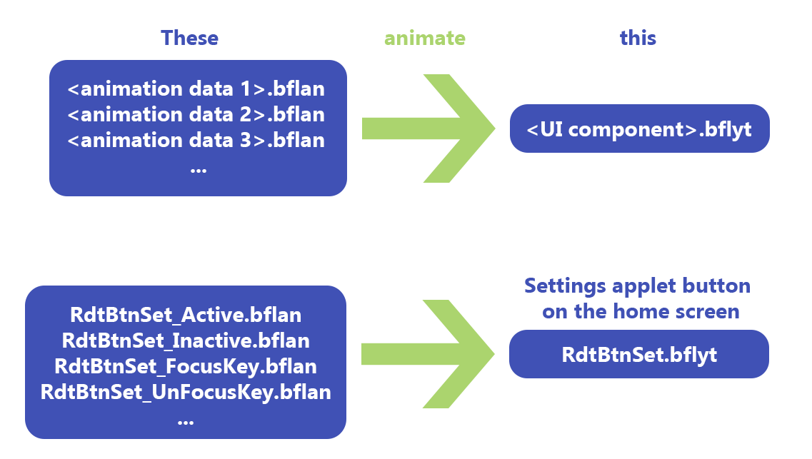

##### :octicons-arrow-left-16: [Volver a Animaciones: introducción](index.md)

# Animaciones: repaso de archivos y diferenciación
---

## Recordatorio rápido sobre archivos de Nintendo Switch

!!! info
    Para más detalles, consulta las siguientes secciones:
    
    - **[Archivos de menú](../menu-files.md) :octicons-arrow-right-16:**
    
    - **[Tipos de archivos](../filetypes.md) :octicons-arrow-right-16:**

Hacer temas implica alterar archivos `.szs`. Estos son archivos que contienen los elementos gráficos de la interfaz de usuario, todos ellos almacenados en archivos `.bflyt` y `.bflan`. Básicamente, toda la interfaz de usuario se descompone en tales archivos. Entonces, para crear animaciones, obviamente tendremos que modificarlos.

Imágenes, iconos, texto y prácticamente todo lo que se muestra en la pantalla de tu consola son objetos de "pane" que están contenidos en archivos `.bflyt`. Estos archivos `.bflyt` también contienen información sobre la posición/tamaño/escala de los paneles y sus canales RGBA. En otras palabras, esos paneles son en lo que nos vamos a meter en este tutorial, **es decir, son precisamente los objetos en los que adjuntaremos nuestras animaciones.** Así que es posible que quieras **ver de antemano el** archivo `.bflyt` **que contiene el panel que deseas animar.**

En la práctica, **nos centraremos principalmente en los archivos** `.bflan`, **en los que se almacenan partes de los datos de animación** para un archivo `.bflyt` **específico**. Casi todo el proceso se realiza a través de Switch Layout Editor, que empezaré a presentar en la próxima subsección.

Volviendo a los archivos `.szs`, los encontrarás en `themes/systemData` en tu tarjeta SD, estos ya han sido extraídos por la aplicación homebrew NXTheme Installer. Ten en cuenta que los archivos `.szs` contienen material con derechos de autor, lo que los hace ilegales para compartir (esa es la razón por la que los modders implementaron el formato `.nxtheme` para sortear esto).

Cada archivo corresponde a un menú específico,

| `.szs`         | Menú                        |
|:--------------:|:---------------------------:|
| `ResidentMenu.szs` | Pantalla de inicio        |
| `Set.szs`         | Configuraciones            |
| `Psl.szs`         | Selección de jugador       |
| `Flauncher.szs`   | Todas las apps/ lanzador completo |
| `Lock.szs`        | Pantalla de bloqueo        |
| `MyPage.szs`      | Página de usuario          |

así que si alguien quiere editar elementos de la interfaz de usuario en la página de inicio, necesitaríamos obtener el archivo `ResidentMenu.szs`. Del mismo modo, si queremos hacer ediciones en la sección de todas las aplicaciones, `Flauncher.szs` es el archivo con el que trabajaremos. Ya tienes la idea.

!!! info
      También encontrarás en `themes/systemData` otros archivos `.szs` que no están listados aquí, por ejemplo, `Option.szs`.
      Estos no son compatibles oficialmente con el inyector de temas, pero es posible editarlos manualmente de todos modos. Echa un vistazo a la sección de [diferenciación](../diffing.md) de LayoutDocs.

## Diffing con Layout Editor

!!! info
    Para más detalles, consulta la siguiente sección:
    
    - **[Diferenciación](../diffing.md) :octicons-arrow-right-16:**

Es posible que estés acostumbrado a trastear con archivos `.json` y compilar temas con Switch Theme Injector, pero quizás no estés familiarizado con Switch Layout Editor. Piensa en él como un lector/archivador de archivos `.szs` que también ofrece una vista previa real en pantalla de la posición de los paneles, lo cual es bastante conveniente para la edición de diseños. Resulta que Layout Editor también se utiliza para la edición de animaciones.

!!! tip
      Alternativamente, puedes utilizar Switch Toolbox (también incluido con [LayoutKit](https://github.com/ThemezerNX/LayoutKit)), que es otro software que tiene prácticamente los mismos propósitos que Layout Editor, al menos para nuestras necesidades actuales. Sin embargo, dado que he estado trabajando con Layout Editor, no cubriré Switch Toolbox aquí, pero al final del día depende de tu preferencia.

Una vez que se hayan implementado las animaciones, necesitaremos hacer una *diferencia de diseño* (como en *diferencia*). Básicamente, queremos trabajar con dos versiones del archivo `.szs` de interés: el primero se mantiene intacto y el segundo contendrá todas las ediciones que se hayan realizado a través de Layout Editor. La diferenciación de diseño es el proceso de comparar (*difuminar*) estos dos archivos `.szs` y generar un diseño `.json` que refleje todas tus ediciones. El archivo `.json` de salida luego se puede utilizar en Switch Theme Injector para compilar el `.nxtheme` como lo harías normalmente.

## En resumen

Pasaremos por estos pasos generales que se aplican a **cualquier tipo de edición de animaciones**:

- hacer dos copias del archivo `.szs` seleccionado

- editar uno de ellos con nuestras animaciones

- diferenciación de diseño

- compilar el `.nxtheme` usando el archivo `.json` de salida/diferenciado e instalarlo en la consola (proceso habitual con Switch Theme Injector y NXTheme Installer)

Con todo esto presentado, finalmente podemos empezar a crear animaciones.

# [Continuar con Animaciones: Tutorial principal](main-tutorial.md) :octicons-arrow-right-16:
