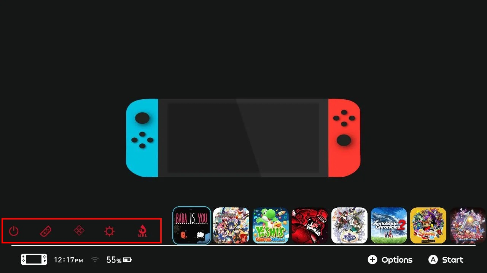
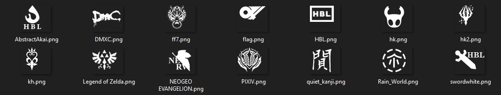
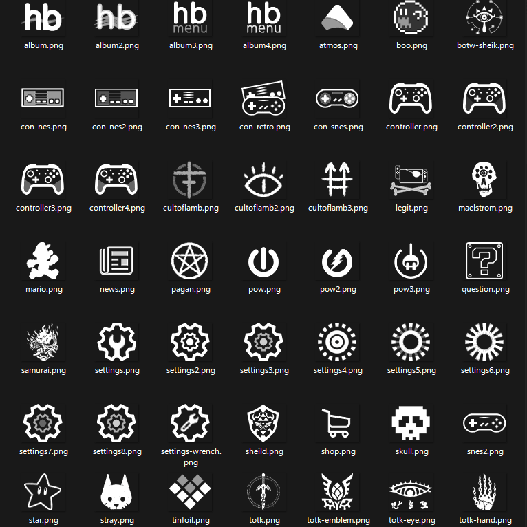

  
_[Pantalla de inicio simple](https://www.reddit.com/r/NXThemes/comments/ba5o8i/rainbow_simple_homescreen_with_rounded_icons_and/) por u/akaisora255_

---

El formato NXTheme tiene soporte para iconos [de botón de applet personalizados](../../../definitions.md#applet-button).  
Como puedes ver en la vista previa anterior, el icono del álbum se reemplaza por una llama.

<!-- prettier-ignore -->
!!! Consejo
    Los iconos personalizados pueden combinarse con [colores de applet personalizados](../custom-element-colors/index.md).

## Ejemplo

1. Crea un icono personalizado. Este icono debe ser:
    - `64x56px`
    - blanco con un fondo transparente
    - un archivo `PNG` (opcionalmente, también se admite `DDS`)
2. Abre la aplicación Switch Theme Injector y ve a la pestaña 'NXTheme Builder'.
3. Asegúrate de haber seleccionado 'Menú principal' en el menú desplegable, o 'Pantalla de bloqueo' si quieres cambiar los iconos de la pantalla de bloqueo.
4. En el cuadro en la parte inferior, etiquetado como 'Configuraciones opcionales del menú principal', puedes hacer clic en cualquiera de los botones junto a 'Iconos de applet personalizados' para seleccionar la imagen png para el botón de applet que deseas.

## Paquetes de Iconos

Un ejemplo de paquete de iconos por u/akaisora255 se puede descargar [desde aquí :octicons-download-16:](Icon Pack 1.zip).

Un paquete de iconos por [sodasoba](https://github.com/sodasoba1) se puede descargar [desde aquí :octicons-download-16:](Icon Pack 2.zip).
