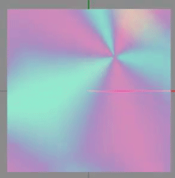
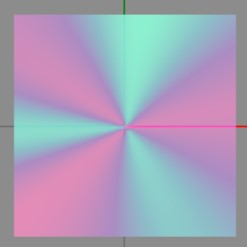
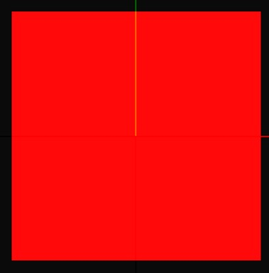
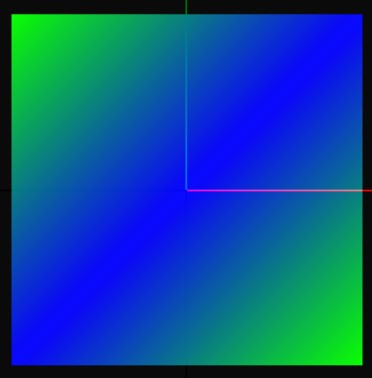

¡Has creado un tema y todo lo que queda es hacer que el cursor coincida con el estilo!
El cursor consta de dos paneles: `P_Main` y `P_Grow`. Estos se pueden encontrar en `Cursor3.bflyt` (cada `szs` tiene uno). `P_Grow` está posicionado sobre `P_Main` y ambos están siempre habilitados.


_Las dos capas P_Main (izquierda) y P_Grow (derecha) separadas_

<!-- prettier-ignore -->
!!! Info
	Ten en cuenta que

    - BackgroundColor (Switch Layout Editor) == White Color (Switch Toolbox)
    - ForegroundColor (Switch Layout Editor) == Black Color (Switch Toolbox)

    Estos dos campos se pueden encontrar en la sección Materiales de ambos programas.

---

## Ejemplos (Simples)

<!-- prettier-ignore -->
!!! Important
	-   Dado que el formato de color es en realidad `aabbggrr` (alfa, azul, verde, rojo), deberás usar una versión invertida del color hexadecimal normal. Por ejemplo, el código de color hexadecimal `0000FF` (rgb)/`0000FFFF` (rgba) se convertiría en `FFFF0000` (abgr).

### Animado

Este ejemplo mantiene la animación estándar y solo cambia los colores.  
Necesitarás cuatro colores: dos colores base y dos variantes ligeramente más claras (consulta el [Paso Avanzado 1](#1-material-color))

<!-- prettier-ignore -->
!!! Warning
	**NO** cambies el canal alfa en este ejemplo (mantén el `FF` y `00`). Solo modifica `bbggrr` en minúsculas.


```json
{
	"TargetName": "ResidentMenu.szs",
	"Files": [
		{
			"FileName": "blyt/Cursor3.bflyt",
			"Patches": [
				{
					"PaneName": "P_Main",
					"UsdPatches": [
						{
							"PropName": "C_B",
							"PropValues": ["0", "0", "0", "0"],
							"type": 1
						},
						{
							"PropName": "C_W",
							"PropValues": ["0", "0", "0", "0"],
							"type": 1
						},
						{
							"PropName": "S_BorderColorSelect0",
							"PropValues": ["0"],
							"type": 1
						},
						{
							"PropName": "S_BorderColor0",
							"PropValues": ["0", "0", "0", "0"],
							"type": 1
						},
						{
							"PropName": "S_DropShadowColorSelect",
							"PropValues": ["0"],
							"type": 1
						},
						{
							"PropName": "S_DropShadowColor",
							"PropValues": ["0", "0", "0", "0"],
							"type": 1
						}
					]
				},
				{
					"PaneName": "P_Grow",
					"UsdPatches": [
						{
							"PropName": "C_B",
							"PropValues": ["0", "0", "0", "0"],
							"type": 1
						},
						{
							"PropName": "C_W",
							"PropValues": ["0", "0", "0", "0"],
							"type": 1
						},
						{
							"PropName": "S_BorderColorSelect0",
							"PropValues": ["0"],
							"type": 1
						},
						{
							"PropName": "S_BorderColor0",
							"PropValues": ["0", "0", "0", "0"],
							"type": 1
						},
						{
							"PropName": "S_DropShadowColorSelect",
							"PropValues": ["0"],
							"type": 1
						},
						{
							"PropName": "S_DropShadowColor",
							"PropValues": ["0", "0", "0", "0"],
							"type": 1
						}
					]
				}
			],
			"Materials": [
				{
					"MaterialName": "P_Grow",
					"BackgroundColor": "FFbbggrr", // set your first color here
					"ForegroundColor": "00bbggrr" // set your second color here
				},
				{
					"MaterialName": "P_Main",
					"BackgroundColor": "FFbbggrr", // set the slightly lighter variant of your first color here
					"ForegroundColor": "00bbggrr" // set the slightly lighter variant of your second color here
				}
			]
		}
	]
}
```

#### Result

  
(El amarillo de arriba es en realidad verde en el propio Switch)

### Estático

Este ejemplo desactiva la animación, pero todavía muestra los dos colores.  
Necesitarás dos colores.

<!-- prettier-ignore -->
!!! Warning
	**NO** cambies el canal alfa en este ejemplo (mantén el `FF` y `00`). Solo modifica `bbggrr` en minúsculas.


```json
{
	"TargetName": "ResidentMenu.szs",
	"Files": [
		{
			"FileName": "blyt/Cursor3.bflyt",
			"Patches": [
				{
					"PaneName": "P_Main",
					"UsdPatches": [
						{
							"PropName": "C_B",
							"PropValues": ["0", "0", "0", "0"],
							"type": 1
						},
						{
							"PropName": "C_W",
							"PropValues": ["0", "0", "0", "0"],
							"type": 1
						},
						{
							"PropName": "S_BorderColorSelect0",
							"PropValues": ["0"],
							"type": 1
						},
						{
							"PropName": "S_BorderColor0",
							"PropValues": ["0", "0", "0", "0"],
							"type": 1
						},
						{
							"PropName": "S_DropShadowColorSelect",
							"PropValues": ["0"],
							"type": 1
						},
						{
							"PropName": "S_DropShadowColor",
							"PropValues": ["0", "0", "0", "0"],
							"type": 1
						}
					]
				},
				{
					"PaneName": "P_Grow",
					"Visible": false
				}
			],
			"Materials": [
				{
					"MaterialName": "P_Main",
					"BackgroundColor": "FFbbggrr", // set your first color here
					"ForegroundColor": "00bbggrr" // set your second color here
				}
			]
		}
	],
	"Anims": [
		{
			"FileName": "anim/Cursor3_Wait.bflan",
			"AnimJson": "{\"LittleEndian\":true,\"Version\":150994944,\"pat1\":{\"AnimationOrder\":0,\"Name\":\"Wait\",\"ChildBinding\":90,\"Groups\":[\"G_Wait\"],\"Unk_StartOfFile\":0,\"Unk_EndOfFile\":0,\"Unk_EndOfHeader\":\"ACoDAAAAAA==\"},\"pai1\":{\"FrameSize\":720,\"Flags\":1,\"Textures\":[],\"Entries\":[]}}"
		}
	]
}
```

#### Result



### Plano

Este ejemplo desactiva la animación, elimina el patrón y cambia el cursor para que sea de uno o más colores. Puedes ser creativo ya que puedes modificar las cuatro esquinas individualmente.  
Necesitarás uno o más colores.

<!-- prettier-ignore -->
!!! Info
	Ten en cuenta que los campos `ColorXX` significan lo siguiente:

    - TL = Superior Izquierda
    - TR = Superior Derecha
    - BL = Inferior Izquierda
    - BR = Inferior Derecha

<!-- prettier-ignore -->
!!! Warning
	**NO** cambies el canal alfa en este ejemplo (mantén el `FF`). Solo modifica `bbggrr` en minúsculas.


```json
{
	"TargetName": "ResidentMenu.szs",
	"Files": [
		{
			"FileName": "blyt/Cursor3.bflyt",
			"Patches": [
				{
					"PaneName": "P_Main",
					"UsdPatches": [
						{
							"PropName": "C_B",
							"PropValues": ["0", "0", "0", "0"],
							"type": 1
						},
						{
							"PropName": "C_W",
							"PropValues": ["0", "0", "0", "0"],
							"type": 1
						},
						{
							"PropName": "S_BorderColorSelect0",
							"PropValues": ["0"],
							"type": 1
						},
						{
							"PropName": "S_BorderColor0",
							"PropValues": ["0", "0", "0", "0"],
							"type": 1
						},
						{
							"PropName": "S_DropShadowColorSelect",
							"PropValues": ["0"],
							"type": 1
						},
						{
							"PropName": "S_DropShadowColor",
							"PropValues": ["0", "0", "0", "0"],
							"type": 1
						}
					],
					"ColorTL": "FFbbggrr", // set your custom color(s) in these four fields
					"ColorTR": "FFbbggrr",
					"ColorBL": "FFbbggrr",
					"ColorBR": "FFbbggrr"
				},
				{
					"PaneName": "P_Grow",
					"Visible": false
				}
			],
			"Materials": [
				{
					"MaterialName": "P_Main",
					"BackgroundColor": "FFFFFFFF",
					"ForegroundColor": "00FFFFFF"
				}
			]
		}
	]
}
```

#### Result

  
_Valor del color: `FF0000FF` (rojo)_

  
Valores de color respectivamente: `FF00FF00`, `FFFF0000`, `FFFF0000`, `FF00FF00`

## Instrucciones (Avanzado)

El color del cursor en realidad consiste en cuatro elementos:

### 1. Color del Material

Los colores del material son los que son visibles en la imagen gif. Los siguientes son los valores predeterminados:

`P_Main`

-   BackgroundColor/Color Blanco: <span class="color-text" markdown="1">`rgb(0,193,242)`</span>
-   ForegroundColor/Color Negro: <span class="color-text" markdown="1">`rgb(0,221,165)`</span>

`P_Grow`

-   BackgroundColor/Color Blanco: <span class="color-text" markdown="1">`rgb(22,158,244)`</span>
-   ForegroundColor/Color Negro: <span class="color-text" markdown="1">`rgb(0,204,44)`</span>

Establece tus colores personalizados en los materiales `P_Grow`. Establece `P_Main` a una variante ligeramente más clara de tus colores.

Siempre quieres que el color ForegroundColor/Color Negro tenga opacidad `0` (predeterminado). Si no lo tiene, el centro (así cubrirá todo el botón en lugar de solo el borde) del cursor se llenará también con el color. Si trabajas en los diseños directamente, este color debe estar en el formato AABBGGRR hexadecimal.

### 2. Color USD

Ambos paneles también tienen una sección USD con [`C_W`](../../layouts/usd-sections.md#c_w) y [`C_B`](../../layouts/usd-sections.md#c_b) establecido. Los siguientes son los valores predeterminados:

-   `P_Main`
    -   [`C_B`](../../layouts/usd-sections.md#c_b): `[37, 0, 0, 0]`
    -   [`C_W`](../../layouts/usd-sections.md#c_w): `[65, 0, 0, 0]`
-   `P_Grow`
    -   [`C_B`](../../layouts/usd-sections.md#c_b): `[38, 0, 0, 0]`
    -   [`C_W`](../../layouts/usd-sections.md#c_w): `[29, 0, 0, 0]`

El color USD en realidad sobrescribe el color del material. De esta manera, el color del material puede cambiar dinámicamente según el tema del sistema (claro/oscuro).

Establece las secciones USD de la siguiente manera para desactivar esto:

-   `P_Main`/`P_Grow`
    -   [`C_B`](../../layouts/usd-sections.md#c_b): `[0, 0, 0, 0]`
    -   [`C_W`](../../layouts/usd-sections.md#c_w): `[0, 0, 0, 0]`

### 3. Color del Borde

El borde tiene una animación que lo hace brillar en un color aún más claro. Este será un azul muy claro si no lo deshabilitas.
Establece las secciones USD de la siguiente manera para desactivar esto:

-   `P_Main`/`P_Grow`
    -   [`S_BorderColorSelect0`](../../layouts/usd-sections.md#s_bordercolorselect0): `0`
    -   [`S_BorderColor0`](../../layouts/usd-sections.md#s_bordercolor0): `[0, 0, 0, 0]`

Opcionalmente, puedes establecer [`S_BorderColor0`](../../layouts/usd-sections.md#s_bordercolor0) en algo personalizado, para que el cursor se vea un poco más vibrante/vivo.

### 4. Color de la Sombra

El cursor también tiene una sombra para agregar un poco de profundidad. Por defecto, añade un ligero tono azul, pero nada notable.
Establece las secciones USD de la siguiente manera si deseas desactivar esta sombra.

-   `P_Main`/`P_Grow`
    -   [`S_DropShadowColorSelect`](../../layouts/usd-sections.md#s_dropshadowcolorselect): `0`
    -   [`S_DropShadowColor`](../../layouts/usd-sections.md#s_dropshadowcolor): `[0, 0, 0, 0]`

Puedes establecer opcionalmente [`S_DropShadowColor`](../../layouts/usd-sections.md#s_dropshadowcolor) en algo personalizado, para que la sombra también coincida con tu color.

### 5. Animación

Te recomiendo que uses Switch Toolbox si quieres experimentar por ti mismo (En LayoutKit: `Configuración > Editor preferido > Switch-Toolbox`). Puede previsualizar cómo se verá tu animación (no el borde, la sombra, etc., solo la animación del color del material). Si no lo haces, hay ejemplos más arriba en esta página.

Con animaciones personalizadas puedes animar los cuatro rincones de un material por separado y posiblemente hacer que se vea muy genial.

<!-- prettier-ignore -->
!!! Warning
	Si experimentas un comportamiento inesperado, ten en cuenta que Switch Toolbox deshabilita de alguna manera un archivo de diseño. Parece que rompe las animaciones de borde, por ejemplo.

---
