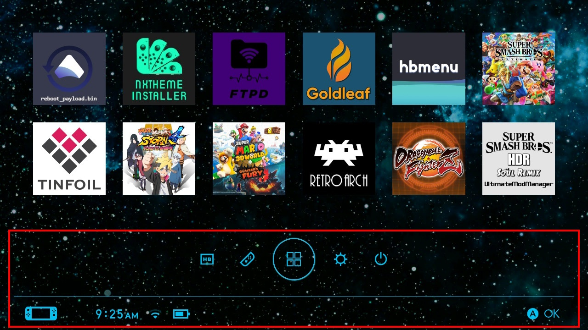

# Colores de Elementos Personalizados

  
_[Menú azul - Inicio](https://themezer.net/themes/homemenu/Blue-Menu-Home-bd2) por Maxu/Maximum_

---

Es posible modificar los colores de, por ejemplo, botones, texto, líneas e iconos.
Un tema que hace uso de esta funcionalidad es [Blue por Mazu/Maximum](https://themezer.net/packs/Blue-Menu-1b4). Se admiten cualquier color.

<!-- prettier-ignore -->
!!! Tip
	Los colores personalizados se pueden mezclar con [iconos de applet personalizados](../custom-applet-icons/index.md).

## Código de Ejemplo

Digamos que quieres que el ícono del álbum sea rojo (`#FF0000`). El siguiente ejemplo muestra cómo hacerlo:


```json
{
	"TargetName": "ResidentMenu.szs",
	"Files": [
		{
			"FileName": "blyt/RdtBtnPvr.bflyt",
			"Patches": [
				{
					"PaneName": "P_Pict",
					"UsdPatches": [
						{
							"PropName": "C_W",
							"PropValues": ["0", "0", "0", "0"], // don't change this!
							"type": 1
						}
					],
					"ColorTL": "FF0000FF", // set your custom color in these four fields
					"ColorTR": "FF0000FF",
					"ColorBL": "FF0000FF",
					"ColorBR": "FF0000FF"
				}
			],
			"Materials": [
				{
					"MaterialName": "P_Pict",
					"BackgroundColor": "FFFFFFFF" // don't change this!
				}
			]
		}
	]
}
```

<!-- prettier-ignore -->
!!! Importante
    -   Dado que el formato de color es realmente `FFbbggrr` (alfa, azul, verde, rojo), deberás usar una versión invertida del color hexadecimal normal. Por ejemplo, el código de color hexadecimal `0000FF` (rgb)/`0000FFFF` (rgba) se convertiría en `FFFF0000` (abgr).

---

# Color de Cursor Personalizado

[Ver esta página](../custom-cursor/index.md)

## Código de Ejemplo para todos los elementos del Menú de Inicio

Para esto, debes reemplazar `FFbbggrr` con el color que desees. La mayoría de los editores te permiten reemplazar varias ocurrencias a la vez.

<!-- prettier-ignore -->
!!! Advertencia
    **NO** cambies el canal alfa en este ejemplo (mantén el `FF`). Solo modifica `bbggrr` en minúsculas.


```json
{
	"TargetName": "ResidentMenu.szs",
	"Files": [
		{
			"FileName": "blyt/RdtBtnCtrl.bflyt",
			"Patches": [
				{
					"PaneName": "P_Form",
					"UsdPatches": [
						{
							"PropName": "C_W",
							"PropValues": ["0", "0", "0", "0"],
							"type": 1
						}
					],
					"ColorTL": "FFbbggrr",
					"ColorTR": "FFbbggrr",
					"ColorBL": "FFbbggrr",
					"ColorBR": "FFbbggrr"
				},
				{
					"PaneName": "P_Stick",
					"UsdPatches": [
						{
							"PropName": "C_W",
							"PropValues": ["0", "0", "0", "0"],
							"type": 1
						}
					],
					"ColorTL": "FFbbggrr",
					"ColorTR": "FFbbggrr",
					"ColorBL": "FFbbggrr",
					"ColorBR": "FFbbggrr"
				},
				{
					"PaneName": "P_Y",
					"UsdPatches": [
						{
							"PropName": "C_W",
							"PropValues": ["0", "0", "0", "0"],
							"type": 1
						}
					],
					"ColorTL": "FFbbggrr",
					"ColorTR": "FFbbggrr",
					"ColorBL": "FFbbggrr",
					"ColorBR": "FFbbggrr"
				},
				{
					"PaneName": "P_X",
					"UsdPatches": [
						{
							"PropName": "C_W",
							"PropValues": ["0", "0", "0", "0"],
							"type": 1
						}
					],
					"ColorTL": "FFbbggrr",
					"ColorTR": "FFbbggrr",
					"ColorBL": "FFbbggrr",
					"ColorBR": "FFbbggrr"
				},
				{
					"PaneName": "P_A",
					"UsdPatches": [
						{
							"PropName": "C_W",
							"PropValues": ["0", "0", "0", "0"],
							"type": 1
						}
					],
					"ColorTL": "FFbbggrr",
					"ColorTR": "FFbbggrr",
					"ColorBL": "FFbbggrr",
					"ColorBR": "FFbbggrr"
				},
				{
					"PaneName": "P_B",
					"UsdPatches": [
						{
							"PropName": "C_W",
							"PropValues": ["0", "0", "0", "0"],
							"type": 1
						}
					],
					"ColorTL": "FFbbggrr",
					"ColorTR": "FFbbggrr",
					"ColorBL": "FFbbggrr",
					"ColorBR": "FFbbggrr"
				}
			],
			"Materials": [
				{
					"MaterialName": "P_Form",
					"BackgroundColor": "FFFFFFFF"
				},
				{
					"MaterialName": "P_B",
					"BackgroundColor": "FFFFFFFF"
				},
				{
					"MaterialName": "P_A",
					"BackgroundColor": "FFFFFFFF"
				},
				{
					"MaterialName": "P_X",
					"BackgroundColor": "FFFFFFFF"
				},
				{
					"MaterialName": "P_Y",
					"BackgroundColor": "FFFFFFFF"
				},
				{
					"MaterialName": "P_Stick",
					"BackgroundColor": "FFFFFFFF"
				}
			]
		},
		{
			"FileName": "blyt/HudTime.bflyt",
			"Patches": [
				{
					"PaneName": "P_A",
					"UsdPatches": [
						{
							"PropName": "C_W",
							"PropValues": ["0", "0", "0", "0"],
							"type": 1
						}
					],
					"ColorTL": "FFbbggrr",
					"ColorTR": "FFbbggrr",
					"ColorBL": "FFbbggrr",
					"ColorBR": "FFbbggrr"
				},
				{
					"PaneName": "P_M",
					"UsdPatches": [
						{
							"PropName": "C_W",
							"PropValues": ["0", "0", "0", "0"],
							"type": 1
						}
					],
					"ColorTL": "FFbbggrr",
					"ColorTR": "FFbbggrr",
					"ColorBL": "FFbbggrr",
					"ColorBR": "FFbbggrr"
				},
				{
					"PaneName": "P_P",
					"UsdPatches": [
						{
							"PropName": "C_W",
							"PropValues": ["0", "0", "0", "0"],
							"type": 1
						}
					],
					"ColorTL": "FFbbggrr",
					"ColorTR": "FFbbggrr",
					"ColorBL": "FFbbggrr",
					"ColorBR": "FFbbggrr"
				},
				{
					"PaneName": "P_Colon",
					"UsdPatches": [
						{
							"PropName": "C_W",
							"PropValues": ["0", "0", "0", "0"],
							"type": 1
						}
					],
					"ColorTL": "FFbbggrr",
					"ColorTR": "FFbbggrr",
					"ColorBL": "FFbbggrr",
					"ColorBR": "FFbbggrr"
				},
				{
					"PaneName": "P_Dot",
					"UsdPatches": [
						{
							"PropName": "C_W",
							"PropValues": ["0", "0", "0", "0"],
							"type": 1
						}
					],
					"ColorTL": "FFbbggrr",
					"ColorTR": "FFbbggrr",
					"ColorBL": "FFbbggrr",
					"ColorBR": "FFbbggrr"
				},
				{
					"PaneName": "P_Comma",
					"UsdPatches": [
						{
							"PropName": "C_W",
							"PropValues": ["0", "0", "0", "0"],
							"type": 1
						}
					],
					"ColorTL": "FFbbggrr",
					"ColorTR": "FFbbggrr",
					"ColorBL": "FFbbggrr",
					"ColorBR": "FFbbggrr"
				}
			]
		},
		{
			"FileName": "blyt/RdtBtnFullLauncher.bflyt",
			"Patches": [
				{
					"PaneName": "P_Pict_00",
					"UsdPatches": [
						{
							"PropName": "C_W",
							"PropValues": ["0", "0", "0", "0"],
							"type": 1
						}
					],
					"ColorTL": "FFbbggrr",
					"ColorTR": "FFbbggrr",
					"ColorBL": "FFbbggrr",
					"ColorBR": "FFbbggrr"
				},
				{
					"PaneName": "P_Pict_01",
					"UsdPatches": [
						{
							"PropName": "C_W",
							"PropValues": ["0", "0", "0", "0"],
							"type": 1
						}
					],
					"ColorTL": "FFbbggrr",
					"ColorTR": "FFbbggrr",
					"ColorBL": "FFbbggrr",
					"ColorBR": "FFbbggrr"
				},
				{
					"PaneName": "P_Pict_02",
					"UsdPatches": [
						{
							"PropName": "C_W",
							"PropValues": ["0", "0", "0", "0"],
							"type": 1
						}
					],
					"ColorTL": "FFbbggrr",
					"ColorTR": "FFbbggrr",
					"ColorBL": "FFbbggrr",
					"ColorBR": "FFbbggrr"
				},
				{
					"PaneName": "P_Pict_03",
					"UsdPatches": [
						{
							"PropName": "C_W",
							"PropValues": ["0", "0", "0", "0"],
							"type": 1
						}
					],
					"ColorTL": "FFbbggrr",
					"ColorTR": "FFbbggrr",
					"ColorBL": "FFbbggrr",
					"ColorBR": "FFbbggrr"
				}
			]
		},
		{
			"FileName": "blyt/RdtBtnSet.bflyt",
			"Patches": [
				{
					"PaneName": "P_Pict",
					"UsdPatches": [
						{
							"PropName": "C_W",
							"PropValues": ["0", "0", "0", "0"],
							"type": 1
						}
					],
					"ColorTL": "FFbbggrr",
					"ColorTR": "FFbbggrr",
					"ColorBL": "FFbbggrr",
					"ColorBR": "FFbbggrr"
				}
			],
			"Materials": [
				{
					"MaterialName": "P_Pict",
					"BackgroundColor": "FFFFFFFF"
				}
			]
		},
		{
			"FileName": "blyt/RdtBtnPvr.bflyt",
			"Patches": [
				{
					"PaneName": "P_PictMask",
					"UsdPatches": [
						{
							"PropName": "C_W",
							"PropValues": ["0", "0", "0", "0"],
							"type": 1
						}
					],
					"ColorTL": "FFbbggrr",
					"ColorTR": "FFbbggrr",
					"ColorBL": "FFbbggrr",
					"ColorBR": "FFbbggrr"
				},
				{
					"PaneName": "P_Pict_01",
					"UsdPatches": [
						{
							"PropName": "C_W",
							"PropValues": ["0", "0", "0", "0"],
							"type": 1
						}
					],
					"ColorTL": "FFbbggrr",
					"ColorTR": "FFbbggrr",
					"ColorBL": "FFbbggrr",
					"ColorBR": "FFbbggrr"
				},
				{
					"PaneName": "P_Color",
					"UsdPatches": [
						{
							"PropName": "C_W",
							"PropValues": ["0", "0", "0", "0"],
							"type": 1
						}
					],
					"ColorTL": "FFbbggrr",
					"ColorTR": "FFbbggrr",
					"ColorBL": "FFbbggrr",
					"ColorBR": "FFbbggrr"
				},
				{
					"PaneName": "P_Pict_00",
					"UsdPatches": [
						{
							"PropName": "C_W",
							"PropValues": ["0", "0", "0", "0"],
							"type": 1
						}
					],
					"ColorTL": "FFbbggrr",
					"ColorTR": "FFbbggrr",
					"ColorBL": "FFbbggrr",
					"ColorBR": "FFbbggrr"
				},
				{
					"PaneName": "P_Effect",
					"UsdPatches": [
						{
							"PropName": "C_W",
							"PropValues": ["34", "0", "0", "0"],
							"type": 1
						}
					]
				}
			],
			"Materials": [
				{
					"MaterialName": "P_Pict_00",
					"BackgroundColor": "FFFFFFFF"
				},
				{
					"MaterialName": "P_Pict_01",
					"BackgroundColor": "FFFFFFFF"
				}
			]
		},
		{
			"FileName": "blyt/HudBatteryNum.bflyt",
			"Patches": [
				{
					"PaneName": "P_Per",
					"UsdPatches": [
						{
							"PropName": "C_W",
							"PropValues": ["0", "0", "0", "0"],
							"type": 1
						}
					],
					"ColorTL": "FFbbggrr",
					"ColorTR": "FFbbggrr",
					"ColorBL": "FFbbggrr",
					"ColorBR": "FFbbggrr"
				},
				{
					"PaneName": "L_GTNum_00",
					"UsdPatches": [
						{
							"PropName": "C_W",
							"PropValues": ["0", "0", "0", "0"],
							"type": 1
						}
					]
				},
				{
					"PaneName": "L_GTNum_01",
					"UsdPatches": [
						{
							"PropName": "C_W",
							"PropValues": ["0", "0", "0", "0"],
							"type": 1
						}
					]
				},
				{
					"PaneName": "L_GTNum_02",
					"UsdPatches": [
						{
							"PropName": "C_W",
							"PropValues": ["0", "0", "0", "0"],
							"type": 1
						}
					]
				}
			],
			"Materials": [
				{
					"MaterialName": "P_Per",
					"BackgroundColor": "FFFFFFFF"
				},
				{
					"MaterialName": "P_GTNum_00",
					"BackgroundColor": "FF8080FF"
				},
				{
					"MaterialName": "P_GTNum_00",
					"BackgroundColor": "FF8080FF"
				},
				{
					"MaterialName": "P_GTNum_00",
					"BackgroundColor": "FF8080FF"
				}
			]
		},
		{
			"FileName": "blyt/HudSignal.bflyt",
			"Patches": [
				{
					"PaneName": "P_Plane",
					"UsdPatches": [
						{
							"PropName": "C_W",
							"PropValues": ["0", "0", "0", "0"],
							"type": 1
						}
					],
					"ColorTL": "FF8080FF",
					"ColorTR": "FF8080FF",
					"ColorBL": "FF8080FF",
					"ColorBR": "FF8080FF"
				},
				{
					"PaneName": "P_Wifi",
					"UsdPatches": [
						{
							"PropName": "C_W",
							"PropValues": ["0", "0", "0", "0"],
							"type": 1
						}
					],
					"ColorTL": "FFbbggrr",
					"ColorTR": "FFbbggrr",
					"ColorBL": "FFbbggrr",
					"ColorBR": "FFbbggrr"
				},
				{
					"PaneName": "P_Local",
					"UsdPatches": [
						{
							"PropName": "C_W",
							"PropValues": ["0", "0", "0", "0"],
							"type": 1
						}
					],
					"ColorTL": "FFbbggrr",
					"ColorTR": "FFbbggrr",
					"ColorBL": "FFbbggrr",
					"ColorBR": "FFbbggrr"
				},
				{
					"PaneName": "P_WireLine",
					"UsdPatches": [
						{
							"PropName": "C_W",
							"PropValues": ["0", "0", "0", "0"],
							"type": 1
						}
					],
					"ColorTL": "FFbbggrr",
					"ColorTR": "FFbbggrr",
					"ColorBL": "FFbbggrr",
					"ColorBR": "FFbbggrr"
				}
			]
		},
		{
			"FileName": "blyt/RdtBtnNtf.bflyt",
			"Patches": [
				{
					"PaneName": "P_PictNtf_00",
					"UsdPatches": [
						{
							"PropName": "C_W",
							"PropValues": ["0", "0", "0", "0"],
							"type": 1
						}
					],
					"ColorTL": "FFbbggrr",
					"ColorTR": "FFbbggrr",
					"ColorBL": "FFbbggrr",
					"ColorBR": "FFbbggrr"
				},
				{
					"PaneName": "P_PictNtf_01",
					"UsdPatches": [
						{
							"PropName": "C_W",
							"PropValues": ["0", "0", "0", "0"],
							"type": 1
						}
					],
					"ColorTL": "FFbbggrr",
					"ColorTR": "FFbbggrr",
					"ColorBL": "FFbbggrr",
					"ColorBR": "FFbbggrr"
				},
				{
					"PaneName": "P_Effect",
					"UsdPatches": [
						{
							"PropName": "C_W",
							"PropValues": ["34", "0", "0", "0"],
							"type": 1
						}
					]
				}
			],
			"Materials": [
				{
					"MaterialName": "P_PictNtf_00",
					"BackgroundColor": "FFFFFFFF"
				},
				{
					"MaterialName": "P_PictNtf_01",
					"BackgroundColor": "FFFFFFFF"
				}
			]
		},
		{
			"FileName": "blyt/RdtBtnShop.bflyt",
			"Patches": [
				{
					"PaneName": "P_Pict",
					"UsdPatches": [
						{
							"PropName": "C_W",
							"PropValues": ["0", "0", "0", "0"],
							"type": 1
						}
					],
					"ColorTL": "FFbbggrr",
					"ColorTR": "FFbbggrr",
					"ColorBL": "FFbbggrr",
					"ColorBR": "FFbbggrr"
				},
				{
					"PaneName": "P_Effect",
					"UsdPatches": [
						{
							"PropName": "C_W",
							"PropValues": ["34", "0", "0", "0"],
							"type": 1
						}
					]
				}
			],
			"Materials": [
				{
					"MaterialName": "P_Pict",
					"BackgroundColor": "FFFFFFFF"
				}
			]
		},
		{
			"FileName": "blyt/RdtBtnPow.bflyt",
			"Patches": [
				{
					"PaneName": "P_Pict_00",
					"UsdPatches": [
						{
							"PropName": "C_W",
							"PropValues": ["0", "0", "0", "0"],
							"type": 1
						}
					],
					"ColorTL": "FFbbggrr",
					"ColorTR": "FFbbggrr",
					"ColorBL": "FFbbggrr",
					"ColorBR": "FFbbggrr"
				},
				{
					"PaneName": "P_Pict_01",
					"UsdPatches": [
						{
							"PropName": "C_W",
							"PropValues": ["0", "0", "0", "0"],
							"type": 1
						}
					],
					"ColorTL": "FFbbggrr",
					"ColorTR": "FFbbggrr",
					"ColorBL": "FFbbggrr",
					"ColorBR": "FFbbggrr"
				}
			],
			"Materials": [
				{
					"MaterialName": "P_Pict_00",
					"BackgroundColor": "FFFFFFFF"
				},
				{
					"MaterialName": "P_Pict_01",
					"BackgroundColor": "FFFFFFFF"
				}
			]
		},
		{
			"FileName": "blyt/BatteryConsole.bflyt",
			"Patches": [
				{
					"PaneName": "P_Ico00",
					"UsdPatches": [
						{
							"PropName": "C_W",
							"PropValues": ["0", "0", "0", "0"],
							"type": 1
						}
					],
					"ColorTL": "FFbbggrr",
					"ColorTR": "FFbbggrr",
					"ColorBL": "FFbbggrr",
					"ColorBR": "FFbbggrr"
				},
				{
					"PaneName": "P_Per",
					"UsdPatches": [
						{
							"PropName": "C_W",
							"PropValues": ["0", "0", "0", "0"],
							"type": 1
						}
					],
					"ColorTL": "FFbbggrr",
					"ColorTR": "FFbbggrr",
					"ColorBL": "FFbbggrr",
					"ColorBR": "FFbbggrr"
				},
				{
					"PaneName": "P_BatBase",
					"Visible": false
				},
				{
					"PaneName": "P_Charge",
					"UsdPatches": [
						{
							"PropName": "C_W",
							"PropValues": ["0", "0", "0", "0"],
							"type": 1
						}
					],
					"ColorTL": "FFbbggrr",
					"ColorTR": "FFbbggrr",
					"ColorBL": "FFbbggrr",
					"ColorBR": "FFbbggrr"
				},
				{
					"PaneName": "P_Error",
					"UsdPatches": [
						{
							"PropName": "C_W",
							"PropValues": ["0", "0", "0", "0"],
							"type": 1
						}
					],
					"ColorTL": "FFbbggrr",
					"ColorTR": "FFbbggrr",
					"ColorBL": "FFbbggrr",
					"ColorBR": "FFbbggrr"
				},
				{
					"PaneName": "P_GaugeNml",
					"UsdPatches": [
						{
							"PropName": "C_W",
							"PropValues": ["0", "0", "0", "0"],
							"type": 1
						}
					],
					"ColorTL": "FFbbggrr",
					"ColorTR": "FFbbggrr",
					"ColorBL": "FFbbggrr",
					"ColorBR": "FFbbggrr"
				},
				{
					"PaneName": "P_GaugeOther",
					"UsdPatches": [
						{
							"PropName": "C_W",
							"PropValues": ["0", "0", "0", "0"],
							"type": 1
						}
					],
					"ColorTL": "FFbbggrr",
					"ColorTR": "FFbbggrr",
					"ColorBL": "FFbbggrr",
					"ColorBR": "FFbbggrr"
				}
			]
		},
		{
			"FileName": "blyt/GTNumL.bflyt",
			"Patches": [
				{
					"PaneName": "P_GTNum_00",
					"UsdPatches": [
						{
							"PropName": "C_W",
							"PropValues": ["0", "0", "0", "0"],
							"type": 1
						}
					],
					"ColorTL": "FFbbggrr",
					"ColorTR": "FFbbggrr",
					"ColorBL": "FFbbggrr",
					"ColorBR": "FFbbggrr"
				}
			],
			"Materials": [
				{
					"MaterialName": "P_GTNum_00",
					"BackgroundColor": "FFFFFFFF"
				}
			]
		},
		{
			"FileName": "blyt/GTNumM.bflyt",
			"Patches": [
				{
					"PaneName": "P_GTNum_00",
					"UsdPatches": [
						{
							"PropName": "C_W",
							"PropValues": ["0", "0", "0", "0"],
							"type": 1
						}
					],
					"ColorTL": "FFbbggrr",
					"ColorTR": "FFbbggrr",
					"ColorBL": "FFbbggrr",
					"ColorBR": "FFbbggrr"
				}
			],
			"Materials": [
				{
					"MaterialName": "P_GTNum_00",
					"BackgroundColor": "FFFFFFFF"
				}
			]
		}
	]
}
```

---
