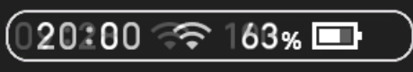
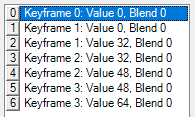

# Deshabilitar el Movimiento del HUD Causado por la Batería



---

Algunos diseños separan el reloj de otros elementos del HUD (por ejemplo, [Doge Layout](https://themezer.net/layouts/homemenu/Doge-Layout-e)).
Por defecto, la posición del reloj cambia dependiendo del porcentaje de batería.
Estos son los valores de relleno predeterminados entre el indicador de red y el icono de batería:



-   `0` (px): porcentaje de batería deshabilitado
-   `32` (px): la batería es ≤9%
-   `48` (px): la batería es ≥10% y ≤99%
-   `64` (px): la batería es 100%

## Código de Ejemplo


```json
{
	"TargetName": "ResidentMenu.szs",
	"Files": [
		{
			"FileName": "blyt/Hud.bflyt",
			"Patches": [],
			"AddGroups": [
				{
					"GroupName": "G_BatteryNumCustom",
					"Panes": ["N_BatteryNum"]
				}
			]
		}
	],
	"Anims": [
		{
			"FileName": "anim/Hud_BatteryNum.bflan",
			"AnimJson": "{\"LittleEndian\":true,\"Version\":150994944,\"pat1\":{\"AnimationOrder\":3,\"Name\":\"BatteryNum\",\"ChildBinding\":10,\"Groups\":[\"G_BatteryNumCustom\"],\"Unk_StartOfFile\":0,\"Unk_EndOfFile\":0,\"Unk_EndOfHeader\":\"AA0AAAAAAA==\"},\"pai1\":{\"FrameSize\":3,\"Flags\":0,\"Textures\":[],\"Entries\":[{\"Name\":\"N_BatteryNum\",\"Target\":0,\"Tags\":[{\"Unknown\":0,\"TagType\":\"FLPA\",\"Entries\":[{\"Index\":0,\"AnimationTarget\":8,\"DataType\":2,\"KeyFrames\":[{\"Frame\":0.0,\"Value\":64.0,\"Blend\":0.0},{\"Frame\":1.0,\"Value\":64.0,\"Blend\":0.0},{\"Frame\":1.0,\"Value\":64.0,\"Blend\":0.0},{\"Frame\":2.0,\"Value\":64.0,\"Blend\":0.0},{\"Frame\":2.0,\"Value\":64.0,\"Blend\":0.0},{\"Frame\":3.0,\"Value\":64.0,\"Blend\":0.0},{\"Frame\":3.0,\"Value\":64.0,\"Blend\":0.0}],\"FLEUUnknownInt\":0,\"FLEUEntryName\":\"\"}]}],\"UnkwnownData\":\"\"}]}}"
		}
	]
}
```

Este código de ejemplo modifica los valores predeterminados y los establece todos en `64`, lo que significa que el HUD ya no se desplazará según el porcentaje de batería. Estos valores están almacenados en una animación: `Hud_BatteryNum`.

La parte `AddGroups` se asegura de que `Hud.bflyt` realmente utilice la nueva animación.
