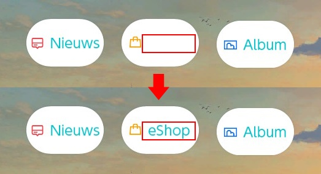
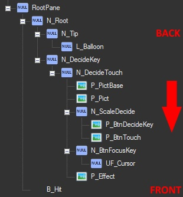
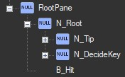
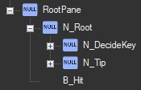

  
_Adelantar paneles en una versión antigua de [Careful Layout](https://themezer.net/layouts/homemenu/Careful-Layout-6) por Migush_

---

En el caso de que las coordenadas z no funcionen, hay otra forma de adelantar paneles o retrocederlos. Este ejemplo muestra cómo puedes hacerlo. Tiene que ver con el orden en el que se enumeran los paneles en el archivo `lyt`. Los paneles se renderizan de arriba a abajo en el árbol jerárquico:



Las dos propiedades soportadas por el NXTheme Installer / Injector son:

-   `PushBackPanes` (array)
-   `PullFrontPanes` (array)

<!-- prettier-ignore -->
!!! Advertencia
    El Switch Theme Injector no detecta cambios en las posiciones de los paneles realizados con Switch Toolbox o Layout Editor. ¡Estos cambios deben hacerse en el json del diseño final **manualmente**!

## Código de Ejemplo

Este ejemplo adelanta el `N_Tip` (el texto) del botón de eShop, como se ve en la imagen en la parte superior de la página.


```json
{
	"TargetName": "ResidentMenu.szs",
	"Files": [
		{
			"FileName": "blyt/RdtBtnShop.bflyt",
			"PushBackPanes": ["N_Tip"]
		}
	]
}
```

<!-- prettier-ignore -->
!!! Importante
    Ten en cuenta `PushBackPanes` en lugar de `PullFrontPanes`. Esto es correcto, ya que internamente "empujar hacia atrás" significa "empujar el panel hacia atrás de arriba a abajo".

### Antes



### Después


