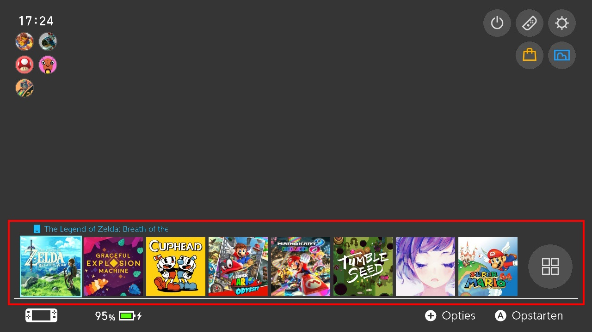

  
_[Doge Layout](https://themezer.net/themes/homemenu/BLK--6be) por Such Meme, Many Skill_

---

Ejemplos de diseños que muestran cómo lucen los iconos de juegos estacionarios son [Doge Layout](https://themezer.net/layouts/homemenu/Doge-Layout-e) y [Two Row layout](https://themezer.net/layouts/homemenu/Two-Row-Layout-Compact--1c).

<!-- prettier-ignore -->
!!! Info
    Si no quieres hacer que los íconos sean estacionarios, sino que quieres *mover* la fila de juegos, consulta [Repositioning and Scaling the Gamerow](../reposition-gamerow/index.md).

## Firmware ≥8.x

Desde la versión 8.0 en adelante, hacer que los íconos de juegos estacionarios funcionen correctamente ha sido un poco complicado. Esto se debe a que en la versión 8.0 se introdujo el desplazamiento en bucle en el menú principal. Otro factor fue que se modificó el comportamiento de las áreas activas.

Para hacer que los íconos estacionarios funcionen correctamente a partir de esta versión en adelante, se deben seguir los siguientes pasos:

### `RdtBtnIconGame.bflyt`

1. Establece la `escala x,y` de `RootPane` en un valor personalizado. Recuerda este valor y llamémoslo `p`.
2. Establece la `escala x,y` de `B_Hit` en `1.0/p`.
3. Establece el `ancho, alto` de `B_Hit` en `264*p`. `264` es el valor predeterminado para el ancho y el alto, pero podría cambiarse en una versión futura.

### `RdtBase.bflyt`

4. Establece el `ancho` de `N_ScrollWindow` en `100000.0`.
5. Establece las coordenadas `x,y` de `N_GameRoot` en la coordenada donde quieres que esté tu primer ícono de juego.
6. Establece la `escala x` de `N_GameRoot` en `0.00001`.
7. Establece la coordenada `x` de `N_Game` en `0.0` (!)
8. Establece la `escala x` de `N_Game` en `100000.0`.
9. Establece las coordenadas `x,y` de `N_Icon_00` en `0.0`.
10. Establece las coordenadas `x,y` de `N_Icon_[01-11]` en las posiciones que desees. Si recuerdo correctamente, la escala `p` tiene una influencia en esto. Mueve los íconos que no quieras que se muestren a `(1;9999)`.
11. Establece las coordenadas `x,y` de `N_Icon_12` (el botón de todas las aplicaciones) en la posición que desees. Si recuerdo correctamente, la escala `p` tiene una influencia en esto.
12. Establece la `escala x,y` de `L_BtnFlc` en `p`.
13. Cambia la `escala y` de `N_ScrollArea` y `N_ScrollWindow` para aumentar el tamaño del área táctil. Notarás que algunos íconos no se pueden tocar si no has configurado esto correctamente.
    - Opcionalmente cambia la coordenada `y`

<!-- prettier-ignore -->
!!! Warning
    Incluso una ligera desviación de los valores anteriores puede hacer que el cursor no pueda alcanzar el ícono o que no se pueda tocar el ícono usando la pantalla táctil. Sin embargo, si encuentras que estos valores no funcionan en tu caso, la única opción sería experimentar con las posiciones de los paneles (no la escala).

## Firmware <8.x

En la versión del firmware 7.x y versiones inferiores, es bastante fácil mover los íconos de los juegos. Para hacer que sean estacionarios, haz lo siguiente:

1. Cambia la `escala x,y` de `RootPane` en `RdtBtnIconGame.bflyt` según tus preferencias.
2. Cambia la `escala x` de `N_Game` en `RdtBase.bflyt` a `100000.0`.
3. Reposiciona los íconos de juegos `N_Icon_[01-12]` en `RdtBase.bflyt` según tus preferencias.

---

_Créditos a Migush_
