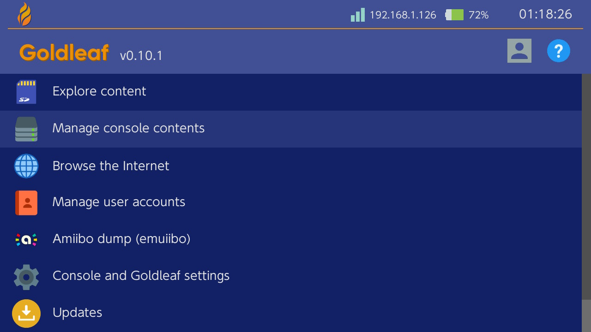
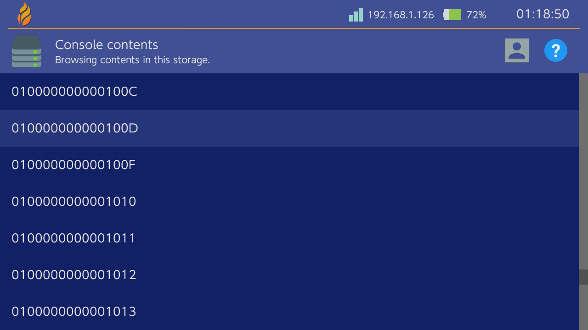
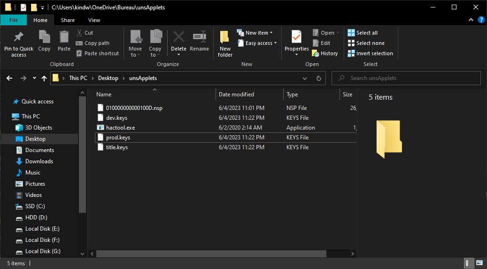
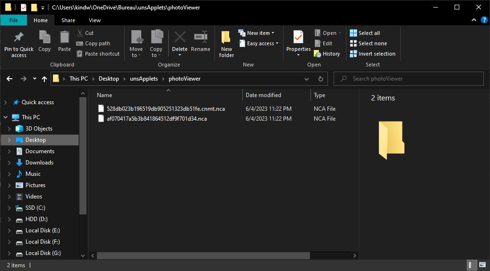

##### :octicons-arrow-left-16: [Volver al ejemplo de parcheo diferencial](../diffpatch/diff-example.md)

# Temas para applets no compatibles: tematización manual de szs
_Escrito por [Capybara](https://themezer.net/creators/382997176307154945). Última actualización: Junio de 2023_

---

Es posible tematizar básicamente todos los menús que no son oficialmente compatibles con Switch Theme Injector utilizando el método habitual de parcheo de diseño `.json` y algunos pasos adicionales. En este tutorial, solo me enfocaré en cómo parchear archivos `.szs` no compatibles, por ejemplo, `PhotoViewer.szs` (aplicación Álbum).

!!! warning
        **Los archivos szs contienen activos protegidos por derechos de autor y están estrictamente destinados para uso personal. Para compartir, usa nxthemes.**

## Requisitos

- Conocimientos básicos sobre edición de diseño y diffing, consulta las guías disponibles en el sitio web
- [Switch Layout Editor](https://github.com/FuryBaguette/SwitchLayoutEditor/releases/tag/beta15)
- [Goldleaf](https://github.com/XorTroll/Goldleaf)
- [hactool](https://github.com/SciresM/hactool/releases/tag/1.4.0)
- Lockpick_RCM para proporcionar claves a hactool
- Un editor de texto, se recomienda encarecidamente [Visual Studio Code](https://code.visualstudio.com/)
- Windows 10 o 11

## Applets qlaunch

Cada aplicación instalada en Switch es un título que tiene un ID único.

`qlaunch` es el que contiene los applets del menú de inicio debajo de él. Algunos de estos son compatibles oficialmente con el inyector (por ejemplo, `ResidentMenu.szs`, `Flaunch.szs`, `Set.szs`, etc.), mientras que otros no lo son (por ejemplo, `Option.szs`). Estos archivos `.szs` ya han sido extraídos por la aplicación homebrew NXTheme Installer y deberían estar ubicados en `themes/systemData` en tu tarjeta SD, por lo que diferenciarlos es un proceso sencillo ya que no necesitas extraer manualmente estos archivos. No elaboraré esto aquí, sino que recomiendo revisar la [sección de parcheo diferencial o diffpatching](/docs/guide/diffpatch/index.md).

El ID de `qlaunch` es `0100000000001000`.

## Otros applets

Los applets que no son parte de `qlaunch` (excepto el menú de selección de jugador y la página de usuario que son compatibles oficialmente) necesitan extracción e instalación manual. Aquí están los pasos generales:

- exporta el título del applet deseado como un `.nsp` usando Goldleaf
- extrae el `romFS` de este `.nsp` usando hactool, que posteriormente extraerá archivos `.szs` con los que podemos trabajar
- crea el diseño `.json`, luego parchea el `.szs` con él
- usa LayeredFS de Atmosphere para instalar el `.szs` parcheado (es decir, arrástralo y suéltalo en tu tarjeta SD)

!!! warning
        Las actualizaciones de firmware pueden proporcionar diferentes archivos `.szs` junto con ellas, lo que significa que deberás repetir estos pasos **en cada actualización de firmware** para evitar posibles problemas de incompatibilidad (probables bloqueos). NXTheme Installer automatiza este proceso para los applets que admite, como habrás notado. Afortunadamente, no debería haber necesidad de reescribir tu diseño `.json`, ya que los archivos `.bflyt` y `.bflan` deberían conservarse en las actualizaciones de firmware, por lo que puedes mantener tu `.json` tal como está.

Para referencia, se proporciona una lista exhaustiva de títulos en el [wiki de switchbrew](https://switchbrew.org/wiki/Title_list). Aquí hay algunos ID que podrían ser de interés:


|      Título     | ID del título      |         Applet         |
|:--------------:|--------------------|:----------------------:|
|  `photoViewer` | `010000000000100D` |          Álbum         |
|  `overlayDisp` | `010000000000100C` | Overlay (configuración rápida, notificaciones, etc.) |
|  `controller`  | `0100000000001003` |    Menú de controladores    |
| `playerSelect` | `0100000000001007` |  Menú de selección de jugador |
|    `myPage`    | `0100000000001013` |        Página de usuario       |

!!! tip
        El siguiente tutorial permitirá editar los archivos `common.szs` asociados a `Psl.szs` (menú de selección de jugador) y `MyPage.szs` (página de usuario), que por cierto *no* son parte de `qlaunch`. Esto hace posible, especialmente, la eliminación de la línea inferior para estos applets, lo cual de otra manera no es posible utilizando únicamente Switch Theme Injector, ya que solo admite el `common.szs` de `qlaunch`.

## Tutorial

Como ejemplo, mi objetivo aquí es tematizar el applet Álbum.

### Extracción del .szs

1) Necesitamos verificar el ID del título del Álbum en el wiki de switchbrew y tomar nota de él (`010000000000100D`).


2) Abre Goldleaf en tu Switch y navega hasta `Administrar contenido de la consola` > `SISTEMA NAND`.

!!! warning
        **Ahora ten cuidado, aunque no haremos nada importante aquí, no quieres estropear accidentalmente tu NAND.**


|  |  |
| ------------------------------------- | --------------------------------------------- |
| `Administrar contenido de la consola` | Buscar el ID del título |

Busca el ID del applet dentro de la lista (`010000000000100D` aquí), selecciónalo, presiona A y elige `Exportar`. Selecciona `Sí` para confirmar la exportación del NSP del título. El applet del Álbum debería exportarse y guardarse como `010000000000100D.nsp` en `switch/Goldleaf/export/title`.

|  |  |
| ------------------------------------- | --------------------------------------------- |
| Exportando `.nsp` | Confirma la exportación del `.nsp` |

3) Podemos proceder con la extracción del `.szs` del `.nsp` exportado.
Primero, descarga hactool y coloca `hactool.exe` en un nuevo directorio (que he llamado unsApplets aquí). [Extrae tus claves](https://nh-server.github.io/switch-guide/extras/dumping_title_keys/) si no lo has hecho ya, luego arrástralas a tu directorio de hactool junto con el `.nsp` exportado.



4) Presiona `Win` + `R`, escribe `cmd` y presiona `Enter` para abrir la línea de comandos. Navega hasta tu carpeta de hactool escribiendo `cd ` (mantén el espacio al final), luego arrastra y suelta la carpeta de hactool sobre la línea de comandos. Presiona `Enter` para confirmar.

5) Copia y pega el siguiente comando, presiona `Enter` para confirmar.

`hactool -t pfs0 --pfs0dir=photoViewer 010000000000100D.nsp`


!!! info
        No prestes atención al error `[WARN] prod.keys does not exist` si lo obtienes.

Esto generará dos archivos `.nca` en la carpeta `photoViewer`, utilizando `010000000000100D.nsp` como archivo de entrada. Los archivos `.szs` que nos interesan están contenidos en el `.nca` más grande (uno debería tener unos pocos KB y el otro alrededor de 25 MB).



6) Realizaremos una segunda extracción usando el `.nca` más grande.

`hactool -k prod.keys --romfsdir=romfs photoViewer/af070417a5b3b841864512df9f701d34.nca`

Esto extraerá el `romFS` en la carpeta `romfs`. Los archivos `.szs` también se han extraído y deberían estar ubicados en `romfs/lyt`.

|  |  |
| ------------------------------------- | --------------------------------------------- |
| Línea de comandos | Carpeta `romfs` |

!!! tip
        Consulta este [repositorio](https://github.com/SciresM/hactool) para obtener más información sobre cómo usar hactool.

### Parcheo diferencial e instalación

Parcheo diferencial es diffpatching pero en español

Básicamente hemos terminado con los pasos adicionales necesarios para tematizar applets no compatibles con `qlaunch`, ya que finalmente hemos obtenido los archivos `.szs`. Lo siguiente ahora es simplemente el diffpatching de `.szs` con Layout Editor. Aquí solo usaré Visual Studio Code para escribir mi `.json` ya que no implementaré animaciones. Ten en cuenta que el encabezado del `.json` debe editarse en consecuencia, como en este caso:

```json
"PatchName": "El nombre de tu tema",
"AuthorName": "Capybara",
"TargetName": "PhotoViewer.szs"
```

Lo que difiere es el proceso de instalación, que normalmente está automatizado por NXTheme Installer para applets compatibles. Los `.szs` parcheados deben copiarse en `atmosphere/contents/<ID del título>/romfs/lyt/<archivo>.szs`, es decir, `atmosphere/contents/010000000000100D/romfs/lyt/PhotoViewer.szs` aquí. Es normal que estos directorios no existan, debes crearlos y asegurarte de reproducir este árbol de carpetas. Luego, LayeredFS de Atmosphere debería cargar el tema personalizado en lugar del predeterminado.

|  |  |
| ------------------------------------- | --------------------------------------------- |
| Applet del Álbum tematizado | ¡Sin más línea inferior en la selección de jugador! |

### Implementación de imágenes de fondo personalizadas

Las imágenes de fondo personalizadas para menús no compatibles *pueden ser* alcanzables también utilizando la función de plantillas adicionales del inyector, aunque tendrás que realizar tus propias pruebas para que funcione correctamente, ya que el script original se basa en la sustitución de texturas dentro del `.btnx` y, por lo tanto, puede provocar ligeras anomalías en la interfaz de usuario si eliges las texturas incorrectas. Para obtener más detalles sobre cómo implementar fondos personalizados en applets no compatibles, consulta la [documentación de exelix](https://github.com/exelix11/SwitchThemeInjector/blob/master/SzsPatching.md).

## Notas adicionales

- Instalar un tema modificado `.szs` desde `overlayDisp` muestra una pantalla en negro en el arranque y no estoy seguro de por qué
- Se necesita más prueba para otros applets

## Agradecimientos especiales

- exelix por su consejo
- contribuyentes de la escena NX

# [Continuar a Guías Específicas](../examples/index.md) :octicons-arrow-right-16:
