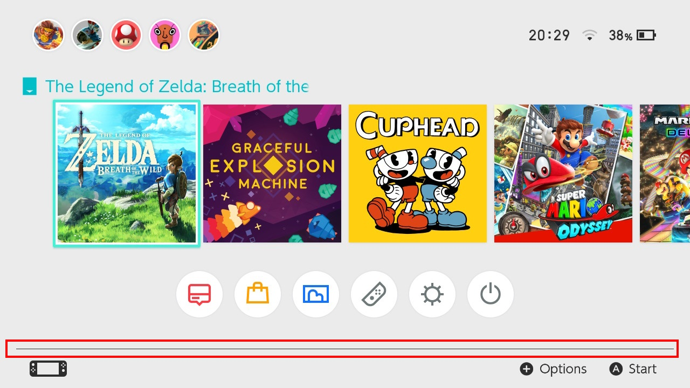

#####  [Volver a common.szs](../index.md)

# LineFooter.bflyt

**Archivo:** `common.szs/blyt/LineFooter.bflyt`

---

## Diseño de `common.szs/blyt/LineFooter.bflyt`

<!-- prettier-ignore -->

## Árbol

-	**RootPane [pan1]**
	-	**P_Line [pic 1]** `Línea en el pie de página; Visible: Verdadero/Falso`
