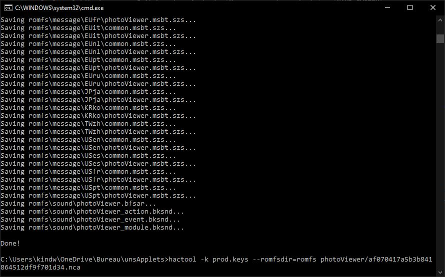
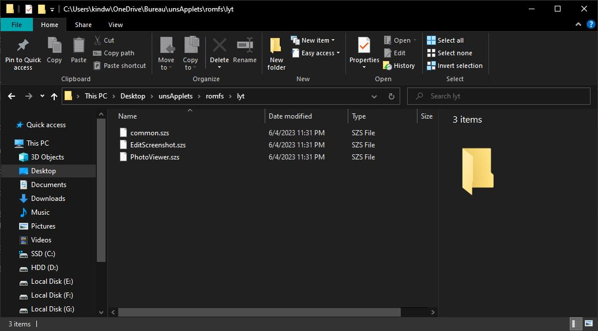

# Temas para applets no compatibles: yendo más allá
*Escrito por [Capybara](https://themezer.net/creators/382997176307154945), junio de 2023*

Es posible personalizar prácticamente todos los menús que no son admitidos oficialmente por Switch Theme Injector utilizando el método estándar de parcheo de diseño `.json` y algunos pasos adicionales. En este tutorial, me centraré únicamente en cómo parchear archivos `.szs` no admitidos, como `PhotoViewer.szs` (applet de Álbum).

**Los archivos .szs contienen activos con derechos de autor y están estrictamente destinados para uso personal. Para compartir, utiliza nxthemes.**

## Tabla de contenidos

- **[I. Applets qlaunch](#i-qlaunch-applets)**
- **[II. Otros applets](#ii-other-applets)**
- **[III. Tutorial](#iii-tutorial)**
	- [III.1. Extracción del archivo .szs](#iii1-extracting-the-szs)
	- [III.2. Parcheo de diferencias e instalación](#iii2-diffpatching-and-installation)
	- [III.3. Implementación de imágenes de fondo personalizadas](#iii3-implementing-custom-background-images)
- **[IV. Notas adicionales](#iv-additional-notes)**
- **[V. Agradecimientos especiales](#v-special-thanks)**

## Requisitos

- Conocimientos sólidos sobre edición de diseño y diferenciación, consulta [LayoutDocs](layoutdocs.themezer.net/)
- [Switch Layout Editor](https://github.com/FuryBaguette/SwitchLayoutEditor/releases/tag/beta15)
- [Goldleaf](https://github.com/XorTroll/Goldleaf)
- [hactool](https://github.com/SciresM/hactool/releases/tag/1.4.0)
- Lockpick_RCM para proporcionar claves a hactool
- Un editor de texto, se recomienda [Visual Studio Code](https://code.visualstudio.com/)
- Windows 10 o 11

## I. Applets qlaunch

Cada aplicación instalada en la Switch es un título que tiene un identificador único.

`qlaunch` es el que contiene los applets del menú principal debajo de él. Algunos de ellos son admitidos oficialmente por el inyector (por ejemplo, `ResidentMenu.szs`, `Flaunch.szs`, `Set.szs`, etc.), mientras que otros no lo son (por ejemplo, `Option.szs`). Esos archivos `.szs` ya han sido extraídos por la aplicación homebrew NXTheme Installer y deben ubicarse en `themes/systemData` en tu tarjeta SD, por lo que diferenciarlos es un proceso sencillo ya que no necesitas extraer manualmente estos archivos. No elaboraré esto aquí, más bien recomiendo revisar el [tutorial de SodaSoba](https://layoutdocs.themezer.net/guide/diffpatch/) sobre el tema.

El ID de `qlaunch` es `0100000000001000`.

## II. Otros applets

Los applets que no forman parte de `qlaunch` (excepto el menú de selección de jugador y la página de usuario que son admitidos oficialmente) necesitan extracción e instalación manual. Aquí están los pasos generales:

- exporta el título del applet deseado como un archivo `.nsp` usando Goldleaf
- extrae el `romFS` de este archivo `.nsp` usando hactool, que posteriormente extraerá archivos `.szs` con los que podemos trabajar
- crea el diseño `.json`, luego parchea el `.szs` con él
- utiliza LayeredFS de Atmosphere para instalar el `.szs` parcheado (es decir, arrastra y suelta en tu tarjeta SD)

Nota importante: Las actualizaciones del firmware pueden proporcionar archivos `.szs` diferentes junto con ellas, lo que significa que tendrás que repetir estos pasos **en cada actualización del firmware** para evitar posibles problemas de incompatibilidad (probables bloqueos). NXTheme Installer automatiza este proceso para los applets que admite, como quizás hayas notado. Afortunadamente, no debería ser necesario reescribir tu diseño `.json`, ya que los archivos `.bflyt` y `.bflan` deberían conservarse en las actualizaciones del firmware, por lo que puedes mantener tu `.json` tal como está.

Como referencia, se proporciona una lista exhaustiva de títulos en el [wiki de switchbrew](https://switchbrew.org/wiki/Title_list). Aquí tienes algunos ID que podrían ser de interés:

|      Título    | ID de Título        |        Applet         |
|:--------------:|--------------------|:----------------------:|
|  `photoViewer` | `010000000000100D` |          Álbum         |
|  `overlayDisp` | `010000000000100C` | Overlay (configuración rápida, notificaciones, etc.) |
|  `controller`  | `0100000000001003` |    Menú de controladores    |
| `playerSelect` | `0100000000001007` |  Menú de selección de jugador |
|    `myPage`    | `0100000000001013` |        Página de usuario       |

Nota adicional: Lo siguiente permitirá la edición de los archivos `common.szs` asociados a `Psl.szs` (menú de selección de jugador) y `MyPage.szs` (página de usuario), que por cierto *no* forman parte de `qlaunch`. Esto hace posible la eliminación de la línea inferior en estos applets, lo cual no es posible únicamente usando Switch Theme Injector, ya que solo admite el `common.szs` de `qlaunch`.

## III. Tutorial

As an example, my goal here is to theme the Album applet.

### III.1. Extracting the .szs

1) We need to check the Album's title id on the switchbrew wiki and take note of it (`010000000000100D`).


2) Open Goldleaf on your Switch and navigate to `Manage console contents` > `NAND SYSTEM`.

**Warning: Now be careful, although we won't do anything major here, you don't want to accidentally mess up your NAND.**


|  |  |
| ------------------------------------- | --------------------------------------------- |

Look for the applet's title id within the list (`010000000000100D` here), select it, press A and choose `Export`. Select `Yes` to confirm the title NSP export. The Album applet should then be exported and saved as `010000000000100D.nsp` at `switch/Goldleaf/export/title`.

|  |  |
| ------------------------------------- | --------------------------------------------- |

3) We can proceed on extracting the `.szs` off the exported `.nsp`.
First, download hactool and put `hactool.exe` into a new directory (which I named unsApplets here). [Dump your keys](https://nh-server.github.io/switch-guide/extras/dumping_title_keys/) if you haven't done it already, then drop them into your hactool directory along with the exported `.nsp`.


4) Press `Win` + `R`, type `cmd` and press `Enter` to open the command line. Browse your hactool folder by typing `cd ` (keep the space at the end), then drag and drop the hactool folder onto the command line. Press `Enter` to confirm.

5) Copy and paste the following command, press `Enter` to confirm.

`hactool -t pfs0 --pfs0dir=photoViewer 010000000000100D.nsp`


Side note: Don't pay attention to the `[WARN] prod.keys does not exist` error if you happen to get it.

This will output two `.nca` files into the `photoViewer` folder, using `010000000000100D.nsp` as the input file. The `.szs` files we're interested in are contained in the largest `.nca` (one should be a few KBs and the other 25-ish MBs).


6) We'll do a second extraction using the largest `.nca`.

`hactool -k prod.keys --romfsdir=romfs photoViewer/af070417a5b3b841864512df9f701d34.nca`

This will extract the `romFS` into the `romfs` folder. The `.szs` have been extracted as well and should be located at `romfs/lyt`.

|  |  |
| ------------------------------------- | --------------------------------------------- |

Side note: Refer to this [repository](https://github.com/SciresM/hactool) for more info on using hactool.

### III.2. Diffpatching and installation

We're basically done with the extra steps required to theme non-`qlaunch` unsupported applets as we finally got our hands on their `.szs` files. What's next now is just the usual `.szs` diffpatching with Layout Editor. I won't be implementing animations here so I'll just stick with Visual Studio Code to write my `.json`. Note that the `.json`'s header must be edited accordingly, like so in this case:

```json
"PatchName": "Your theme name",
"AuthorName": "Capybara",
"TargetName": "PhotoViewer.szs"
```

What differs is the installation process, which is normally automated by NXTheme Installer for supported applets. Patched `.szs` must be copied to `atmosphere/contents/<title id>/romfs/lyt/<file>.szs`, i.e. `atmosphere/contents/010000000000100D/romfs/lyt/PhotoViewer.szs` here. It's normal that these directories don't exist, you have to create them and make sure to reproduce this folder tree. Atmosphere's LayeredFS should then load the custom theme instead of the default one.

|  |  |
| ------------------------------------- | --------------------------------------------- |


*No more bottom line in player selection, finally!*

### III.3. Implementing custom background images

Custom background images for unsupported menus *may be* achievable as well using the extra templates feature of the injector, although you'll have to do your own testing to make it work properly as the original script relies on texture replacement within the `.btnx` and thus may lead to mild UI glitches if you picked the wrong textures. For more details on how to implement custom backgrounds to unsupported applets, please refer to [exelix's documentation](https://github.com/exelix11/SwitchThemeInjector/blob/master/SzsPatching.md).

## IV. Additional notes

- Installing a modified `.szs` theme from `overlayDisp` blackscreens the console on boot and I'm not sure why
- Further testing for other applets is needed

## V. Special thanks

- exelix for his advice
- contributors of the NX scene
