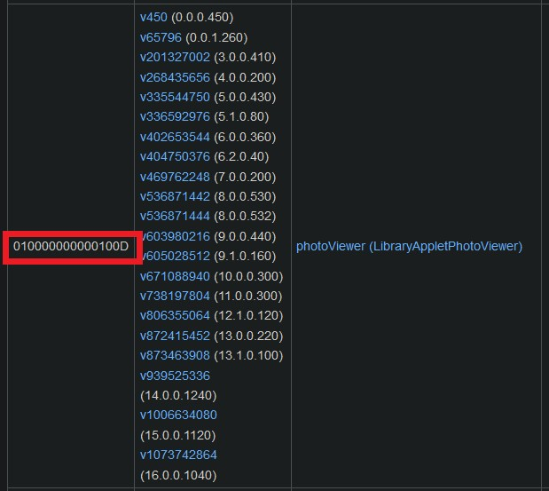
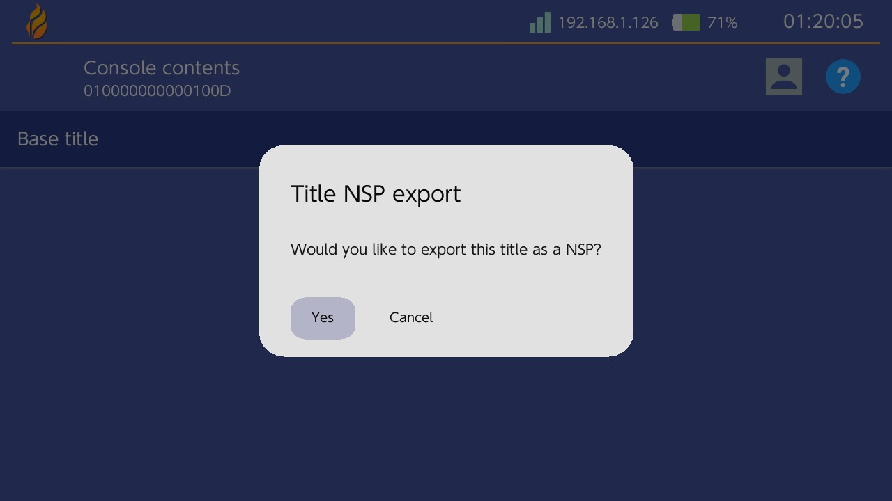

# Temas para applets no compatibles: yendo más allá
*Escrito por [Capybara](https://themezer.net/creators/382997176307154945), junio de 2023*

Es posible personalizar prácticamente todos los menús que no son admitidos oficialmente por Switch Theme Injector utilizando el método estándar de parcheo de diseño `.json` y algunos pasos adicionales. En este tutorial, me centraré únicamente en cómo parchear archivos `.szs` no admitidos, como `PhotoViewer.szs` (applet de Álbum).

**Los archivos .szs contienen activos con derechos de autor y están estrictamente destinados para uso personal. Para compartir, utiliza nxthemes.**

## Tabla de contenidos

- **[I. Applets qlaunch](#i-applets-qlaunch)**
- **[II. Otros applets](#ii-otros-applets)**
- **[III. Tutorial](#iii-tutorial)**
	- [III.1. Extracción del archivo .szs](#iii1-extraccion-del-archivo)
	- [III.2. Parcheo de diferencias e instalación](#iii2-diffpatching-and-installation)
	- [III.3. Implementación de imágenes de fondo personalizadas](#iii3-implementing-custom-background-images)
- **[IV. Notas adicionales](#iv-additional-notes)**
- **[V. Agradecimientos especiales](#v-special-thanks)**

## Requisitos

- Conocimientos sólidos sobre edición de diseño y diferenciación, consulta [LayoutDocs](layoutdocs.themezer.net/)
- [Switch Layout Editor](https://github.com/FuryBaguette/SwitchLayoutEditor/releases/tag/beta15)
- [Goldleaf](https://github.com/XorTroll/Goldleaf)
- [hactool](https://github.com/SciresM/hactool/releases/tag/1.4.0)
- Lockpick_RCM para proporcionar claves a hactool
- Un editor de texto, se recomienda [Visual Studio Code](https://code.visualstudio.com/)
- Windows 10 o 11

## I. Applets qlaunch

Cada aplicación instalada en la Switch es un título que tiene un identificador único.

`qlaunch` es el que contiene los applets del menú principal debajo de él. Algunos de ellos son admitidos oficialmente por el inyector (por ejemplo, `ResidentMenu.szs`, `Flaunch.szs`, `Set.szs`, etc.), mientras que otros no lo son (por ejemplo, `Option.szs`). Esos archivos `.szs` ya han sido extraídos por la aplicación homebrew NXTheme Installer y deben ubicarse en `themes/systemData` en tu tarjeta SD, por lo que diferenciarlos es un proceso sencillo ya que no necesitas extraer manualmente estos archivos. No elaboraré esto aquí, más bien recomiendo revisar el [tutorial de SodaSoba](https://layoutdocs.themezer.net/guide/diffpatch/) sobre el tema.

El ID de `qlaunch` es `0100000000001000`.

## II. Otros applets

Los applets que no forman parte de `qlaunch` (excepto el menú de selección de jugador y la página de usuario que son admitidos oficialmente) necesitan extracción e instalación manual. Aquí están los pasos generales:

- exporta el título del applet deseado como un archivo `.nsp` usando Goldleaf
- extrae el `romFS` de este archivo `.nsp` usando hactool, que posteriormente extraerá archivos `.szs` con los que podemos trabajar
- crea el diseño `.json`, luego parchea el `.szs` con él
- utiliza LayeredFS de Atmosphere para instalar el `.szs` parcheado (es decir, arrastra y suelta en tu tarjeta SD)

Nota importante: Las actualizaciones del firmware pueden proporcionar archivos `.szs` diferentes junto con ellas, lo que significa que tendrás que repetir estos pasos **en cada actualización del firmware** para evitar posibles problemas de incompatibilidad (probables bloqueos). NXTheme Installer automatiza este proceso para los applets que admite, como quizás hayas notado. Afortunadamente, no debería ser necesario reescribir tu diseño `.json`, ya que los archivos `.bflyt` y `.bflan` deberían conservarse en las actualizaciones del firmware, por lo que puedes mantener tu `.json` tal como está.

Como referencia, se proporciona una lista exhaustiva de títulos en el [wiki de switchbrew](https://switchbrew.org/wiki/Title_list). Aquí tienes algunos ID que podrían ser de interés:

|      Título    | ID de Título        |        Applet         |
|:--------------:|--------------------|:----------------------:|
|  `photoViewer` | `010000000000100D` |          Álbum         |
|  `overlayDisp` | `010000000000100C` | Overlay (configuración rápida, notificaciones, etc.) |
|  `controller`  | `0100000000001003` |    Menú de controladores    |
| `playerSelect` | `0100000000001007` |  Menú de selección de jugador |
|    `myPage`    | `0100000000001013` |        Página de usuario       |

Nota adicional: Lo siguiente permitirá la edición de los archivos `common.szs` asociados a `Psl.szs` (menú de selección de jugador) y `MyPage.szs` (página de usuario), que por cierto *no* forman parte de `qlaunch`. Esto hace posible la eliminación de la línea inferior en estos applets, lo cual no es posible únicamente usando Switch Theme Injector, ya que solo admite el `common.szs` de `qlaunch`.

## III. Tutorial

Como ejemplo, mi objetivo aquí es tematizar el applet del Álbum.

### III.1. Extracción del .szs

1) Necesitamos verificar el ID del título del Álbum en el wiki de switchbrew y tomar nota de él (`010000000000100D`).



2) Abre Goldleaf en tu Switch y ve a `Administrar contenidos de la consola` > `NAND SYSTEM`.

**Advertencia: Ahora ten cuidado, aunque no haremos nada importante aquí, no querrás estropear accidentalmente tu NAND.**


|  |  |
| ------------------------------------- | --------------------------------------------- |

Busca el ID del título del applet en la lista (`010000000000100D` aquí), selecciónalo, presiona A y elige `Exportar`. Selecciona `Sí` para confirmar la exportación del título NSP. El applet del Álbum debería exportarse y guardarse como `010000000000100D.nsp` en `switch/Goldleaf/export/title`.

|  |  |
| ------------------------------------- | --------------------------------------------- |

3) Podemos proceder a extraer el `.szs` del `.nsp` exportado.
Primero, descarga hactool y coloca `hactool.exe` en un nuevo directorio (que he llamado unsApplets aquí). [Extrae tus claves](https://nh-server.github.io/switch-guide/extras/dumping_title_keys/) si aún no lo has hecho, luego colócalas en tu directorio de hactool junto con el `.nsp` exportado.


4) Presiona `Win` + `R`, escribe `cmd` y presiona `Enter` para abrir la línea de comandos. Navega hasta tu carpeta de hactool escribiendo `cd ` (mantén el espacio al final), luego arrastra y suelta la carpeta de hactool sobre la línea de comandos. Presiona `Enter` para confirmar.

5) Copia y pega el siguiente comando, presiona `Enter` para confirmar.

`hactool -t pfs0 --pfs0dir=photoViewer 010000000000100D.nsp`


Nota adicional: No prestes atención al error `[WARN] prod.keys does not exist` si llegas a obtenerlo.

Esto generará dos archivos `.nca` en la carpeta `photoViewer`, utilizando `010000000000100D.nsp` como el archivo de entrada. Los archivos `.szs` que nos interesan están contenidos en el archivo `.nca` más grande (uno debería tener unos pocos KB y el otro alrededor de 25 MB).


6) Realizaremos una segunda extracción usando el archivo `.nca` más grande.

`hactool -k prod.keys --romfsdir=romfs photoViewer/af070417a5b3b841864512df9f701d34.nca`

Esto extraerá el `romFS` en la carpeta `romfs`. Los archivos `.szs` también se han extraído y deberían estar ubicados en `romfs/lyt`.

|  |  |
| ------------------------------------- | --------------------------------------------- |

Nota adicional: Consulta este [repositorio](https://github.com/SciresM/hactool) para obtener más información sobre cómo usar hactool.

### III.2. Diffpatching e instalación

Básicamente, hemos terminado con los pasos adicionales necesarios para tematizar los applets no admitidos por `qlaunch`, ya que finalmente hemos obtenido sus archivos `.szs`. Lo siguiente ahora es simplemente la diffpatching habitual de los archivos `.szs` con Layout Editor. No implementaré animaciones aquí, así que solo usaré Visual Studio Code para escribir mi `.json`. Ten en cuenta que el encabezado del `.json` debe editarse en consecuencia, así es en este caso:

```json
  "PatchName": "Nombre de tu tema",
  "AuthorName": "Capybara",
  "TargetName": "PhotoViewer.szs"
```

Lo que difiere es el proceso de instalación, que normalmente es automatizado por NXTheme Installer para applets admitidos. Los archivos `.szs` parcheados deben copiarse en `atmosphere/contents/<ID del título>/romfs/lyt/<archivo>.szs`, por ejemplo, `atmosphere/contents/010000000000100D/romfs/lyt/PhotoViewer.szs`. Es normal que estos directorios no existan, debes crearlos y asegurarte de reproducir esta estructura de carpetas. LayeredFS de Atmosphere debería cargar el tema personalizado en lugar del predeterminado.

 | 
| ------------------------------------- | ---------------------------------------------
*¡Sin más línea inferior en la selección de jugadores, finalmente!*

### III.3. Implementando imágenes de fondo personalizadas

Las imágenes de fondo personalizadas para menús no admitidos *pueden ser* alcanzables también utilizando la función de plantillas adicionales del inyector, aunque necesitarás realizar tus propias pruebas para asegurarte de que funcione correctamente, ya que el script original se basa en la sustitución de texturas dentro de `.btnx` y puede provocar problemas de interfaz si eliges las texturas incorrectas. Para obtener más detalles sobre cómo implementar fondos personalizados en applets no admitidos, consulta la [documentación de exelix](https://github.com/exelix11/SwitchThemeInjector/blob/master/SzsPatching.md).

## IV. Notas adicionales

- La instalación de un tema modificado en `.szs` desde `overlayDisp` provoca una pantalla en negro al iniciar la consola y no estoy seguro de por qué.
- Se necesita realizar más pruebas para otros applets.

## V. Agradecimientos especiales

- exelix por sus consejos.
- Colaboradores de la escena de Nintendo Switch.
